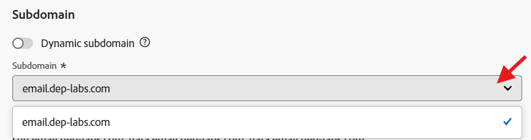

# Configurar para relacional

## Objetivo

En el siguiente conjunto de pasos creará una configuración de canal de correo electrónico para usarla solo con campañas orquestadas, usando el atributo `email` del esquema relacional `dep-rel: Customer Account`

## Crear configuración de canal

1. Vaya a **Configuraciones de canal** que se encuentran en el menú **Administración → Canales → Configuración general**
2. Haga clic en el botón **Crear configuración**

3. En el asistente Crear establezca los siguientes valores:
   - **Nombre:** `Relational-Email`
   - **Canal:** `Email`
   - **Acción de marketing:** `Email Targeting`

>[!NOTE]
>
>Al seleccionar Correo electrónico como canal, aparece una nueva sección Configuración de correo electrónico.

## Configurar tipo de correo electrónico

Definir **Tipo de correo electrónico** en **Marketing**

## Configurar subdominio

En el menú desplegable **Subdominio**, seleccione **email.dep-labs.com**

## Configurar detalles del grupo de IP

En el menú desplegable **grupo de IP**, seleccione **marketing**

## Configurar cancelación de suscripción a lista

1. Asegúrese de que la opción esté **habilitada** para cancelar la suscripción a una lista
1. En el área de preferencias de cancelación de suscripción a lista, asegúrese de que todas las casillas de verificación estén **marcadas**
1. En Administración de vínculos, asegúrese de que **Adobe managed** está seleccionado
1. Para el nivel de consentimiento, asegúrese de que esté establecido en **Canal**

## Configurar parámetros de encabezado

1. Defina los campos siguientes como se indica a continuación:
   - **Nombre desde:** `DEP Labs`
   - **Del prefijo de correo electrónico:** `dep`
   - **Responder al nombre:** `DEP Labs Support`
   - **Responder al correo electrónico:** `reply@email.dep-labs.com`
   - **Prefijo de correo electrónico con error:** `error`

## Configurar correo electrónico CCO

Deje esto en blanco

>[!NOTE]
>
>Puede conservar una copia de los correos electrónicos enviados enviándolos a una bandeja de entrada CCO. Escriba la dirección de correo electrónico que desee para que cada correo electrónico enviado se copie de forma oculta a esta dirección de CCO. Tenga en cuenta que el dominio de la dirección CCO debe ser diferente de cualquier subdominio delegado a Adobe. Esta funcionalidad es opcional. *Cómo usar CCO para correos electrónicos*

## Configurar parámetros de reintento de correo electrónico

Déjelo con la configuración predeterminada de **Horas** establecida en **84**

## Configurar parámetros de seguimiento de URL

Mantener la configuración predeterminada

## Detalles de ejecución

1. En la ficha Campaña orquestada y **marque** la casilla de verificación Habilitado.

2. En Dimensión de ejecución, configure lo siguiente:
   - **Enviar un mensaje por:** `Target Dimension `
   - **Dimension de destino de perfil:** `dep-rel: Customer Account - customer_id`

3. En Dirección de ejecución, configure lo siguiente:
   - **Source:** `Target Dimension`
   - **Dirección de envío:** `click on the Edit button`

4. En la ventana emergente, haga clic en la carpeta **dep-rel: Customer Account**

5. Seleccione **Correo electrónico** y haga clic en el botón **Seleccionar**

6. Cuando termine, los detalles de ejecución finales se parecerán a la captura de pantalla siguiente

>[!NOTE]
>
>Para las campañas organizadas, se dirige a la cuenta del cliente con un correo electrónico, por lo que solo necesita enviar un mensaje por cada Dimension de Target.  La dirección de ejecución que usa proviene del propio Dimension de Target (es decir, lo que se almacena en la tabla **dep-rel: Customer Account** para la dirección **email**)

## Revisar y guardar

1. Revise todos los detalles de nuevo para asegurarse de que coinciden.
1. Desplácese hacia arriba y haga clic en **Enviar**.
1. Cuando haya terminado, verá dos configuraciones de canal de correo electrónico, ambas probablemente en estado de &quot;procesamiento&quot;.

>[!WARNING]
>
>Se ha observado que el procesamiento de la configuración del canal de correo electrónico tarda hasta dos horas.

## Resumen

Ahora ha visto cómo crear una configuración de canal de correo electrónico para utilizar el atributo de esquema relacional para campañas orquestadas.
