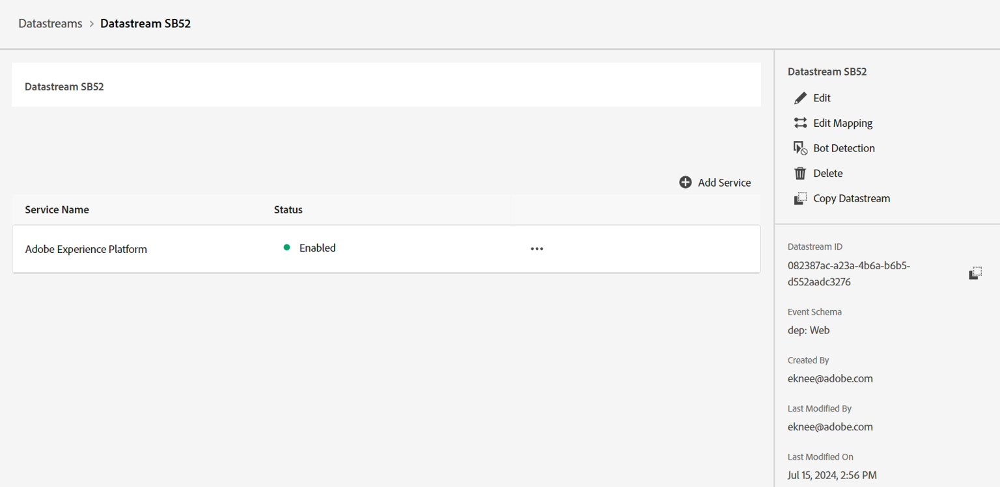

# Crear secuencia de datos

## Objetivo de aprendizaje

Cree y configure una secuencia de datos con los servicios necesarios para habilitar el procesamiento de eventos de Edge.

Un flujo de datos define qué servicios lo utilizarán.

- Al enviar datos a Edge, debe especificar qué secuencia de datos utilizar
- Los datos enviados a estas secuencias de datos pueden realizar acciones según el servicio configurado
  - Adobe Experience Platform

## Crear una nueva secuencia de datos

1. En el carril izquierdo bajo **Recopilación de datos**, haga clic en **Flujos de datos**
1. A continuación, haga clic en **Nueva secuencia de datos** para crear una

## Configurar flujo de datos

Configure la secuencia de datos con la siguiente información:

1. Nombre -> **Datastream SB + \&lt;sandbox name> (es decir Datastream SB01)**
1. Esquema de asignación -> **dep: Web**
1. Cambie **on** todas las opciones en **Geolocalización y Búsqueda de red** si desea capturar esta información.
1. Haz clic en el botón **Guardar** cuando termines

>[!WARNING]
>
>No haga clic en Guardar y agregar asignación.  Si lo hace accidentalmente, simplemente cancele la suscripción

Después de guardar la secuencia de datos, verá la siguiente pantalla:

## Añadir servicio de Adobe Experience Platform

Esto le permite enviar datos al concentrador y aterrizar en un conjunto de datos para los datos recibidos por este conjunto de datos.

1. Haga clic en el botón azul **Agregar servicio** que se encuentra en medio de la pantalla

&#x200B;2. Configure los siguientes elementos:
   - **Servicio** -> `Adobe Experience Platform`
   - **Conjunto de datos de evento** -> `dep: Web`
   - **Conjunto de datos del perfil** -> `dep: Customer Account`
   - **Seleccionar casilla de verificación** -> `Offer Decisioning`
   - **Seleccionar casilla de verificación** -> `Adobe Journey Optimizer`
&#x200B;3. Cuando termine, haga clic en **Guardar**

Verá el servicio ahora agregado a su secuencia de datos

Se agregó el servicio 

**Copie** y **guarde** la **ID de secuencia de datos** en el equipo local (la usaremos más adelante en Postman)

## Resumen

Debe tener un flujo de datos que funcione con el servicio Adobe Experience Platform configurado.
