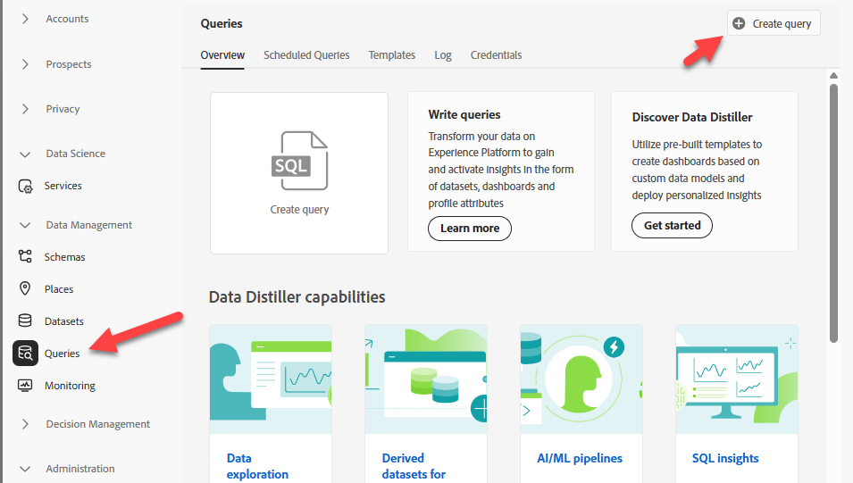

# Validar evento en el lago de datos

## Objetivo de aprendizaje

Compruebe que el evento web se haya escrito en el lago de datos de Experience Platform.

## Validar evento

&#x200B;> [!NOTE]
>
>Finalmente, los datos aparecerán en el lago de datos.  **Esto puede tardar hasta 60 minutos**.  Sabemos que el conjunto de datos está habilitado para el perfil y, por lo tanto, el evento creará un fragmento de perfil.
>
>Puede buscar y consultar el conjunto de datos web.

1. Vaya a **Consultas** y **Crear consulta**



&#x200B;2. Copie este SQL y péguelo en la consulta

```sql
SELECT identityMap['email'][0].id, * FROM dep_web
where identityMap['email'][0].id = 'henry.creel@emailsim.io'
```

&#x200B;3. **Ejecutar** Consulta

&#x200B;> [!NOTE]
>
>**Recordar**: Finalmente, los datos aparecerán en el lago de datos.  **Esto puede tardar hasta 60 minutos**.
>
>No es necesario esperar a que aparezca. No dude en volver a este paso y comprobarlo más tarde.


## Resumen

El registro de evento aparece en el conjunto de datos adecuado.
