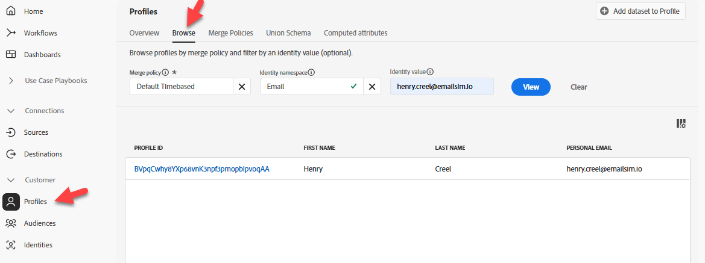

# Validar perfil en Hub

## Objetivo de aprendizaje

Compruebe que el evento haya resultado en una actualización de perfil y una calificación de segmentos en el Perfil en tiempo real en el Hub.

## Búsqueda del perfil en Hub

En Adobe Experience Platform, busque el perfil que acaba de enviar desde el evento que acaba de enviar a Edge Network.

1. Vaya a **Cliente** -> **Perfiles** -> **Examinar** para realizar la búsqueda con la siguiente información:
   - **Política de combinación** -> `Default Timebased`
   - **Área de nombres de identidad** -> `Email`
   - **Valor de identidad** -> `henry.creel@emailsim.io`
1. Haga clic en **Ver** para buscar el perfil




## Comprobar el perfil del concentrador

1. Haga clic en **ID de perfil** para abrir el perfil
1. Primero haga clic en la ficha **Atributos** y luego en el botón de opción **Hub** para ver el **Perfil de Hub**


## Validar eventos

1. Haz clic en **Eventos** en la barra de navegación superior y podrás ver el evento que acabas de enviar


## Validar segmentos

### Mediante JSON

1. Haga clic en el encabezado **Atributos** y vea **JSON**

   

2. Buscar **segmentMembership**.  Debe tener este aspecto (sus ID serán diferentes)

```json
  "segmentMembership": {
    "ups": {
      "ce0b8386-ef2a-4244-8ad0-1a72d6494181": {
        "status": "realized",
        "lastQualificationTime": "2025-12-15T23:11:49Z"
      },
      "8ce516fe-920a-4f9d-b92b-0403890a8491": {
        "status": "realized",
        "lastQualificationTime": "2025-12-12T15:01:01Z"
      }
    }
```

>[!NOTE]
>
>**¿Cómo se lee segmentMembership?**
>
>[https://experienceleague.adobe.com/es/docs/experience-platform/xdm/field-groups/profile/segmentation](https://experienceleague.adobe.com/es/docs/experience-platform/xdm/field-groups/profile/segmentation)
>
>**ups:** Esta es la clave de asignación para los distintos tipos de audiencias que admite AEP.  La clave ups contiene las audiencias creadas por el Generador de reglas.  Otras audiencias estarán contenidas en otras claves (por ejemplo, AAM).
>
>**lastQualificationTime**: marca de tiempo de la última vez que este perfil se calificó para el segmento.
>
>**estado**
>
>*realizado*: El perfil se califica para el segmento.
>*exit*: el perfil está saliendo del segmento como parte de la solicitud actual.
>
>

### Mediante IU

1. Una manera más fácil de validar que el perfil se ha clasificado para las audiencias es mirando la pestaña **Pertenencia a la audiencia** (debería ver al menos estas):
   - dep: cualquier flujo de eventos (en una hora)
   - dep: Cualquier evento de Edge (en una hora)


>[!NOTE]
>
>**¿Por qué no hay audiencia por lotes?**
>
>No debería ver **dep: Cualquier lote de eventos (dentro del día)** calificado para ya que transmitimos los datos y la evaluación por lotes se realiza una vez al día.

## Resumen

Existe un perfil en el concentrador que cumple los requisitos de la audiencia esperada.
