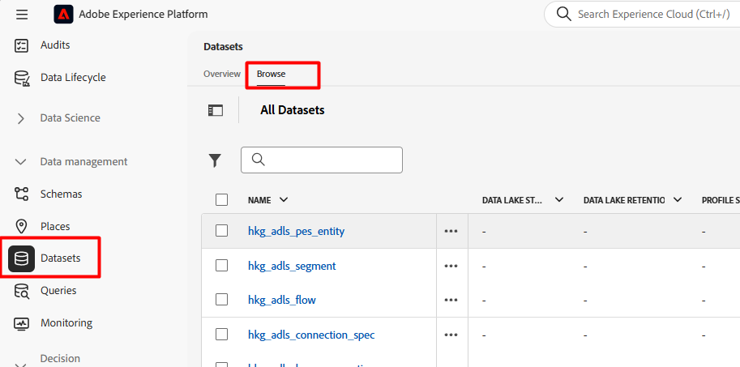

# Validar instantánea de perfil

## Objetivo de aprendizaje

Confirme que el perfil aún no aparece en el conjunto de datos Instantánea de perfil.

## Uso del conjunto de datos Instantánea de perfil

1. En la barra de navegación izquierda debajo de la sección Administración de datos, haga clic en **Conjuntos de datos** y luego haga clic en la **pestaña Examinar** que se encuentra en el carril superior



2. En el **cuadro de búsqueda** escriba `profile`, a continuación **haga clic en la fila** con el título &quot;Instantánea de perfil...&quot;.   y en el carril derecho **copie el nombre de la tabla** y péguelo en algún lugar al que pueda hacer referencia en el siguiente paso.

> [!NOTE]
>
>Es posible que tenga que borrar cualquier filtro si no ve el mensaje &quot;Profile-Snapshot...&quot; conjunto de datos.


3. Vuelva al editor de consultas y copie y pegue el SQL siguiente en el editor

```sql
select
  identityMap,
  segmentID,
  segmentMembershipUps[segmentID] ['lastQualificationTime'],
  segmentMembershipUps[segmentID] ['status'],
  current_timestamp
from
  (
    select
      identityMap,
      explode (map_keys (segmentMembership['ups'])) as segmentID,
      segmentMembership['ups'] as segmentMembershipUps
    from
   
    where
      map_keys (segmentMembership['ups']) is not null
    limit 100
  )
  --where identityMap['email'][0].id = 'henry.creel@emailsim.io'
  limit 50
```

4. Actualice el nombre y la dirección de correo electrónico de la tabla como se describe a continuación:
   - **Nombre de tabla:** en la línea 14 copie y pegue el nombre de tabla que tiene para la tabla Instantánea de perfil entre `from` y `where`
   - **Dirección de correo electrónico:** por ahora, en la línea 19, escriba la misma dirección de correo electrónico que usó para enviar el evento Web (usamos henry.creel\@emailsim.io, a menos que lo haya cambiado).
     - Por el momento, hemos comentado esto (déjalo así). Cuando se ejecuta la consulta y buscas a Henry, no lo encuentras.


5. **Ejecute** la consulta haciendo clic en la flecha de la parte superior izquierda
6. Los resultados son los siguientes (pero si buscas a Henry, no lo encuentras)


>[!NOTE]
>
>**¿Por qué no hay resultados para Henry?**
>
>**Recordatorio**: la instantánea de perfil es una **reflexión** o instantánea de lo que existía en el perfil en un **momento específico**. El trabajo se ejecuta **diariamente** y se usa para fines de flujo descendente como AJO. Como acaba de transmitir estos datos, la instantánea de perfil aún no la tiene.  Lo hará mañana.

## Resumen

Comprenda que los conjuntos de datos de instantáneas se actualizan en un proceso por lotes programado en lugar de inmediatamente.
