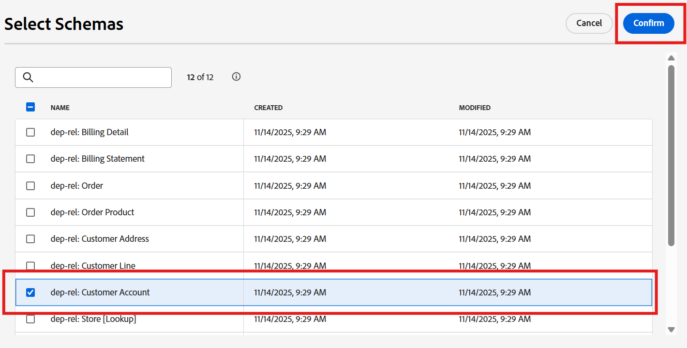

# Examinar esquemas

## Objetivo

En el siguiente conjunto de pasos, se mostrará la interfaz de usuario para ver los esquemas y sus relaciones.  Esto es importante para familiarizarse con los esquemas y relaciones disponibles al crear la campaña.

## Ver esquemas

El modelo de datos relacional Connection 5G ya se ha creado para usted. Para ver los esquemas usted mismo, vaya a la página **Esquemas -> Examinar** en la interfaz de usuario.

En el cuadro de búsqueda, escriba `dep-rel` para ver todos los esquemas.

>[!NOTE]
>
>Observe que el tipo de todos los esquemas es *Relacional*

## Ver diagrama de relación

Con los esquemas XDM relacionales puede ver fácilmente el diagrama de relación de entidades (ERD) seleccionando cualquier esquema y haciendo clic en el botón Ver diagrama de relación.

Haga lo siguiente:

1. Haga clic en la ficha **Relaciones** y, a continuación, haga clic en el botón **Ver diagrama de relaciones**

   

2. Haga clic en **Seleccionar esquemas**
3. En la ventana emergente, seleccione `dep-rel: Customer Account` y haga clic en **Confirmar**

   

4. En el ERD, haga clic en **3 puntos** y seleccione **Mostrar entidades relacionadas**

   

5. Vea el ERD con todas las tablas directamente relacionadas con dep-rel: Cuenta del cliente. Opcionalmente, puede descargar el ERD como archivo PNG.

>[!TIP]
>
>Bastante guay eh?!

## Resumen

Ahora ha visto lo fácil que es navegar por la IU de Esquema y relaciones.  Puede seleccionar esquemas específicos y navegar para ver las relaciones que le ayudarán a comprender y utilizar los datos en la orquestación de campañas.

Puede leer más [aquí](https://experienceleague.adobe.com/en/docs/journey-optimizer/using/data-management/get-started-schemas) si está interesado.
