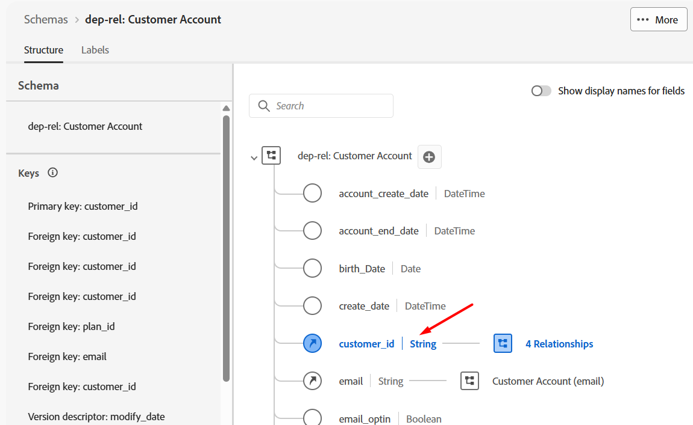
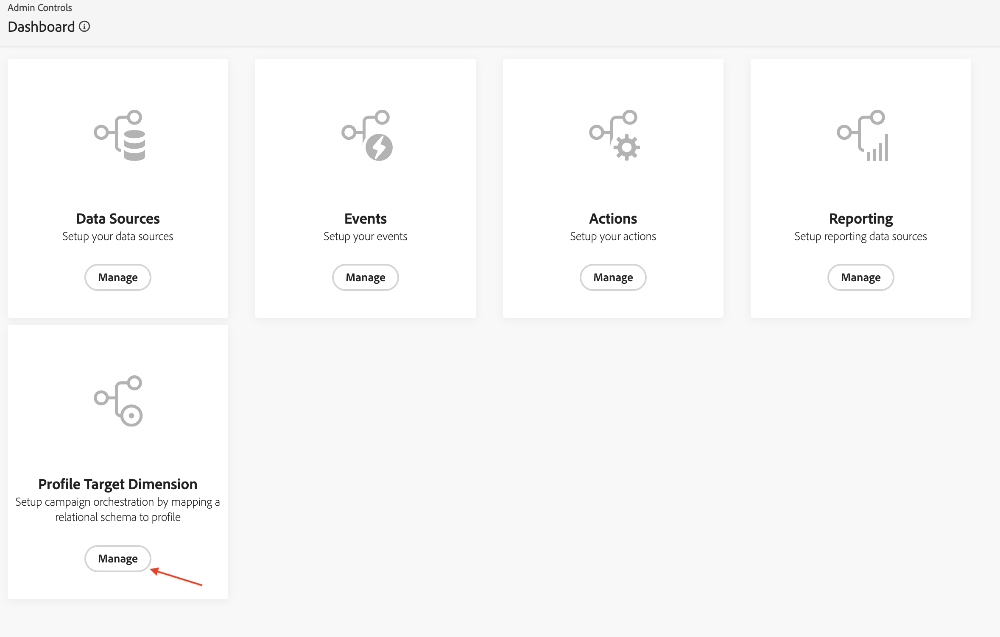

# Dimension de destino de perfil

## Objetivo

En el siguiente conjunto de pasos, se mostrará la interfaz de usuario para ver el esquema y configurar la identidad. A continuación, se configura la Dimension de destino del perfil, que es el tipo de entidad a la que se dirige la campaña y que se concilia con el perfil de AEP para su envío.

## Por qué esto es importante

La Dimension de destino de perfil se utiliza para indicar a Adobe Journey Optimizer cómo se pueden unir los datos entre el perfil del cliente en tiempo real y el almacén relacional. Los ingredientes de esta configuración son los siguientes:

- Un esquema relacional
- Un solo campo del esquema relacional
- Un área de nombres de identidad asociada a ese campo

>[!CAUTION]
>
>Sin esta configuración, no se puede realizar ninguna lectura ni compartir audiencias, ni se puede enviar ningún mensaje desde Campañas orquestadas

## Etiqueta de identidad

1. Haz clic en el icono **Aplicaciones** y selecciona **Journey Optimizer**

   

2. Haga clic en **Esquemas** en el menú Administración de datos y asegúrese de que ha seleccionado la pestaña **Examinar**.
3. Busque el esquema llamado `dep-rel: Customer Account`

   

4. Abra el esquema haciendo clic en su nombre y luego haga clic en el campo **customer\_id**

   

5. En el carril derecho, localice la casilla de verificación denominada **Identidad**, **marque la casilla** y elija el área de nombres de identidad denominada **customerID**

   

6. Haga clic en el botón **Guardar** para guardar el esquema. Aparece un mensaje de confirmación
7. Haga clic en el botón **Cancelar** o en **Esquemas** en el carril izquierdo para salir de la interfaz de usuario del esquema

>[!CAUTION]
>
>Si no guarda el esquema después de agregar la etiqueta de identidad, el siguiente conjunto de pasos de configuración no funciona

>[!NOTE]
>
>Después de guardar, tardan unos minutos (menos de 5 minutos) en aparecer en el menú desplegable Dimension de destinatario de perfil en el siguiente paso.

## Creación del Dimension de destinatario del perfil

1. Haz clic en **Configuraciones** en **Administración**

   

2. Seleccione **Dimension de destino de perfil** y haga clic en **Administrar**

   

3. Se abre el panel Dimension de destino de perfil, haga clic en **Crear**

   

4. Seleccione el esquema `dep-rel: Customer Account` de la lista desplegable.

   >[!NOTE]
   >
   >El esquema puede tardar unos minutos en aparecer en esta pantalla después de marcar la identidad. Actualice la página y repita los dos pasos anteriores hasta que aparezca el esquema.

   

5. Para el **valor de identidad**, seleccione `/customer_id`

   

   >[!NOTE]
   >
   >Un esquema relacional puede tener muchos campos etiquetados con identidades, por lo que es un cuadro de lista.

6. Haga clic en el botón **Guardar** para crear el Dimension de destino del perfil. A continuación, verá aparecer el registro.

>[!NOTE]
>
>El nombre del registro creado es una concatenación del nombre de esquema *(dep-rel: Customer Account)* y el campo etiquetado con la identidad *(customer\_id)*

>[!TIP]
>
>¡Felicidades! Esto concluye el paso de creación de Dimension de destinatario de perfil en el laboratorio.

## Resumen

Ya ha visto lo fácil que es navegar por el esquema, marcar un atributo como identidad y crear la Dimension de destinatario de perfil.

Puede leer más [aquí](https://experienceleague.adobe.com/es/docs/journey-optimizer/using/campaigns/orchestrated-campaigns/data-configuration/target-dimension) si está interesado.
