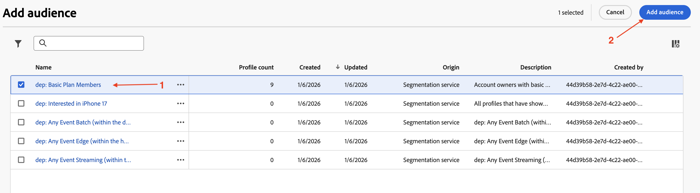
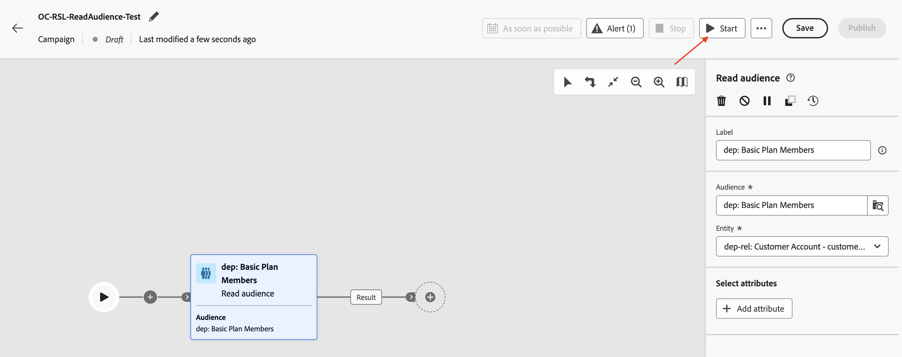
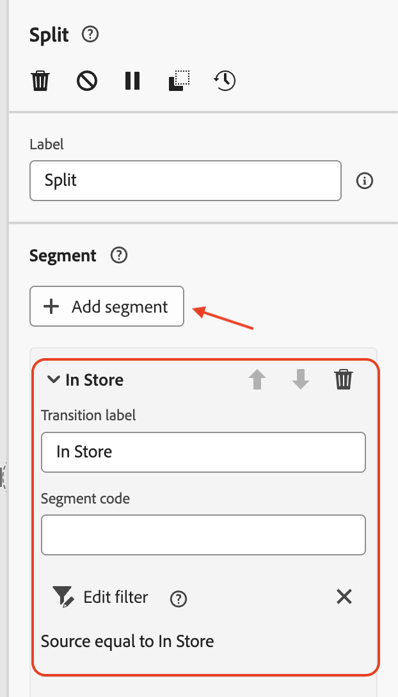
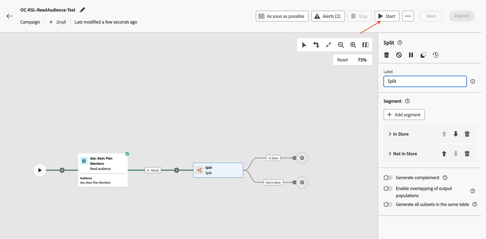
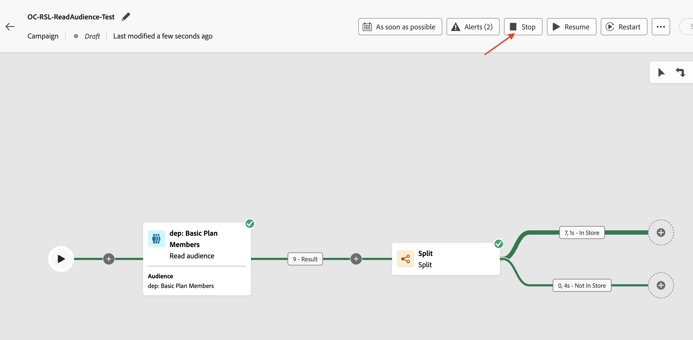

# Leer una audiencia

## Objetivo

En el siguiente conjunto de pasos, debe crear una campaña para leer una audiencia de AEP y utilizarla junto con el Dimension de destinatario de perfil creado anteriormente. Utilice la actividad Split para dividir los datos en función de una condición. Finalmente, pruebe la campaña para comprender cómo funcionan estas audiencias cuando se utilizan con el esquema relacional.

## Leer público

Este laboratorio cubre el uso de la actividad Leer audiencia junto con el esquema relacional para el enriquecimiento.

Orchestrated Campaign utiliza el esquema relacional para todas las actividades. Al utilizar la actividad Leer audiencia, que lee la audiencia de AEP, se debe configurar una entidad correspondiente (Target Dimension) para reconciliar la audiencia con el Dimension de Campaign Target.

## Creación de una campaña

1. En el carril izquierdo, haga clic en **Campañas**

   

2. Haz clic en **Crear campaña**

   

3. Seleccione **Orquestación - Marketing** y haga clic en **Confirmar**

   

4. Proporcione los detalles de la campaña como se indica a continuación y haga clic en **Guardar botón**
   - Nombre: **OC-RSL-ReadAudience-Test**
   - Descripción: **Prueba de audiencia de lectura de RSL**

   

5. Esperar al mensaje de confirmación

## Añadir actividad de lectura de audiencia

1. Haga clic en **+** dentro del lienzo para abrir el menú de opciones y, a continuación, seleccione **Leer audiencia** de las **actividades de segmentación**

   

2. En el panel de detalles de **Leer audiencia**, haga clic en el icono Buscar de **Audiencia**

   

3. Seleccione la audiencia **dep: miembros del plan básico** con recuento de perfiles de **9** y haga clic en **Agregar audiencia**

   

4. A continuación, haga clic en el menú desplegable de **Entity** y seleccione la Dimension de `dep-rel: Customer Account - customer_id` Campaign Target

>[!NOTE]
>
>También se pueden extraer otros atributos del perfil de AEP para usarlos en el lienzo con el botón **Agregar atributo**. Sin embargo, para este laboratorio, no se requieren atributos adicionales, por lo que se omite ese paso.

## Prueba de la campaña

1. Se ha completado la configuración de la actividad **Leer audiencia**. Haga clic en **Iniciar** para ejecutar la campaña en **Modo de prueba**

   

   >[!NOTE]
   >
   >Esto tarda unos minutos en ejecutarse.
   >
   >El modo de prueba permite la ejecución de la campaña para verificar y supervisar su comportamiento junto con los resultados de cada actividad. Las actividades se ejecutan secuencialmente hasta el final del lienzo.

2. La ejecución de la prueba se inicia y los resultados se muestran cuando se completa. Haga clic en el nodo **Result** y luego en Preview results para ver los resultados de la ejecución

   

3. Observe que los perfiles **2** (de 9) de la **audiencia de lectura** no tienen una **dimensión de destino** correspondiente del esquema relacional (es decir, existen en el almacén de perfiles pero no en el almacén relacional). Y dado que la Campaña orquestada funciona del esquema relacional, el(la) `customer_id` (**2**) sin coincidencias de la **audiencia de lectura** se descarta y solo los *coincidentes*, **7** en este caso, se pueden utilizar en actividades posteriores que aprovechen **datos relacionales** en la campaña

   

   >[!NOTE]
   >
   >Los siguientes pasos utilizan los datos relacionales para confirmar que se descartó la instrucción anterior de `customer_id` sin coincidencias.

4. Haga clic en **Detener** para detener el **modo de prueba** de la campaña

   

5. Haga clic en **+** al final del flujo y agregue **Split** desde las **actividades de segmentación**

   

6. En el panel de detalles de la actividad **Split**, expanda la primera división llamada **Subset**

   

7. Cambiarle el nombre a &quot;**En tienda**&quot; y hacer clic en **Crear filtro** para establecer la condición de filtro

   

8. En el panel **Crear filtro** r, haga clic en **Agregar condición**

   

9. Dado que no se extrayeron otros atributos del perfil de AEP, el único atributo de perfil de AEP disponible aquí es el `Customer ID`. Sin embargo, hay columnas del almacén relacional correspondientes a la dimensión de Target coincidente disponibles para configurar la condición de filtro. Expanda **Dimensión de segmentación** haciendo clic en **>**

   

10. Seleccione `Source` de la lista y haga clic en **Confirmar**

&#x200B;11. Los distintos valores de la columna Source están disponibles en la lista desplegable. Para la **condición personalizada**, seleccione **&quot;En tienda&quot;** en la lista desplegable y haga clic en **Confirmar** para salir

&#x200B;12. En el panel de detalles de la actividad **Split**, se completó la configuración de la primera Split. Haga clic en **Agregar segmento** a la segunda división

Se crea un nuevo segmento con el nombre **Result**

&#x200B;13. Cambie el nombre de &quot;**Result**&quot; a &quot;**Not In Store**&quot; y haga clic en **Crear filtro** para establecer la condición de filtro

&#x200B;14. En el panel **Crear filtro**, haga clic en **Agregar condición**. Siga el mismo enfoque que arriba, expanda **Targeting dimension** haciendo clic en **>**, luego seleccione `Source` de la lista y haga clic en **Confirmar**

&#x200B;15. Para la **condición personalizada**, seleccione **&quot;En tienda&quot;** de la lista desplegable y para el operador seleccione &quot;**no igual a**&quot;. Haz clic en **Confirmar** para salir

&#x200B;16. En el panel de detalles de la actividad **Split**, se completó la configuración de las dos Splits. Haga clic en **Iniciar** para ejecutar la campaña en **Modo de prueba**

&#x200B;17. La ejecución de la prueba comienza y los resultados se muestran al finalizar. Dado que solo se encontraron **7** dimensiones de destino coincidentes en el esquema relacional, se observa el mismo recuento después de las operaciones de división (**7** y **0**)

&#x200B;18. Haz clic en cada cuadro de resultados y **Previsualizar resultados** para ver los resultados

&#x200B;19. Haga clic en **Detener** para detener el **modo de prueba** de la campaña

>[!NOTE]
>
>Mientras que la audiencia de lectura mostró **9** perfiles. Como hemos creado un filtro en Source y el campo Source existe en el almacén relacional, tuvimos que unirnos del almacén de perfiles al almacén relacional para comprobarlo. Cuando se unió con el esquema relacional, a través de la Dimension de Campaign Target, solo coincidía un total de **7** perfiles. Estos **7** ID de clientes coincidentes están disponibles para su uso en las siguientes actividades que intentan utilizar datos relacionales. Todos los ID de cliente de **7** tenían `Source` establecido en **&quot;En tienda&quot;**, lo cual se evidenció a través de los flujos de división.
>
>Por lo tanto, mantener la coherencia de los datos es fundamental al utilizar perfiles de AEP junto con sus homólogos relacionales para el enriquecimiento.

>[!TIP]
>
>Felicitaciones, esto completa el laboratorio sobre el uso de la actividad Leer audiencia con el esquema relacional.

## Resumen

Ahora ha visto lo fácil que es crear una campaña, realizar una actividad de lectura de audiencia junto con la Dimension de segmentación de perfiles para aprovechar el esquema relacional. La actividad Split se utilizaba para dividir la audiencia en función de una condición. Por último, el modo de prueba ayudó a comprender que es importante tener la coherencia de datos entre el perfil y el esquema relacional.

Puede leer más [aquí](https://experienceleague.adobe.com/en/docs/journey-optimizer/using/campaigns/orchestrated-campaigns/design-campaigns/read-audience) si está interesado.
