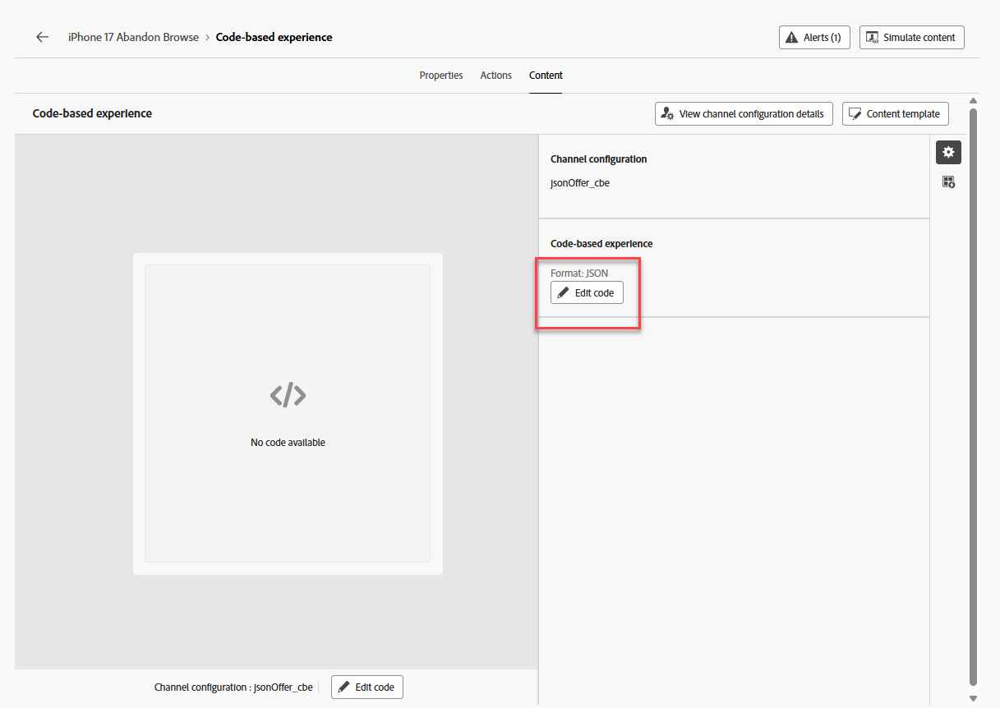
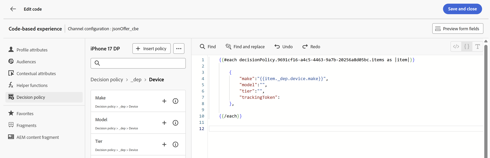

# Creación del Recorrido

## Nombrar y definir criterios de entrada

1. Si es necesario, expanda el elemento de menú **administración de Recorrido** en el carril izquierdo y haga clic en **Recorridos**. Aterrizas en la página &quot;Recorridos&quot;.
2. Haz clic en el botón azul **Crear Recorrido**.
3. Cuando aparezca la superposición &quot;Crear un Recorrido&quot;, selecciona **Crear desde cero** y haz clic en **Confirmar**
4. En el carril derecho, asigne un nombre al Recorrido **iPhone 17 Abandonar exploración** y haga clic en el botón azul **Guardar** para que pueda empezar a agregar acciones al lienzo del Recorrido.
5. Arrastre el evento **Calificación de audiencias** al lienzo.
6. En el carril derecho, haga clic en el icono **Lápiz** para seleccionar la audiencia de este evento.
7. Seleccione la audiencia **dep: interesado en iPhone 17**.
8. Asegúrese de que la lista desplegable **Espacio de nombres** esté establecida en **customerID.** En este punto, el Recorrido tiene este aspecto:

   

9. Una vez que todos se vean correctos, haz clic en el botón azul **Guardar** para guardar tu progreso.

>[!NOTE]
>
>La audiencia &quot;dep: Interesado en iPhone 17&quot; es una audiencia de streaming en la que el criterio de entrada es ver la página de información general ficticia de Connection 5G iPhone 17 3 veces en el mismo día. Al igual que muchas páginas de información general del producto, la página de información general de iPhone 17 de Connection 5G es una página dinámica con varios elementos que se actualizan sin que sea necesario volver a cargar la página. Uno puede comparar los diferentes niveles de iPhone 17 y sus características en esta sola página. Por lo tanto, si alguien ve esta página 3 veces en el mismo día, es probable que tenga interés en iPhone 17. Sin embargo, como no todos los elementos de la página están etiquetados y medidos, Connection 5G utilizará la edad de los usuarios autenticados para determinar el nivel de teléfono que se mostrará a ellos cuando interactúen con diferentes puntos de contacto de la marca Connection 5G.


## Configurar el CBE y la política de decisión

1. Expanda el acordeón **Actions** que acaba de salir del lienzo, arrastre el elemento **Action** al lienzo y conéctelo al primer nodo.
2. Cuando aparezca la superposición &quot;Seleccionar tipo de acción&quot;, selecciona la acción **Experiencia basada en código** y haz clic en el botón azul **Agregar**.
3. En las propiedades &quot;Action\:Code-based experience&quot;, que ahora están visibles, haga clic en el botón **Configurar acción**.

   

4. Cambie el menú desplegable **Configuración basada en código** al cubo **jsonOffer\_cbe** que creó en la última sección.

   

5. Haga clic en el botón **Editar contenido** que se encuentra justo encima de la lista desplegable &quot;Configuración basada en código&quot;.
6. En la pantalla del editor de experiencias basado en código resultante, haga clic en el botón **Editar código**. La pantalla resultante es donde se agrega el JSON devuelto a las solicitudes de Experience Event

   

7. En el extremo izquierdo del editor de código, haga clic en el elemento de menú **Directiva de decisión**, seguido de un clic en el botón **Agregar directiva de decisión** del nuevo menú.

   

   >[!NOTE]
   >
   >Si en una estrategia de selección es donde se vincula una colección de ofertas a un método de clasificación (y se aplica la elegibilidad de nivel de estrategia), entonces es en una política de decisión donde se vincula una estrategia de selección a una entrega específica de un canal.

8. Asigne un nombre a esta directiva de decisión **iPhone 17 DP** y deje el número de elementos establecido en 1.

   >[!NOTE]
   >
   >Hasta este punto, ha configurado las ofertas y cómo pedirlas, pero no ha configurado cuántas se devuelven. Aquí es donde se configura la cantidad de ofertas que deben devolverse.

9. Haga clic en el botón **Siguiente** azul. Aquí es donde se agrega la estrategia de selección. Haga clic en el botón **+Agregar** (es posible que tenga que desplazarse hacia abajo para verlo) y elija **Estrategia de selección**.
10. Marque la casilla junto a la única estrategia de selección que debería tener (**Estrategia de selección de iPhone 17**) y haga clic en **Guardar**. Cuando termine, esto es lo que ve:


>[!NOTE]
>
>Observe cómo puede agregar varias estrategias de selección o simplemente agregar los propios elementos de decisión. ¿Cuándo utilizaría varias estrategias de selección? Imagine que tiene una cuadrícula de recomendaciones de 4 X 4 en una de las propiedades digitales. Desea rellenar todas ellas con 16 ofertas. Puede que tenga esas ofertas distribuidas en algunas colecciones o que las dos primeras filas requieran una estrategia de selección, mientras que las dos filas inferiores necesitan una estrategia diferente. En la pantalla anterior, habría elegido 16 y luego habría utilizado esta pantalla para agregar tantas estrategias de selección u ofertas como fuera necesario para llegar a 16.
>
>La oferta de reserva es opcional porque solo se aplicaría si fuera posible que los usuarios finales no fueran aptos para ninguna de las ofertas (o que dejaran de serlo). En nuestro caso, nuestra estrategia de selección era para todos los visitantes, y las únicas personas que llegarían al nodo de CBE eran las que entraban en el Recorrido. La autenticación es un requisito para la entrada de Recorrido (el área de nombres establecida en el Recorrido es una que solo tendría si se autenticara). También hemos incorporado una oferta de reserva en nuestra fórmula de clasificación, por lo que, en nuestro caso, no es necesario establecer esta oferta de reserva.

&#x200B;11. Haga clic en el botón azul **Siguiente** para revisar la directiva de decisión.


&#x200B;12. Una vez que todo parezca correcto, haga clic en el botón azul **Crear**. Una vez creado, vuelve a la página del editor de expresiones.
&#x200B;13. Debería ver una pantalla similar a la de abajo; si no es así, vuelva a hacer clic en **Directiva de decisiones** para que aparezca la directiva de decisiones.


&#x200B;14. Haga clic en el botón **+ Insertar directiva** y verá aparecer un bucle ForEach en el editor de código:


>[!NOTE]
>
>¿Por qué un para cada bucle? En nuestro caso, solo estamos devolviendo una sola oferta. Sin embargo, considere los pasos anteriores en los que podríamos devolver varias ofertas. Cuando se tiene en cuenta la funcionalidad, el mecanismo de bucle tiene sentido.

&#x200B;15. Añada un JSON válido dentro de los límites del bucle para devolver la marca, el modelo y el nivel del teléfono que debe ofrecerse al usuario final. Dado que también se ha establecido un límite de frecuencia, es necesario agregar un trackingToken a la respuesta. Más información más adelante en las instrucciones. Para ahorrar tiempo, simplemente copie y pegue estas líneas de código en el editor de código dentro del bucle For Each:

```javascript
{
     "make":"",
     "model":"",
     "tier":"",
     "trackingToken":""
 },
```


>[!NOTE]
>
>Recuerde que ha añadido atributos al esquema XDM de oferta estándar, en concreto, la marca, el modelo y el nivel. Después, rellenó esos atributos cuando se crearon las ofertas. Ahora puede agregar esos atributos como variables que se rellenan con valores de la oferta seleccionada. El campo trackingToken es un valor generado por el sistema que se utiliza para rastrear clics e impresiones.

&#x200B;16. Coloque el cursor entre **&quot;&quot;** del nodo &#39;make&#39;. Inserte la marca de la oferta navegando en el menú de la directiva de decisión hasta el nodo **\_dep > Dispositivo > Crear**.  Haga clic en el icono **+** en el elemento **Make** y verá que rellena el editor.



&#x200B;17. Agregue los atributos **model** y **tier** de manera similar.
&#x200B;18. Haga clic en **Directiva de decisiones** en la navegación de atributos para regresar al nivel raíz.
&#x200B;19. Rellene el atributo trackingToken navegando hasta el valor del token de seguimiento a través de la ruta **\_experience > decisioning > decisionitem > Token de seguimiento**.
&#x200B;20. Por último, coloque todo el código entre corchetes (**\[]**). El código JSON final debería tener un aspecto similar al siguiente:


>[!WARNING]
>
>Asegúrese de incluir los corchetes &quot;\[ ]&quot; alrededor de todo el elemento de decisión. ¿Confundido? Consulte el paso #20 de nuevo.


&#x200B;21. Una vez que todo se vea en la captura de pantalla anterior, haz clic en **Guardar y cerrar** en la esquina superior derecha para guardar el código. A continuación, volverá a la página Experiencia basada en código.
&#x200B;22. Haga clic en el icono de flecha hacia atrás **\&lt;** junto al nombre del Recorrido y volverá al lienzo.


&#x200B;23. Haga clic en el botón azul **Guardar** para guardar el nodo de acción de CBE. El Recorrido ahora tiene este aspecto:


&#x200B;24. Una vez completado el Recorrido, haz clic en el botón azul **Publicar** en la esquina superior derecha y vuelve a **Publicar** cuando aparezca el cuadro de confirmación. ¡Después de un momento o dos, ves que tu Recorrido está ahora en vivo!


>[!TIP]
>
>Su Recorrido ya está listo para ofrecer ofertas JSON para este paquete de Decisioning.

>[!NOTE]
>
>¿Por qué se creó automáticamente un nodo de espera después de que el CBE se colocara en el lienzo? Recuerde que un CBE es un canal entrante. A diferencia de las notificaciones push o de correo electrónico que se envían de forma proactiva al usuario final, un CBE se inserta en Edge y, allí, espera a que el usuario final acceda a la propiedad digital y solicite una oferta. El tiempo que espera allí se define mediante ese nodo de espera. De forma predeterminada, se establece para 3 días, pero se puede configurar. En este laboratorio se tardan 3 días, pero en una situación real, es probable que desee prolongarla más tiempo, ya que cuando ha transcurrido el tiempo de espera, el Recorrido de ese usuario progresa hasta el nodo final y el CBE se elimina del almacén de perfiles de Edge para ese usuario.
>
>Esto también pone de relieve una importante consideración de la arquitectura y el tiempo. ¿Cuándo se inserta el CBE de ese usuario en el almacén de perfiles de Edge? Cuando el usuario progresa a ese nodo, lo que significa después de cumplir los requisitos para el segmento. Esto significa que transcurrirán entre unos segundos y varios minutos después de que el usuario visualice esa tercera página antes de que se ejecute la segmentación de flujo continuo. El usuario se colocará en ese segmento, entrará en el recorrido y progresará hasta el nodo de CBE y, a continuación, ese CBE se proyectará en Edge para ese usuario.  En una organización de prueba con muy pocos datos y demandas de procesamiento, todo ese proceso es solo unos segundos o minutos. Para una organización más grande con un rendimiento mucho mayor, planifique al menos 15 minutos con un potencial de hasta 2 horas.


## Resumen

En esta página, ha configurado un canal de experiencia basada en código (CBE) que permite a los sistemas externos solicitar decisiones de oferta a través de un canal entrante de estilo API. Esta configuración incluía especificar los parámetros de superficie/ubicación que enviarán los sistemas cliente y elegir el formato de salida JSON.
