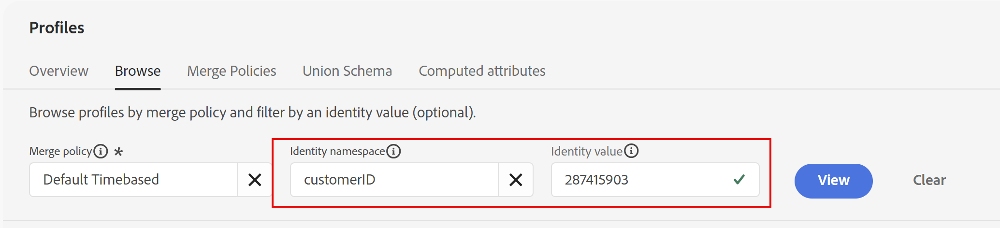
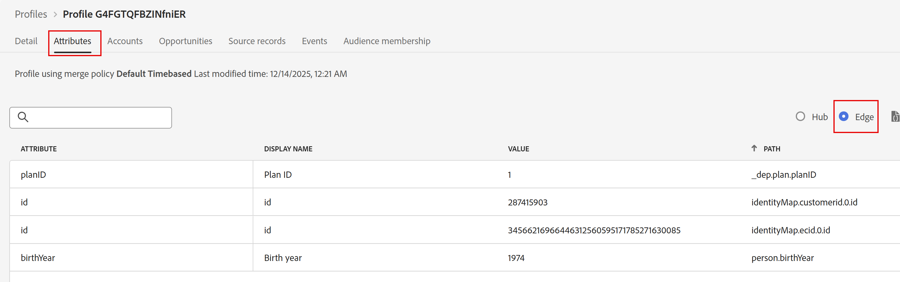

# Decisiones y CBE en acción

## Objetivo

Ahora que la Recorrido está activa, puede empezar a enviar eventos de experiencia y ver las ofertas devueltas. Dado que el año de nacimiento y los ID de plan de teléfono de los perfiles individuales afectan a la oferta que se devuelve, tenemos que enviar eventos de experiencia para perfiles preconfigurados con años de nacimiento específicos e ID de plan.

## Configuración de perfiles y Postman

Los tres perfiles que utilizará ya están en la zona protegida y se describen en esta tabla:

| Nombre | Apellidos | Año de nacimiento | ID de plan | customerID | ECID | Correo electrónico |
| ---------- | ------------ | ---------- | ------- | ---------- | -------------------------------------- | --------------- |
| Bob | Básico | 1974 | 1 | 287415903 | 34566216966446312560595171785271630085 | bob\@dep.com |
| Peter | Profesional | 1981 | 2 | 105946728 | 22344522145769262754334953788432801285 | peter\@dep.com |
| Úrsula | Ultimate | 2002 | 3 | 730682145 | 35615467908312308343036144243711275069 | ursula\@dep.com |

Localice estos perfiles en AEP

1. Si es necesario, expanda el elemento **Customer** en el carril izquierdo y haga clic en **Perfiles**
1. Haga clic en la ficha **Examinar** y, entre todos los perfiles que ya se han creado para usted o que ha creado como parte de laboratorios anteriores, verá estos tres perfiles.

   Busque los eventos de experiencia correspondientes para cada perfil en la colección Postman

1. Si es necesario, abra Postman
1. Asegúrese de que las variables de entorno **EDGE\_REGION** y **DATASTREAM\_CONFIG** sigan configuradas. Si es necesario volver a configurarlos, revise los pasos en el laboratorio &quot;Importar entorno y colección&quot;.
1. Expanda la carpeta **Decisioning Lab**. Para cada perfil, ve dos eventos de experiencia:

## Envío de eventos de experiencia

>[!IMPORTANT]
>
>No omita la explicación de apertura de texto de esta sección.

Con un tiempo y recursos ilimitados, le pediremos que cree e implemente una biblioteca de etiquetas con AEP Web SDK en un sitio web real. Esto demostraría cómo recuperar e informar sobre ofertas. Sin embargo, dada la gran amplitud y profundidad del contenido cubierto en estos laboratorios, hemos elegido crear previamente los eventos de experiencia necesarios para entrar en el Recorrido, recuperar ofertas e informar sobre ellas en una colección de Postman, en lugar de requerir que etiquete un sitio web. Cuando se utiliza correctamente, esta colección imita cómo un sitio etiquetado correctamente (o cualquier canal digital) utilizaría el canal de entrega CBE en un Recorrido.

El método recomendado para las implementaciones de AEP Web SDK es utilizar un método de dos llamadas por página. En este patrón, el SDK web envía una llamada de &quot;recuperación&quot; en la parte superior de la página a Edge para solicitar las personalizaciones necesarias para el usuario. Estas personalizaciones las devuelve Edge y luego las procesa Web SDK. A continuación, se envía a Edge una segunda llamada al final de la página, generalmente denominada llamada de recopilación de datos, que informa sobre lo que se ha mostrado al usuario final, junto con otros datos para Analytics, CJA y otras soluciones. Cuando se trata de recuperar propuestas de Edge, recuerde un mnemotécnico simple: FAR, que significa Recuperar, Aplicar e Informe. Todas las propuestas deben recuperarse, aplicarse o procesarse (se deben mostrar al usuario final) y, a continuación, notificarse. Es fundamental que se informe de que estas ofertas se han visto para que funcionen las reglas de restricción de frecuencia.

Las actividades de Adobe Target y el canal web de AJO pueden obtener sus respuestas y aplicarlas automáticamente desde AEP Web SDK. Sus informes también se pueden enviar con la llamada de recopilación de datos en la parte inferior de la página. Sin embargo, los CBE son diferentes. AEP Web SDK puede recuperar las propuestas, pero depende del cliente aplicar (procesar) lo que se devuelva y, a continuación, utilizar AEP Web SDK para informar sobre lo que se ha mostrado. Un CBE no suele utilizar las llamadas de recopilación de datos para informar sobre lo que se mostró, por lo que deben pasarse manualmente.

En la colección Postman, verá que cada perfil tiene dos llamadas de Experience Event

Un evento de experiencia de búsqueda superior de página

Evento de experiencia de recopilación de datos en la parte inferior de una página

El evento de experiencia principal de página incluye el parámetro &quot;jsonOfferContainer&quot; en la solicitud, que es la &quot;Ubicación en la página&quot; que configuró para el CBE. Además, esta llamada utiliza la funcionalidad de script de Postman para obtener la respuesta de Edge y, a continuación, enviar inmediatamente una segunda llamada al sistema de informes de Edge en la que se indica que la oferta se ha mostrado al usuario final. No hay ninguna aplicación real ni representación de la oferta porque no hay ningún sitio web para este laboratorio. Pero desde la perspectiva de AJO, la oferta fue devuelta y luego reportada como vista.

La llamada de recopilación de datos page bottom se realiza únicamente con el fin de generar una vista de página para la página de información general de iPhone 17. Recuerde que el segmento para entrar en el propio Recorrido requiere 3 vistas de esta página. Una vez que el evento de experiencia se haya enviado tres veces, ese usuario entrará en el Recorrido y, a continuación, solo se necesitará el evento de experiencia de búsqueda principal de página para obtener la oferta y notificar que se vio.

Empiece con el perfil de Bob.

1. Haga clic en la solicitud **Bob - Recopilación de datos de la parte inferior de la página**.
2. Haga clic en la ficha **Body** y observe los parámetros que se están pasando, como el área de nombres customerID en IdentityMap, que indicaría que está autenticado, así como el parámetro &quot;web.webPageDetails.name&quot; que pasa el nombre de página de &quot;phones\:apple\:iphone 17\:overview&quot;.

   

3. Haga clic en **Enviar** en la esquina superior derecha para enviar una vista de página. Recibe una respuesta similar a esta

   

4. Una vez que hayas recibido la respuesta adecuada, vuelve a hacer clic en **Enviar** para reenviar el mismo evento Page bottom por segunda vez. Espere unos segundos y, a continuación, envíe una tercera llamada de recopilación de datos para el perfil de Bob. Ha enviado un total de 3 llamadas al final de página.

   En este punto, el sistema está procesando esas visitas y añadiendo Bob al segmento de streaming &quot;Profundo: Interesado en iPhone 17&quot;. Una vez hecho esto, Bob es puesto en el Recorrido. Una vez en el Recorrido, la entrada de Bob al Recorrido y al segmento tarda solo unos minutos en proyectarse en la tienda de perfiles de Edge para Bob.

5. Vuelva a la interfaz de usuario de AJO y haga clic en **Perfiles** en el carril izquierdo, seguido de la pestaña **Examinar**.
6. Busque el perfil de Bob usando el área de nombres **customerID** con el valor **287415903**.

   

7. Haz clic en **Ver** para abrir el perfil de Bob (el color del perfil de Bob puede ser diferente al que se muestra en la captura de pantalla).

   

8. Una vez que se abre el perfil de Bob, haga clic en la ficha **Pertenencia a la audiencia** y verá que Bob es ahora miembro del segmento &quot;Profundo: Interesado en iPhone 17&quot;, al menos desde la perspectiva de AEP Hub.
9. Haz clic en **Atributos,** y luego selecciona el botón de opción **Edge** para cambiar a la vista de Edge.

   

   >[!WARNING]
   >
   >Hay un error de interfaz de usuario desafortunado que requiere que haga clic en la pestaña Atributos para cambiar el botón de opción a Edge.

10. Vuelva a hacer clic en **Suscripción a audiencia,** y, si realizó estos pasos con la rapidez suficiente, verá que Edge está seleccionado y muestra que Bob no es miembro de audiencia

1. En una nueva pestaña del explorador, vaya al Recorrido que ha creado y haga clic en él. Verá que un perfil ha entrado en la Recorrido y ahora está en el nodo CBE.

   

   En este punto, Bob ha entrado en el Recorrido y la proyección de Edge está montando una proyección que actualiza el perfil de Bob en Edge.

1. Cambie a Postman y haga clic en la segunda de las llamadas de evento de experiencia de Bob, **Bob - Page Top Fetch.**
1. Haga clic en **Enviar**. ¿Qué debería suceder?
   - Si el perfil de Edge de Bob aún no se ha actualizado, obtendrá una respuesta muy similar a la que obtuvo de la llamada de recopilación de datos. Si este es el caso, espere uno o dos minutos más y vuelva a intentar enviar la llamada de búsqueda superior de la página de Bob.
   - Si se actualizó el perfil de Edge de Bob, recibirá una respuesta con el JSON configurado anteriormente, junto con información adicional utilizada para la creación de informes. Pero antes de continuar, ¿qué oferta de iPhone 17 debería ofrecerse a Bob?

     Bob nació en 1974, más que en 1966, por lo que se habría clasificado para el segundo criterio de fórmula de clasificación, y sus puntuaciones de prioridad de ofertas genéricas, base y profesionales se habrían multiplicado por 100, lo que daría a esas ofertas puntuaciones de 100, 200 y 300, respectivamente. Sin embargo, Bob Basic tiene un ID de plan 1, por lo que no cumple los requisitos para las ofertas de nivel Ultra o Pro gracias a la regla Decision. Por lo tanto, se mostraría la oferta de Nivel base, que tiene una puntuación de 200. Puede ver lo siguiente en la respuesta (probablemente tenga que desplazarse hacia abajo):

   

1. Recuerde que esta solicitud de Postman envía automáticamente una notificación de visualización para esta oferta, de modo que AJO ya ha registrado al menos una impresión para esta oferta. Vuelva a hacer clic en **Enviar** para enviar una segunda impresión. Compruebe que se ha devuelto la oferta base.
1. Recuerde que se aplica un límite de frecuencia de 3 impresiones a los modelos de nivel Base, Pro y Ultra. Haz clic en **Enviar** por tercera vez para obtener una tercera respuesta con el nivel base y registrar otra impresión.
1. Haz clic en **Enviar** por cuarta vez y ¿qué debería suceder? Se alcanza el límite de frecuencia de la oferta de nivel base y recibe la oferta genérica en la respuesta:

   

1. Vuelva a hacer clic en **Enviar** y verá la oferta de nivel genérico. Puede hacer clic en Enviar 100 veces más y recibirá la misma oferta hasta el día siguiente, cuando se restablezca el límite de frecuencia.

   >[!WARNING]
   >
   >Recuerde que en AJO, el día se restablece a medianoche GMT. Si enviara otra llamada de recuperación después de la medianoche GMT, vería la devolución de la oferta de nivel base.

1. Vuelva a la interfaz de usuario de Journey Orchestration y haga clic en el Recorrido **iPhone 17 Abandonar exploración** que creó. Como el Recorrido está activo y publicado, empieza a ver estadísticas. Verá que 1 perfil ha entrado en la Recorrido y se encuentra actualmente en el nodo CBE.

>[!NOTE]
>
>En este punto, es posible que se esté preguntando por qué el perfil no está en el nodo de espera. Una vez que llegó al nodo de CBE y proyectó las actualizaciones al perfil de Edge de Bob, ¿debería estar en el nodo de espera? La respuesta corta es que podría ser, pero... uno también podría argumentar que ya que el CBE está siendo devuelto activamente, entonces es donde Bob está en este Recorrido. Pero después de 3 días, el Recorrido mostrará que el perfil ha completado el Recorrido sin estar nunca en el nodo de espera.

## Envío de eventos de experiencia para otros perfiles

Ahora que ha visto al Recorrido trabajando para el perfil de Bob, hay otros dos perfiles que probar.

1. Vuelva a Postman y busque los eventos de experiencia para Peter y Ursula.
2. Ejecute el evento &quot;Recopilación de datos del final de la página&quot; 3 veces para cada perfil, recordando proporcionar de 1 a 3 segundos entre cada solicitud de envío/recopilación de datos.
3. Espere un par de minutos para que los tres perfiles cumplan los requisitos para el segmento de flujo continuo, introduzca el Recorrido y, a continuación, haga que el CBE proyecte sus perfiles de Edge.
4. Envíe la llamada de búsqueda superior de página tantas veces como sea necesario para comprobar que las reglas de decisión y las fórmulas de clasificación funcionan según lo esperado.

   **Perfiles de decisión: comportamiento esperado**

   | Nombre | Apellidos | 1.ª oferta | 2.ª oferta | 3.ª oferta | 4.ª oferta |
   | ---------- | ------------ | --------- | --------- | --------- | --------- |
   | Bob | Básico | Base | Genérico | Genérico | Genérico |
   | Peter | Profesional | Pro | Base | Genérico | Genérico |
   | Úrsula | Ultimate | Ultra | Pro | Base | Genérico |

5. Una vez finalizado, vuelva al Recorrido. Verá que los 3 perfiles han entrado en la Recorrido y están en el nodo CBE.

>[!NOTE]
>
>Si tuviera que esperar tres días y volver a enviar la parte superior de la búsqueda de páginas, vería que no se devolvió ninguna oferta y que los tres perfiles habían finalizado el Recorrido

## Resumen

En esta última página del laboratorio, pasó a la fase de ejecución, en la que probó la configuración de decisión mediante eventos de experiencia y un canal de experiencia basada en código (CBE). Postman se ha utilizado para enviar eventos de experiencia simulados a Adobe Journey Optimizer para lo siguiente:

- Los perfiles han introducido el recorrido que ha creado porque cumplen los criterios del segmento de flujo continuo.
- El canal CBE se invocó con eventos de recuperación para obtener decisiones de oferta basadas en datos de perfil (año de nacimiento, plan telefónico, etc.).
- Las ofertas se devolvían y se contabilizaban teniendo en cuenta los límites de frecuencia según la configuración, lo que mostraba cómo afectaban las distintas reglas y lógica de clasificación a la oferta entregada.
- Ha verificado que la restricción de frecuencia y la idoneidad funcionaban según lo esperado al enviar repetidamente llamadas de recuperación de ofertas.

Ha ejecutado llamadas de decisiones reales y ha validado que las reglas de elegibilidad, la fórmula de clasificación y la configuración de ofertas se comportan correctamente cuando los perfiles interactúan con el motor de decisión.
