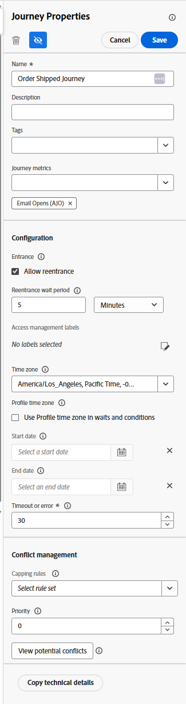
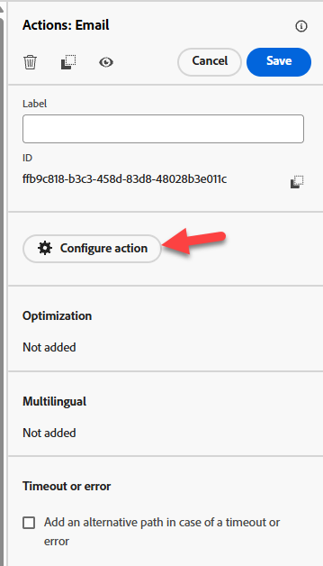
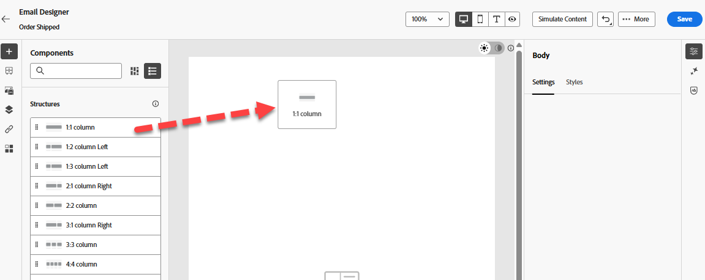
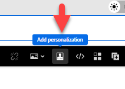
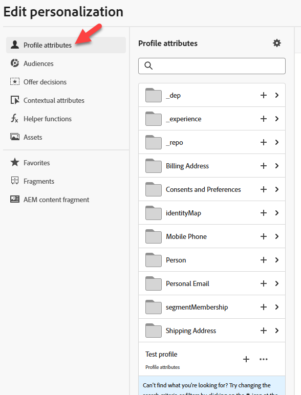
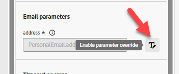
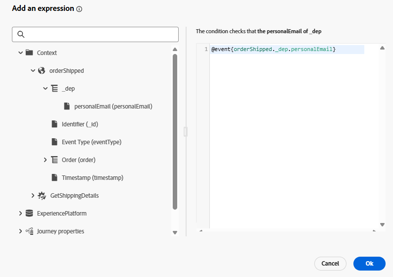

# Generar recorrido

## Objetivo de aprendizaje

Cree un recorrido unitario que comience con el evento de envío de pedidos configurado, obtenga el ETA de un servicio externo y envíe un correo electrónico.

## Crear recorrido

Vaya a **Recorridos** y haga clic en **Crear Recorrido - Crear desde cero**


## Propiedades del recorrido

1. Actualice las Propiedades del Recorrido en el carril derecho con lo siguiente:
   - **Nombre**: `Order Shipped Journey`
   - **Descripción**: `Notify customer that order has shipped. Include shipping details.`
   - **Etiquetas**: `Default`
   - **métricas de Recorrido**: *dejar en blanco*

     >[!NOTE]
     >
     >**Lista desplegable vacía?**
     >
     >No te preocupes y sigue adelante. El primer recorrido creado en una zona protegida necesita &quot;cebar la bomba&quot;.  Una vez que publiquemos el recorrido, esta lista desplegable tendrá opciones para elegir.

   - **Permitir la reentrada**: `checked`

   - **Período de espera de reentrada:** `5 minutes`

   - **Etiquetas de acceso**: *dejar en blanco*

   - **Zona horaria**: `Your Local timezone`

   - **Usar zona horaria del perfil en esperas y condiciones**: `NOT checked`

   - **Fecha de inicio/finalización**: *dejar en blanco*

   - **Tiempo de espera o error**: `30`

   - **Reglas de límite:** *dejar en blanco*

   - **Prioridad**: `0`


2. Si todo parece correcto, haga clic en el botón **Guardar**




## Lienzo del recorrido

### Añadir un evento unitario

En el panel izquierdo, debajo del **menú Eventos**, arrastre y suelte el evento **orderShipped** en el lienzo, como se muestra a continuación


### Añadir una acción personalizada

1. Si el panel izquierdo expande el **menú Acciones** y, a continuación, arrastra y suelta en el lienzo la acción que creó denominada **GetShippingDetails** después del evento orderShipped

   

2. En el carril derecho, en la lista desplegable Configuración de acceso y privacidad —> Acción de marketing, asegúrese de que el valor esté establecido en **Ninguno**

   

3. En la configuración de punto de conexión —> Parámetros de consulta, haga clic en el **icono de lápiz** junto a id de pedido

   

4. En el modal que aparece expanda **Contexto** -> **pedido enviado** -> **Pedido** y, a continuación, seleccione **ID de pedido (orderID)** y haga clic en **Aceptar**

   

5. En el carril derecho, asegúrese de que la opción Tiempo de espera o Error esté **desmarcada** y luego haga clic en el **botón Guardar**


### Añadir acción de correo electrónico

1. En el menú Acciones, arrastre y suelte la acción **Action** en el lienzo después de la acción GetShippingDetails

   

2. Seleccione **Correo electrónico** para la acción de marketing y después **Agregar**.

   

3. En el carril derecho, haga clic en **Configurar acción**

   

4. estableció **Configuración del canal de correo electrónico** en `Profile-Email` y luego hizo clic en **Editar contenido**


### Añadir contenido del cuerpo del correo electrónico

Para el contenido, va a mantener las cosas simples. Como estúpido simple.

1. Actualice la línea de asunto a `Order Shipped` y luego haga clic en el **botón Editar cuerpo del correo electrónico**

   

2. En la barra superior, haz clic en el bloque de contenido **Diseñar desde cero**

   

3. En la barra izquierda debajo del contenedor Estructura, arrastre y suelte la columna **1:1** en el lienzo

   

4. A continuación, bajo el contenedor Contenido, arrastre y suelte el componente **Texto** en la columna **1:1**

   

5. Haga clic en el componente Texto y **elimine el texto actual** y, a continuación, haga clic en el icono **Agregar Personalization**

   

6. En el carril izquierdo, haga clic en la carpeta **Atributos contextuales**, navegue por **Journey Orchestration** -> **Acciones** y seleccione **GetShippingDetails**

   

7. En el cuerpo principal del correo electrónico ahora **copia y pega** el siguiente JSON en el **editor de Personalization**

   ```json
   {{profile.person.name.firstName}}, your order has shipped
   ETA:
   Tracking Number:
   ```

8. Agregue los campos personalizados de la siguiente manera (**haga clic en el signo más &quot;+&quot; situado junto al campo en el carril izquierdo**):
   - **ETA:** `eta`
   - **Número de seguimiento:** `tracking_number`

   

   >[!NOTE]
   >
   >Haga clic en **+ símbolo** para agregar atributos de personalización del carril al lienzo.  Los colocará donde está el cursor para garantizar que esté &quot;alineado&quot; apropiadamente

   >[!NOTE]
   >
   >Su correo electrónico utilizará una combinación de atributos de contexto (ETA y número de seguimiento) y atributos de perfil (nombre). Si desea agregar otros atributos de perfil, puede hacer clic en la pestaña Atributos de perfil y seleccionar cualquier cosa que vea.
   >
   >

9. En la parte inferior de la pantalla, haga clic en el botón **Validar** y compruebe que no hay errores

   

10. Si todo parece correcto, haga clic en el **botón Guardar** en la parte superior derecha
11. A continuación, vuelva a hacer clic en el botón **Guardar** en la parte superior derecha y haga clic en la flecha **\&lt;- izquierda** en la parte superior izquierda


1. Finalmente, haga clic en el icono **\&lt; Atrás** en la parte superior izquierda para volver al lienzo de Recorrido


>[!TIP]
>
>Y luego haz clic de nuevo en el botón **Atrás**... ¡Bromeando! Ese es el último botón de retroceso...en esta sección 😜


### Anular parámetros de correo electrónico

Cuando vuelva al lienzo del Recorrido principal, en el nodo Correo electrónico, asegúrese de que puede ver los campos de solo lectura (puede que tenga que hacer clic en el icono **Mostrar campos de solo lectura**)


1. Desplácese hacia abajo hasta **Parámetros de correo electrónico** y haga clic en el icono **Habilitar anulación de parámetros**

   

2. Haga clic en el cuadro de texto vacío y, a continuación, en el carril izquierdo para explorar en profundidad **Contexto** -> **orderShipped** -> **\_dep** y haga clic en el campo **personalEmail**.  Luego haga clic en el **botón Aceptar**

   

   >[!WARNING]
   >
   >Es peligroso hacerlo, evite utilizarlo a menos que lo necesite en un entorno de producción.  Esto anulará la ubicación predeterminada que Recorrido busca en el perfil para ejecutar los mensajes.


3. Haga clic en el **botón Guardar** en la parte superior derecha y, a continuación, haga clic en la **flecha hacia atrás** \&lt;- en la parte superior izquierda para **cerrar** el Recorrido


## Resumen

Un recorrido publicado que puede responder al déclencheur de eventos de pedidos enviados, obtener el ETA de un servicio externo y enviar un correo electrónico.
