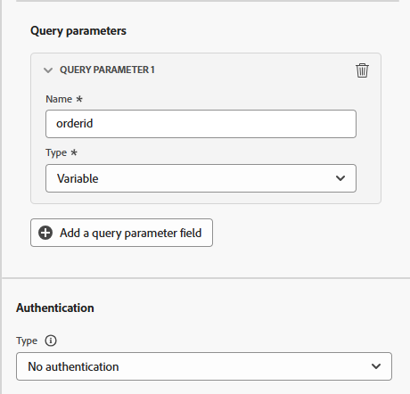

# Configurar la acción personalizada

## Objetivo de aprendizaje

Cree una acción personalizada que defina cómo se comunicará el recorrido con un extremo o servicio externo para obtener un ETA para el momento en que llegará el paquete.

## Navegar a acciones

En el carril izquierdo bajo el menú Administración, haga clic en **Configuraciones** y, a continuación, en el mosaico Acciones, haga clic en el botón **Administrar**


## Configurar la acción

### Nombre y detalles de la acción

1. En la esquina superior derecha, haga clic en el botón **Crear acción**

   

2. En el panel de configuración que aparece, actualice los siguientes valores básicos como se muestra a continuación:
   - **Nombre**: `GetShippingDetails`
   - **Descripción**: `Call third party to get Shipping ETA and Tracking Number`
   - **Tipo de acción**: `Custom`
   - **Canal**: `Email`
   - **Acción de marketing necesaria**: `Email Targeting`


### Detalles del extremo

En el área de Configuración de extremo, proporcione los siguientes detalles:

- **URL de extremo**: `https://api.mockaroo.com/api/67077bb0?count=1&key=a0dbce20`
- **Método**: `GET`
- **Encabezados:** *dejar tal cual*
- **Parámetros de consulta:**
  - **Nombre**: `orderid`
  - **Tipo**: `variable`

>[!NOTE]
>
>Una variable permite pasar un valor durante un recorrido frente a tener un valor estático para todos los recorridos

- **Tipo de autenticación**: `No Authentication`





### Detalles de carga de respuesta

Ahora debe proporcionar una carga útil de ejemplo para que la acción sepa cómo debería ser la carga útil de respuesta.

1. En el área Cargas útiles, haga clic en el **icono de lápiz** para abrir la pantalla Configuración de campo

   

   


2. **Copie y pegue** la siguiente carga útil en el cuadro Carga útil

   ```json
   {
    "eta": "11/19/2025",
    "tracking_number": "072000326"
   }
   ```

   >[!NOTE]
   >
   >Esta es la misma estructura JSON que el punto final de Mockaroo anterior debería devolver:


3. Se mostrará la carga útil de respuesta. Haga clic en el botón **Guardar**.


>[!NOTE]
>
>Puede dejar todo como una cadena, pero en la vida real probablemente desee actualizar esto para que coincida con el tipo de datos


### Prueba de la acción

1. Haga clic en el botón **Enviar solicitud de prueba** en el carril inferior derecho para comprobar que no ha estropeado nada 😀

   


2. Haga clic en la ficha **Parámetros de consulta** y actualice el valor de `orderId` a **123**

   


3. Haga clic en el **botón Enviar** y, si todo funciona bien, debería ver un código de respuesta de 200 y una vista previa de la carga útil, como se muestra a continuación...

   

   Vista previa

   ```json
   {
     "eta": "12/26/2025",
     "tracking_number": "063112249"
   }
   ```

   >[!WARNING]
   >
   >Si no ve una respuesta de 200 o una vista previa, no continúe. Levante su ✋ para obtener ayuda.


4. Haga clic en el botón **Cancelar** para volver a la pantalla Acción y, a continuación, desplácese hacia arriba en el carril superior derecho y haga clic en el botón **Guardar**

>[!TIP]
>
>¡Felicidades! La acción personalizada está activa, gracias a sus habilidades con Ctrl+C y Ctrl+V de nivel de experto.

## Resumen

Una acción personalizada reutilizable configurada en Adobe Journey Optimizer que toma un ID de pedido y devuelve el ETA y el número de seguimiento.
