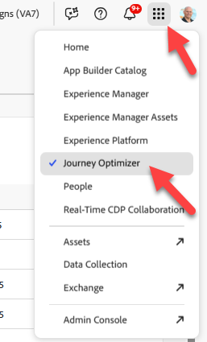

# Configurar evento

## Objetivo de aprendizaje

Cree y configure un evento que almacenará en déclencheur los recorridos de un cliente cuando se produzca la acción posterior a la compra (pedido enviado).

## Navegar a Journey Optimizer

En la esquina superior derecha del navegador, haz clic en **Cubo** y luego selecciona **Journey Optimizer**

## Configurar evento de envío de pedido

Para crear un Recorrido que utilice un Evento unitario, primero debemos configurar el evento.

1. En el carril izquierdo bajo el menú Administración, haga clic en **Configuraciones** y, a continuación, en el mosaico Eventos, haga clic en el botón **Administrar**

&#x200B;2. En la esquina superior derecha, haga clic en el botón **Crear evento**

&#x200B;3. Actualice la configuración del evento de la siguiente manera:
   - **Nombre** = `orderShipped`
   - **Tipo** = `Unitary`
   - **Tipo de id. de evento** = `Rule based`
   - **Esquema** = `dep: Orders v.1`

&#x200B;4. En el cuadro de entrada `Fields`, haga clic en el **icono de lápiz**

&#x200B;5. Seleccione los campos siguientes para agregarlos al evento y, cuando termine, haga clic en el botón **Aceptar**
   - `Event Type (eventType)`
   - `Order ID (orderID)`

>[!NOTE]
>
>Asegúrese de seleccionar únicamente el campo Id. de pedido y no todos los campos del pedido 😁

&#x200B;6. En `Event Id condition input`, haga clic en el **icono de lápiz**

&#x200B;7. **Arrastre** el campo `Event Type` al lienzo

&#x200B;8. En el cuadro de selección que aparece, busque y compruebe el valor titulado **orders.sent.** Luego haga clic en el botón **Aceptar**.

&#x200B;9. A continuación, actualice los dos últimos valores de Área de nombres e Identificador de perfil con los valores que se muestran a continuación:
   - **Espacio de nombres** —> `Email`
   - **Identificador de perfil** —> `personalEmail`

>[!NOTE]
>
>**¿Para qué se utilizan el área de nombres y el identificador de perfil?**
>
>Para cualquier recorrido que utilice un evento, debe especificar para ese evento qué área de nombres de identidad e identificador de perfil asociado se deben utilizar para buscar el perfil. Es importante entender que elegir una identidad sobre otra puede afectar cómo funcionará el recorrido.
>
>*Ejemplo rápido:*
>
>La carga útil de evento es una vista de página que contiene identidades como: ECID (identidad principal) e ID de cliente (opcional)
>
>- ECID elegido —> es probable que sea la primera vez que el servicio de identidad ve esta relación, por lo que cuando un recorrido reciba este evento, intentará buscar el perfil mediante el ECID y no encontrará ningún perfil.  ¿Por qué? La relación aún no existe entre ECID y el ID de cliente, y es probable que los rasgos del perfil se almacenen con el identificador conocido ID de cliente
>- ID de cliente elegido —> no es necesario rellenar esta identidad, y es probable que en la mayoría de las vistas de página esté vacía.  Por lo tanto, si se eligió esta identidad la única vez que se activaría un Recorrido es cuando hay una vista de página autenticada en la que se establece el ID de cliente.
>
>Respuesta breve: no hay una respuesta correcta, solo las compensaciones que debe hacer en función del caso de uso 😃

## Configuración final del evento orderShipped

Compruebe que la configuración final del evento coincida con lo siguiente.  Si todo parece correcto, haga clic en el botón **Guardar**

>[!TIP]
>
>Ha configurado su primer evento de AJO. ¡Choca esos cinco!

## Resumen

Un evento de envío de pedido configurado en Adobe Journey Optimizer que puede utilizarse como punto de entrada para un recorrido
