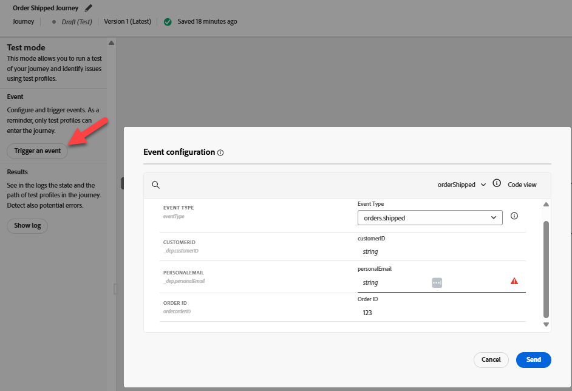
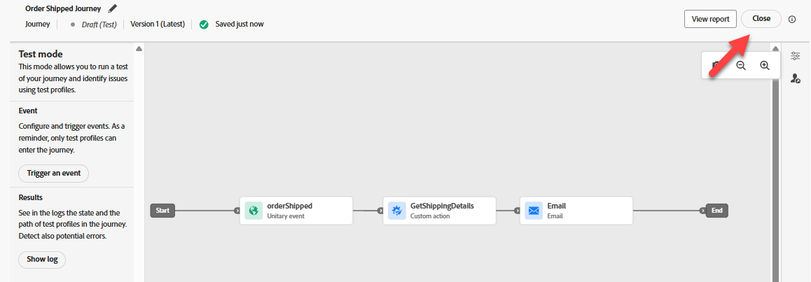
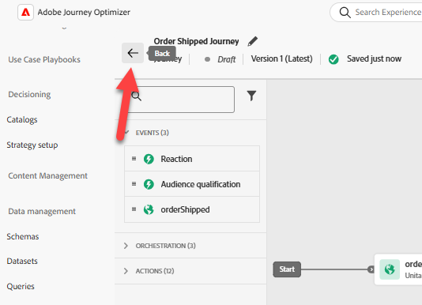

# Recorrido de prueba

## Objetivo de aprendizaje

Utilice las herramientas de prueba de recorrido para comprobar que el déclencheur de eventos y la lógica de recorrido están correctamente configurados.

## Prueba del recorrido

1. Haz clic en **Recorridos** en el carril izquierdo y en la **pestaña Examinar** si no ves una lista de Recorridos
2. Haz clic en el **Recorrido** para abrirlo
3. Haz clic en **Alertas** y asegúrate de que no haya errores (las advertencias son correctas)


>[!NOTE]
>
>**Qué es CJMMAS - 2001-200**
>
>Indica que falta el vínculo de no participación en una variante de correo electrónico

4. Haga clic en **Simular** y, en el lado izquierdo, seleccione **Modo de prueba**


>[!NOTE]
>
>Podría tomar un minuto para prepararse. Durante ese tiempo, el Déclencheur de un botón de evento no estará disponible.


5. Haga clic en **Déclencheur un evento** y rellene estas propiedades:
   - **Tipo de evento**: `orders.shipped`
   - **Correo electrónico personal**: `henry.creel@emailsim.io`
   - **Id. de pedido**: `123`
6. Haga clic en **Enviar** (tenga en cuenta que tarda unos segundos en responder después de hacer clic en enviar)



> [!WARNING]
>
>Algunos estudiantes tienen errores y necesitan enviar esto un par de veces. Es posible que tenga que hacer esto **varias** veces.
>
>**A veces** el primer envío genera un error de:
>
>**La entrada no existe (ID de referencia: 3216a850-c40d-11f0-8fa5-73d1522cc9a2)**
>
>Si recibes un error, haz clic en **Déclencheur de un evento** y luego **envía** de nuevo.  Es posible que tenga que hacer esto **varias veces**.


7. En **Resultados** -> Haga clic en **Mostrar registro** a la izquierda


> [!NOTE]
>
>Algunos alumnos que recibieron errores a veces reciben registros diferentes que muestran una matriz de instancias vacía `{"instances": []}`. Esto no es un bloqueador, continúe y pase al siguiente paso.

Debería ver algo similar a esto en el &quot;log&quot;:

>[!NOTE]
>
>Buscamos los campos clave utilizados: **actionsHistory**, **transitionsHistory**, **eta**, **tracking_number**, **eventType**, **personalEmail** y **orderID**.

```json
{
  "actionsHistory": {
    "8919055f-1b00-4a43-8bd6-c8af894474b2": {
      "eta": "11/27/2025",
      "tracking_number": "091204404",
      "jo_status_code": "http_200"
    }
  },
  "transitionsHistory": {
    "orderShipped (1158856989)": {
      "eventType": "orders.shipped",
      "_id": "joTestModeEvent_5abbfdcd-561d-45a7-ba42-d0640539831a",
      "_dep": {
        "personalEmail": "henry.creel@emailsim.io"
      },
      "order": {
        "orderID": "123"
      },
      "timestamp": "2025-11-17T23:30:49.576289372Z"
    }
  }
}
```


8. **Cerrar** el explorador **pestaña**
9. **Cerrar modo de prueba** en la parte superior derecha



10. Haz clic en **Publicar** el Recorrido en la parte superior derecha


11. **Cierre** el **Recorrido** haciendo clic en la flecha \&lt;- en la parte superior izquierda



A continuación, enviaremos un evento de envío de pedidos real a AEP

## Resumen

El recorrido ha superado la validación de configuración y está listo para recibir eventos
