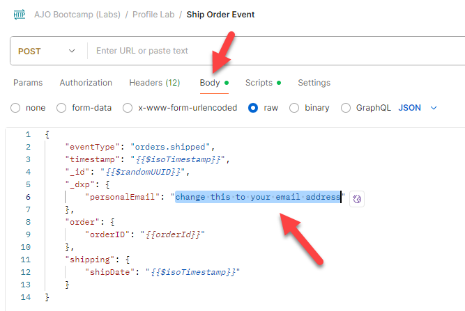

# Validar evento introducido

## Objetivo de aprendizaje

Confirme que el evento se ha ingerido correctamente en Adobe Experience Platform.

## Validar evento en el perfil

1. Vaya a sus **perfiles** y busque su perfil para ver que el evento se incorporó al perfil.  Aparece en segundos.
   - **Área de nombres de identidad** -> `email`
   - **Valor de identidad** -> `henry.creel@emailsim.io`
2. Haga clic en la ficha **Eventos**. Busque el evento `orders.shipped`.

   evento 

   >[!WARNING]
   >
   >¿Ha recibido algún evento **message.feedback**?  Estos son de Recorridos y suelen indicar un fallo o una exclusión.  Haga clic en ellos y observe `reason`.
   >
   >Algunos ejemplos que puede encontrar en la producción son los siguientes:
   >
   >- EmailNoAddressFoundInProfile (ha intentado enviar un correo electrónico a un perfil que no tenía un correo electrónico)
   >- EmailNoConsent (ha intentado enviar un correo electrónico a un perfil que tenía el consentimiento establecido en no.

3. Valide que el perfil se haya clasificado para las **audiencias** (puede tardar unos minutos).
   - Cualquier evento de Edge (en 15 minutos)
   - Cualquier flujo de eventos (en 15 minutos)

## Pruebe con su propio correo electrónico

Ahora que ha validado el perfil, envíe algunos eventos de pedidos enviados por correo electrónico.

1. Vuelva a Postman y busque el **Evento de envío de pedido**
2. haz clic en **Cuerpo** y cambia la **dirección de correo electrónico** por la tuya.

   

3. **Guardar** y pulsar **Enviar**.
4. Vuelva a los pasos 1-3 y valide con su dirección de correo electrónico.

## Resumen

El evento aparece en el almacén de perfiles y el perfil ahora forma parte de las audiencias que buscaban el evento.
