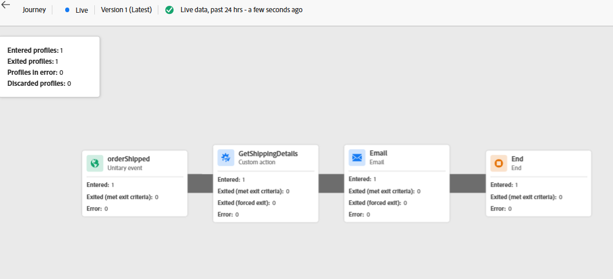
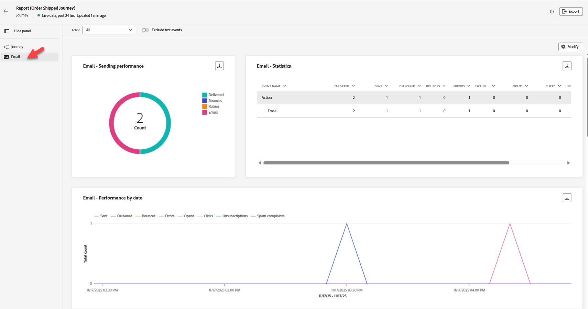

# Validar recorrido

## Objetivo de aprendizaje

Compruebe que el recorrido se ha activado y ejecutado según lo esperado.  Verifique que los informes muestren las métricas actualizadas según lo esperado.

## Comprobación del recorrido

1. Vaya al Recorrido de pedidos enviados y ábralo si lo ha cerrado
2. Se ven al menos 2 perfiles ingresados



&#x200B;3. Haga clic en **Ver informe** -> **Últimas 24 horas** en la parte superior derecha.
&#x200B;4. De manera predeterminada, se encuentra en la ficha **Recorrido** (en el carril izquierdo)
   - Verá algunas entradas y salidas (el recuento dependerá de cuántos eventos haya enviado, de cualquier prueba, de cualquier error, etc.)


Si todo ha salido limpio, tiene (desplácese hacia abajo para comprobarlo):

**Estadísticas de Recorrido**

3 perfiles ingresados (Henry, usted y la prueba que hicimos)

Puede hacer clic en el botón de alternancia en la parte superior para **excluir eventos de prueba** si lo desea y verá cambiar estos números

3 perfiles salientes (Henry, tú y la prueba que hicimos)

**Acciones ejecutadas y errores**

6 acciones (3 correo electrónico, 3 GetShippingDetails)

**Razones de error de acciones**

0 errores (con suerte)

**Eventos**

3 eventos (orderShipped)

3 Eventos externos

&#x200B;5. Haga clic en la ficha **Correo electrónico** (en el carril izquierdo)
   - **Correo electrónico: rendimiento de envío**
     - Verá algunos valores para **Delivered** y **Sent** (el recuento dependerá de cuántos eventos haya enviado, de cualquier error, etc.)
     - Con suerte, no tendrá errores (a menos que haya tenido algunos problemas anteriormente)
   - **Correo electrónico: estadísticas**
     - Correo electrónico: 3 destinatarios, enviados y entregados



&#x200B;6. Ve a comprobar tu **bandeja de entrada de correo electrónico** y ver si recibiste el correo electrónico (se parece a esto abajo)
   - *,* su pedido ha enviado ETA: *17/10/2026* Número de seguimiento: *051009364*

&#x200B;> [!NOTE]
>
>Compruebe la carpeta de correo no deseado para campañas de AJO [ajo-campaigns@email.dep-labs.com](mailto:ajo-campaigns@email.dep-labs.com)

>[!NOTE]
>
>**¿Por qué falta el nombre?**
>
>Hemos cambiado el nodo Correo electrónico para ver el Contexto del evento de la dirección de correo electrónico.  Sin embargo, el nombre en la personalización se obtiene de \{\{profile.person.name.firstName\}\}.
>
>Cuando buscas tu perfil para tu correo electrónico, ¿tienes un nombre?


&#x200B;7. *Después de 30 a 60 minutos*, incluso puede comprobar su conjunto de datos en el lago de datos con lo siguiente: **Consultas** -> **Crear consulta** -> **Copiar/Pegar SQL** -> **Ejecutar**

>[!NOTE]
>
>El evento de pedidos enviados se transmitió en streaming, por lo que, aunque actualizó el perfil rápidamente, transcurre un tiempo antes de que se actualice el lago de datos.

```sql
SELECT * FROM dep_orders
WHERE timestamp >= CURRENT_DATE
LIMIT 10
```


## Bonificación (comprobar eventos de paso)

>[!NOTE]
>
>Eventos de paso registra cada vez que un perfil inicia un recorrido y cada paso del recorrido. Nota: estos eventos pueden tardar unos minutos en registrarse en el conjunto de datos.


1. En el servicio de consultas, puede ver qué captura el conjunto de datos de eventos de paso ejecutando este SQL. Copie el siguiente SQL y péguelo en una consulta.

```sql
select timestamp,
  identityMap,
  _experience.journeyOrchestration.stepevents.journeyVersionName,
  _experience.journeyOrchestration.stepevents.NodeName,
  _experience.journeyOrchestration.stepevents.*
  from journey_step_events
limit 50
```

Los resultados tienen más de 100 columnas y le dan una idea de qué registros de eventos de paso.

>[!NOTE]
>
>Si desea saber qué significa cada campo, consulte el diccionario de esquemas de AJO y cambie la lista desplegable al esquema de eventos de pasos de Recorrido: [https://experienceleague.adobe.com/tools/ajo-schemas/schema-dictionary.html?lang=en](https://experienceleague.adobe.com/tools/ajo-schemas/schema-dictionary.html?lang=en)


## Resumen

La instancia de recorrido aparece en los informes o registros de recorrido y se ejecuta la acción configurada
