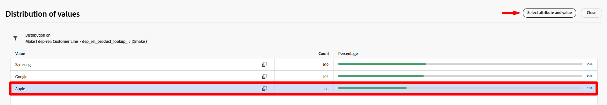
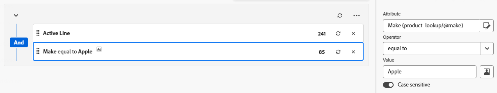
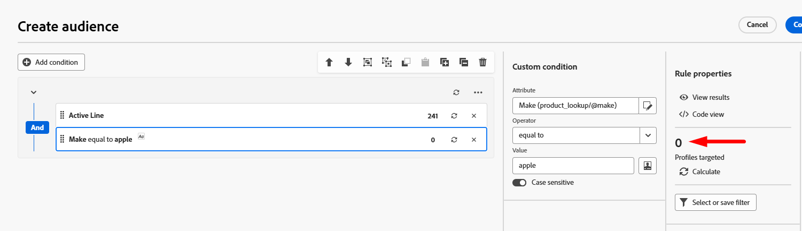

# Crear una audiencia

## Objetivo

En los siguientes pasos creará la audiencia a la que desea dirigirse para la campaña, que son todos los titulares de líneas activos que tienen una marca que coincide con el teléfono insignia que se está lanzando.  El objetivo es este grupo al que quieres dirigirte con un mensaje SMS que les anime a actualizar sus teléfonos.

## Añadir actividad Generar audiencia

1. En el lienzo, haga clic en **+ símbolo** y, a continuación, seleccione la actividad **Generar audiencia** para agregarla al flujo de trabajo

2. En el carril derecho, verá las propiedades Generar audiencia. Actualice Label para que indique lo siguiente: `Active Lines with Apple`

## Seleccionar dimensión de segmentación

El siguiente paso es seleccionar **Targeting dimension** (es decir, qué tabla desea consultar). Siga estos pasos:

1. Haga clic en el **icono de búsqueda** en el cuadro Dimensión de segmentación

2. En la ventana emergente, busque y seleccione la tabla denominada **dep-rel: Customer Line** y, a continuación, haga clic en el botón **Confirmar**.

>[!NOTE]
>
>Recuerde siempre la **dimensión de segmentación** de cada audiencia que cree. Aprenderá su importancia en los siguientes pasos.

>[!NOTE]
>
>si alguna vez selecciona un esquema creado por Adobe, verá que el esquema empieza por -> *(caas)*. Este es solo un área de nombres aplicada a las tablas dentro del almacén relacional y significa Campaign as a Service :)

## Crear audiencia

Ahora que ha seleccionado la dimensión de segmentación (qué esquema relacional va a consultar), puede empezar a crear la definición.

1. En el carril derecho, haga clic en el botón **Crear audiencia**

2. Haga clic en el botón **Agregar condición**

## Crear condición(s)

Ahora es el momento de escribir la lógica de la audiencia utilizando los atributos encontrados en el esquema. El objetivo es encontrar todas las líneas de clientes activas y que utilizan una marca de Apple.

### Crear #1 de condición

1. Establezca la condición con la siguiente información:
   - **Atributo**: `Active Line`
   - **Valor**: `true`

2. Haga clic en el icono **Actualizar** para ver los recuentos correspondientes de la condición.

>[!TIP]
>
>Verá un resultado de 241 si ha creado la condición correctamente

### Crear #2 de condición

1. Haga clic en el botón **Agregar condición** y seleccione el esquema **dep-rel:** **Product \[Lookup]** haciendo clic en el icono **>**

![Seleccione el esquema dep-rel: [Consulta] del producto haciendo clic en el icono >](assets/build-an-audience-select-product-lookup-schema.png)

2. Busque el campo llamado **Make**, haga clic en los tres puntos y seleccione **Distribución de valores**

3. Tenga en cuenta los distintos valores. Solo desea `Apple` y, afortunadamente, no tiene 100 ortografías diferentes. Haga clic en el **campo Apple** para seleccionarlo y luego haga clic en el **botón Seleccionar atributo y valor** en la esquina superior derecha.

>[!NOTE]
>
>Este es un ejemplo excelente de dónde debería haber diseñado el arquitecto de datos el esquema con enumeraciones.  De este modo, un experto en marketing no tiene que seleccionar/escribir manualmente el valor.  ¡Qué vergüenza el arquitecto de datos!

4. El campo `Make` se agrega automáticamente junto con las condiciones que se muestran a continuación.
   - **Operador:** `Equal to`
   - **Valor:** `Apple`
   - **Distinción entre mayúsculas y minúsculas:** `Enabled`

5. Haz clic en el **icono de cálculo** y verás 85 como resultado.

>[!NOTE]
>
>Observe el uso del operador AND en el grupo. Tanto si lo crea en un solo grupo como si se muestra o en varios grupos, el AND es importante porque indica a las campañas orquestadas que ambas condiciones deben ser verdaderas.

## Verificar recuentos

1. Haga clic en el **icono de cálculo** que se encuentra en el carril derecho bajo el encabezado Perfiles segmentados para obtener una estimación exacta del tamaño de la audiencia. Ve **65** como el **recuento final**.

>[!NOTE]
>
>Observe cómo cada condición individual devolvió un número diferente (condición #1 —> 241 y condición #2 —> 85), pero el tamaño final de la audiencia fue el menor de los dos requisitos.  Esto se debe a ese operador AND.

2. Si ve el recuento final de **65**, haga clic en el botón **Confirmar** en la parte superior derecha de la pantalla y, a continuación, haga clic en el botón **Guardar** en la parte superior derecha para guardar el trabajo.

## Desafío

Supongamos que durante un momento escribió la última condición, de modo que `Make` era igual a `apple` (en minúsculas) y que dejó la opción de configuración para `Case sensitive` alternó `on`.  Esto haría que el recuento de registros de condiciones fuera igual a 0.  Así que tendríamos 241 líneas activas y 0 donde la marca es manzana.

**¿Cuál sería el tamaño final de la audiencia en este caso?**

## Respuesta

No es nada. ¿Sabes por qué?

## Resumen

Ha creado correctamente su primera audiencia y ahora debería ver lo fácil que es desarrollar y validar sus recuentos dentro de la actividad Generar audiencia.

