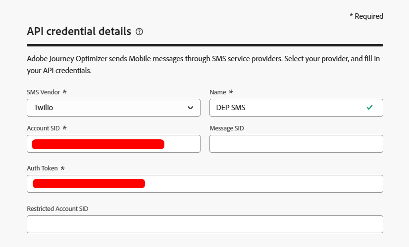
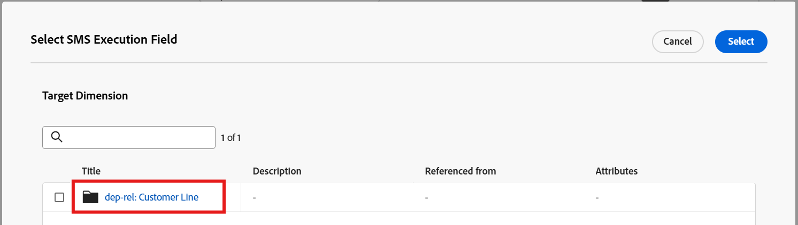

# Configuración del canal SMS

## Objetivo

En el siguiente conjunto de pasos configurará el canal SMS. Esto es necesario para poder enviar mensajes a los titulares de línea individuales más adelante cuando esté creando la campaña.

## Navegar a canales

1. En Adobe Journey Optimizer, vaya al menú **Administración** -> **Canales**.
1. Seleccione **Configuración de SMS** → **credenciales de API**.
1. Haga clic en **Crear credencial de API**.

## Defina las credenciales de la API de SMS

Empezará creando el conector de API que AJO utilizará para enviar solicitudes de SMS salientes.

1. En Proveedor de SMS, elija **Twilio**.
1. Escriba los siguientes detalles de credenciales de API, usando su propia [cuenta de prueba de Twilio](https://www.twilio.com/try-twilio):
   - **Nombre:** `DEP SMS`
   - **SID de cuenta:** encontrado en su tablero de la consola Twilio
   - **Se encontró el token de autenticación:** en el panel de la consola Twilio (haz clic en **Ver** para mostrarlo)
1. Haga clic en **Enviar** para registrar la credencial de la API

>[!NOTE]
>
>Necesitarás una cuenta de prueba gratuita de Twilio con un número de teléfono verificado antes de comenzar este paso. Regístrese en [twilio.com/try-twilio](https://www.twilio.com/try-twilio) y busque el SID de cuenta y el token de autenticación en el panel de la consola de Twilio.

## Creación de configuración de canal SMS

Ahora asignará esta credencial de API a una configuración de canal que puedan utilizar los recorridos y las campañas.

1. Vaya a **Canales** → **Configuración general** → **Configuraciones de canal**.

&#x200B;2. Haga clic en **Crear configuración de canal**.

&#x200B;3. Complete los Ajustes de configuración de canal SMS con los siguientes valores:
   - **Nombre:** `Relational-SMS-Multi-Entity`
   - **Canal:** `Mobile Message`
   - **Acción de marketing:** `SMS Targeting`

&#x200B;> [!NOTE]
>
>Si aparece un error que indica que el usuario no tiene permiso, ignórelo y continúe.

## Configuración de SMS

Al seleccionar Canal como Mensaje móvil, aparece una nueva sección llamada Configuración de SMS. Rellénelo con los siguientes detalles:

- **Tipo de mensaje móvil:** `Marketing`
- **Configuración de mensaje móvil:** `DEP SMS`
- **Número de remitente:** `01234567890`
- **Subdominio:** `leave blank`
- **Número de exclusión:** `leave blank`

## Detalles de ejecución

1. En Detalles de ejecución, haga clic en la ficha **Campaña organizada**

&#x200B;2. Asegúrese de que la casilla de verificación **Habilitado** esté marcada

&#x200B;3. A continuación, en la subsección **Dimensión de ejecución**, asegúrese de que las siguientes opciones estén configuradas de la siguiente manera:
   - **Enviar mensaje por:** `Target + Secondary Dimension`
   - **Dimension de destino de perfil:** `dep-rel: Customer Account - customer_id`
   - **Dimension secundario:** `Customer Line`

>[!NOTE]
>
>Esto le indica a las campañas orquestadas que cuando envía mensajes, debe enviar un mensaje por registro que coincida con el Dimension de destinatario del perfil.

&#x200B;4. Bajo el encabezado Dirección de ejecución, asegúrese de seleccionar el botón de opción de **Dimension secundario** y, a continuación, haga clic en el botón de edición en el **Campo de ejecución de SMS**

&#x200B;5. En el elemento emergente, haga clic en el esquema **dep-rel: Customer Line** y seleccione **Teléfono móvil**.

&#x200B;6. Confirme las coincidencias de la sección Detalles de ejecución final a continuación

## Enviar y revisar

1. Puede hacer clic en el botón **Enviar** para completar la configuración y ver cómo aparece un mensaje de éxito

&#x200B;2. En la página de inventario de configuraciones de canal, asegúrese de que el estado se muestre como **Activo** antes de continuar

>[!CAUTION]
>
>Espere hasta que el estado se convierta en **Activo**; de lo contrario, los pasos de laboratorio futuros fallarán miserablemente para usted

&#x200B;3. Cuando el estado se active, estará completo.

>[!TIP]
>
>🚀 ¡Booyah! Su canal SMS ya está activo y listo para la acción.

## Resumen

Ya ha visto cómo configurar correctamente un canal SMS.  Tenga en cuenta que este es un SMS basado en API, por lo que según el proveedor pueden utilizar métodos alternativos para la autenticación.

Puede leer más [aquí](https://experienceleague.adobe.com/es/docs/journey-optimizer/using/channels/sms/configure-sms/sms-configuration) si está interesado.
