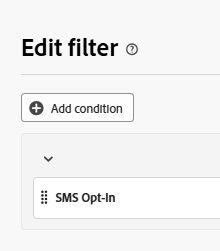
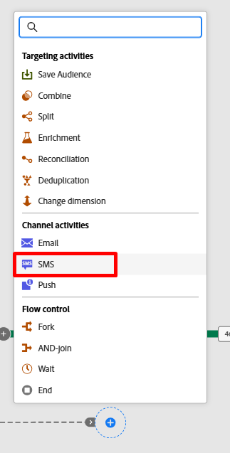

# Filtrar las líneas

## Objetivo

En el siguiente conjunto de pasos va a filtrar todas las líneas que realmente no pueden segmentarse con un mensaje SMS debido a su exclusión en el nivel de línea.  No puede confiar en el consentimiento del perfil aquí porque es un destinatario de nivel de línea.

## Configuración de la actividad División

1. Haga clic en el icono **+** en la transición inferior de la actividad Bifurcación y seleccione la actividad **Dividir** en la ventana emergente.

   

2. En el carril derecho, actualice Label para que indique lo siguiente: `Filter out opt'd out lines`

   

3. En el carril derecho, expanda la sección del segmento predeterminado **Subconjunto** y haga clic en el botón **Crear filtro**

   

4. Añada una condición para asegurarse de eliminar todas las líneas de cliente que no están incluidas en los mensajes SMS y, a continuación, haga clic en **Confirmar**.

   

   >[!NOTE]
   >
   >Debe averiguar cómo crear la condición, pero el resultado final coincide con la captura de pantalla anterior.  ¡Lo tienes!

5. Haga clic en el botón Save en la esquina superior derecha para guardar el trabajo.  El lienzo tiene el aspecto, así que ahora\...

## Añadir la actividad SMS

1. En el lienzo del flujo de trabajo, haga clic en el icono **+** después de la condición dividida que agregó y seleccione la **Actividad de SMS**

   

   

2. En el carril derecho, haga clic en el botón Editar SMS para iniciar la configuración del mensaje SMS

   

3. En la parte de navegación superior, haga clic en el elemento de menú Acciones y, a continuación, en la lista desplegable Configuración de SMS, seleccione el canal que creó anteriormente.

>[!CAUTION]
>
>¡Oh, no 🫨!  ¿Por qué no obtienes resultados?  ¿No has configurado ya tu canal SMS?  ¿Está roto el producto?
>
>¡QUÉ LOCO!!!!!!!!!

## Momento de asustar

La transición de la ramificación tiene actualmente una dimensión de segmentación de Línea del cliente (es decir, a qué tabla se relaciona el resultado actual en el Almacén relacional).  Sin embargo, lo que es único con las campañas orquestadas es que siempre se vuelve a unir al Perfil del cliente en tiempo real en el momento de la entrega, de modo que la información de entrega y seguimiento de los mensajes se atribuye a un perfil.  Esta unión se ha creado previamente para usted desde la tabla Cuenta de cliente.

La configuración de canal para SMS ya se había configurado previamente para usted y actualmente parece ser así...

**La forma de leer esto es la siguiente:**

- Enviar un mensaje por la dimensión de destino (es decir, Cuenta del cliente) sobre el número de registros relacionados encontrados en la dimensión secundaria (es decir, Línea del cliente)
- Ejecute cada envío SMS con el número de teléfono móvil encontrado en la dimensión secundaria (es decir, Línea del cliente)

Esta capacidad única para enviar muchos mensajes a un perfil es una de las funciones principales de las campañas orquestadas, lo que las diferencia de los Recorridos.

Entonces, ¿cómo hacer que esto funcione?  Agregar un cambio de dimensión 😀

## Añadir dimensión de cambio

1. Haga clic en el botón Atrás en la pantalla de edición de SMS

   

2. En el lienzo del flujo de trabajo, haga clic en el **+** **icono** entre las actividades Filter y SMS y seleccione **Cambiar dimensión**.

   

3. En la parte derecha, actualice la dimensión de cambio con la siguiente información:
   - **Etiqueta:** `Convert Line to Account`
   - **Nueva dimensión de destino:**`dep-rel: Customer Account`

   

4. Haga clic en el botón **Guardar** en la parte superior derecha del lienzo para guardar el trabajo. Cuando termina, el flujo de trabajo tiene este aspecto...

## Configuración de mensaje SMS

Ahora que ha corregido el flujo de trabajo, vuelva a configurar el SMS.

1. Haz clic en la actividad SMS en el lienzo del flujo de trabajo y luego, en el carril izquierdo, haz clic en el botón **Editar SMS**

   

   >[!NOTE]
   >
   >Esta pantalla tarda unos minutos en cargarse.  Sé que es molesto, confía en mí que está siendo arreglado

2. En la barra de navegación superior, haga clic en el elemento de menú **Actions** y, a continuación, en la lista desplegable de configuración de SMS, seleccione el canal que creó anteriormente.

>[!TIP]
>
>Se siente bien, ¿no es así 😮‍💨?

## Resumen

Has pasado por esto y, con suerte, has aprendido dos cosas muy importantes:

1. La dimensión de segmentación de resultados finales debe coincidir con la configuración de canal que desee utilizar
1. La actividad Cambiar dimensión probablemente se convierta en su mejor amigo para garantizar que esto suceda
