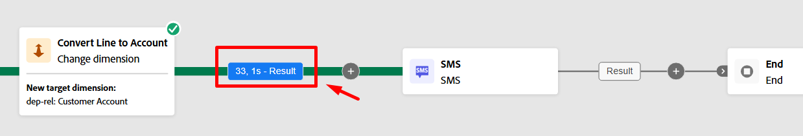

# Ejecutar el flujo de trabajo

## Objetivo

En los siguientes pasos, aprenderá a probar el flujo de trabajo y, lo que es más importante, su actividad de SMS mediante el modo de prueba.

## Verificar flujo de trabajo

1. El flujo de trabajo final presenta un aspecto similar al siguiente cuando termina. Comprueba que todo se ve bien. Verá lo siguiente:

   

2. Si aún no ha detenido el flujo de trabajo, asegúrese de hacerlo ahora haciendo clic en el botón **Detener** en la esquina superior derecha.

   

   >[!NOTE]
   >
   >De forma opcional, puede intentar hacer clic en el botón Reiniciar, pero es probable que vea un error porque ha añadido actividades después de crear el flujo de trabajo y su caché ya no es válida.

3. Luego haga clic en el botón **Start** para ejecutar y probar el flujo de trabajo de principio a fin

   

4. Revise el resultado que entra a la actividad de SMS haciendo clic en **Resultado** (hay dos Resultados, así que use el izquierdo como se muestra a continuación) y luego en el carril izquierdo haciendo clic en el botón **Previsualizar resultados**.

   

   

5. Verá **33 registros** y la dimensión de segmentación coincide con el ID de cliente (la clave de unión si desea generar un perfil)

## Prueba de la actividad SMS

1. Cierre la ventana anterior, haga clic en la **actividad SMS** y, a continuación, haga clic en el botón **Ejecutar prueba** en el carril derecho

   

2. Casi inmediatamente aparece un nuevo botón con la etiqueta **Ver informe**.  Haga clic en el botón **Ver informe** para iniciar sesión en la pantalla del informe.

   

   >[!NOTE]
   >
   >Esta pantalla no se rellenará inicialmente, ya que la ejecución de la prueba tarda un poco en ejecutarse. Es posible que tenga que actualizar algunas veces antes de ver los resultados.

3. Cuando obtenga resultados, verá que el 100% fueron el objetivo.

   

   *Espera, un minuto... el resultado entrante fue de 33 registros, así que ¿a dónde fueron los 4?*

4. Vuelva al lienzo del flujo de trabajo, haga clic en la transición **Result** que entra en la actividad de SMS y luego haga clic en **Preview results** en el carril derecho.

   

5. En la pantalla Vista previa de resultados, desplácese hasta la parte inferior de la tabla y verá que **4 registros** tienen **una dimensión de segmentación en blanco**.

## Explicación

Así que esto es lo que pasó.

- Tenía 33 líneas de clientes a las que quería enviar un mensaje SMS
- Después del cambio, la actividad de dimensión 4 de esas líneas de cliente no tenía una cuenta de cliente asociada
- La unión al Perfil del cliente en tiempo real requiere que tenga un ID de cliente y, como no hay ninguno en esos 4 registros, no hay forma de buscar un perfil o crear uno nuevo sobre la marcha

Result —> Orchestrated Campaigns suelta esos 4 registros en la ejecución del mensaje

>[!NOTE]
>
>Se está llevando a cabo una mejora para ayudar a resolver este problema de dos maneras:
>
>1. Asegúrese de crear un registro de exclusión para los registros a los que les falta una dimensión de segmentación en el envío
>2. Actualice la actividad Cambiar dimensión para hacer una unión interna frente a una unión externa que dejaría caer esos 4 registros por adelantado

>[!TIP]
>
>¡Felicidades! Ahora está oficialmente certificado para lanzar sus propias Campañas Orquestadas y transmitir mensajes al mundo, responsablemente, esperamos. ¡Salga y comercialice como un majestuoso mago digital!

## Publicación del flujo de trabajo

No van a hacer esto en el laboratorio, pero para el contexto esto es lo que sucede en el momento de la publicación:

1. El planificador inicia la campaña si tiene una programación establecida
1. Guarde las actividades de Audience para crear el shell de audiencia en Audience Portal y los perfiles cualificados empiezan a ingerir
1. La ejecución del mensaje se inicia para la primera actividad de mensaje del flujo de trabajo
   - Las búsquedas de perfiles se producen en la instantánea Perfil
     - Los perfiles coincidentes respetan el consentimiento encontrado en el perfil
     - Los perfiles que no coinciden se crean sobre la marcha
   - Los registros de envío se crean en `AJO Message Feedback Event Dataset`
