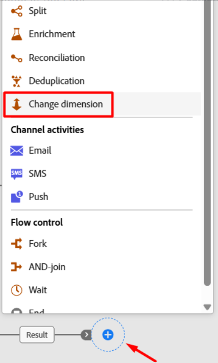
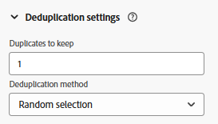
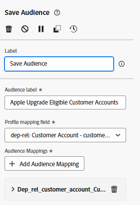
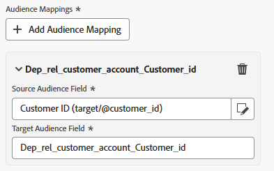

# Guardar la audiencia

## Objetivo

En el siguiente conjunto de pasos guardará la audiencia que creó en el Portal de audiencias para que otras soluciones de Adobe Experience Platform y sus aplicaciones puedan aprovecharla para sus propios casos de uso.

## Cambio de la dimensión

1. En el lienzo del flujo de trabajo, haga clic en el **+** **icono** de la rama **Guardar audiencia** y, en la lista de actividades, seleccione la actividad **Cambiar dimensión**

2. Actualice las propiedades de la dimensión de cambio como se describe a continuación:
   - **Etiqueta:** `Convert Line to Account`
   - **Nueva dimensión de destino:** `dep-rel: Customer Account`

>[!NOTE]
>
>**¿Por qué hace esto, pregunta?**  Recuerde que para unirse al perfil del cliente en tiempo real (que es donde guarda las audiencias) debe utilizar la asignación de destino de perfil que configuró, que solo se une desde el esquema dep-rel: Customer Account.

3. Cuando termine, este es el aspecto del lienzo.  Guarde el trabajo.

## Deduplicación del resultado

1. Haga clic en el **+** **icono** después de la actividad Cambiar dimensión y en la lista de actividades seleccione la actividad **Anulación de duplicación**

2. Actualice la etiqueta de la actividad Deduplication a `Dedup customer id`

3. Ahora haga clic en el botón **+ Agregar atributo** y seleccione el campo del esquema titulado **ID de cliente**

4. En la configuración de Deduplicación, asegúrese de que tiene el siguiente conjunto:
   - **Duplicados que mantener:** `1`
   - **Método de deduplicación:** `Random selection`

>[!NOTE]
>
>Las otras opciones de deduplicación le permiten especificar su propia lógica personalizada.  La mayoría de las veces, si necesita deduplicar, lo hace utilizando la clave principal de la tabla.

5. Cuando haya terminado, el lienzo tendrá este aspecto. Haga clic en el botón **Guardar** en la esquina superior derecha antes de continuar.

## Añadir actividad Guardar audiencia

1. Haga clic en el icono **+** después de la actividad de anulación de duplicación y seleccione la actividad **Guardar audiencia**

2. En el carril derecho, establezca las propiedades de la actividad en lo siguiente:
   - **Etiqueta de audiencia**: `Apple Upgrade Eligible Customer Accounts`
   - **Campo de asignación de perfil**: `dep-rel: Customer Account - customer id`

>[!NOTE]
>
>El &quot;campo Asignación de perfiles&quot; es lo que configuró anteriormente para que el almacén relacional pueda unirse al perfil del cliente en tiempo real.  El perfil se ha modelado como un nivel de cuenta de cliente, por lo que desea guardar la audiencia en el mismo.  De ahí la necesidad de cambiar de dimensión y de deduplicación.

## Asignaciones de campos de audiencia

De forma predeterminada, la clave principal de la dimensión de segmentación (es decir, el ID de cliente) se añade a la audiencia como un campo. Puede verlo si mira a la derecha y expande el campo.  Hay dos cosas que hay que tener en cuenta:

- **Campo de audiencia de Source** —> hace referencia al campo proveniente del esquema relacional
- **Campo de audiencia de destino** —> el nombre del campo que se creará como parte del guardado de audiencia

>[!NOTE]
>
>Observe lo terrible que es el nombre del campo Audiencia de destino `Dep_rel_customer_account_Customer_id`.  Siempre debe cambiarlo por algo más legible para un experto en marketing, sin excusas.

## Corregir campo de audiencia predeterminado

1. Cambie el nombre del campo de audiencia de Target predeterminado a **Customer\_ID**, como se muestra a continuación:

>[!TIP]
>
>Ahora tiene un nombre de campo legible para humanos 🎉

2. Haga clic en el botón **Iniciar** para ejecutar el flujo de trabajo. El flujo de trabajo tiene este aspecto y verá los recuentos de la siguiente manera:
   - Generar audiencia: `65`
   - Convertir línea en cuenta: `65`
   - Desduplicar id. de cliente: `46`

>[!NOTE]
>
>La actividad Guardar audiencia solo creará la audiencia cuando se publique el flujo de trabajo, no cuando simplemente se inicie. Cuando se cree la audiencia, incluirá todos los atributos que le añadió y se unirá al perfil del cliente en tiempo real durante la siguiente ejecución diaria programada del trabajo de servicio de segmentación.

>[!CAUTION]
>
>NO PUBLIQUE EL FLUJO DE TRABAJO.

## Desafío

¿Qué sucede si no anula la duplicación antes de guardar la audiencia?  ¿Almacenará la audiencia los 65 registros o solo los 46?

## Respuesta

La audiencia almacenará los 65 registros, pero una actividad de audiencia de lectura los desduplicará en la importación según la condición de unión 😁

## Resumen

Ahora debería comprender bien cómo funciona Guardar audiencia y por qué importa la deduplicación.  Recuerde que siempre debe tener la asignación de destino de perfil definida porque los datos del almacén relacional deben saber cómo unirse al perfil del cliente en tiempo real.  La asignación de destino de perfil es la condición de unión 🙂
