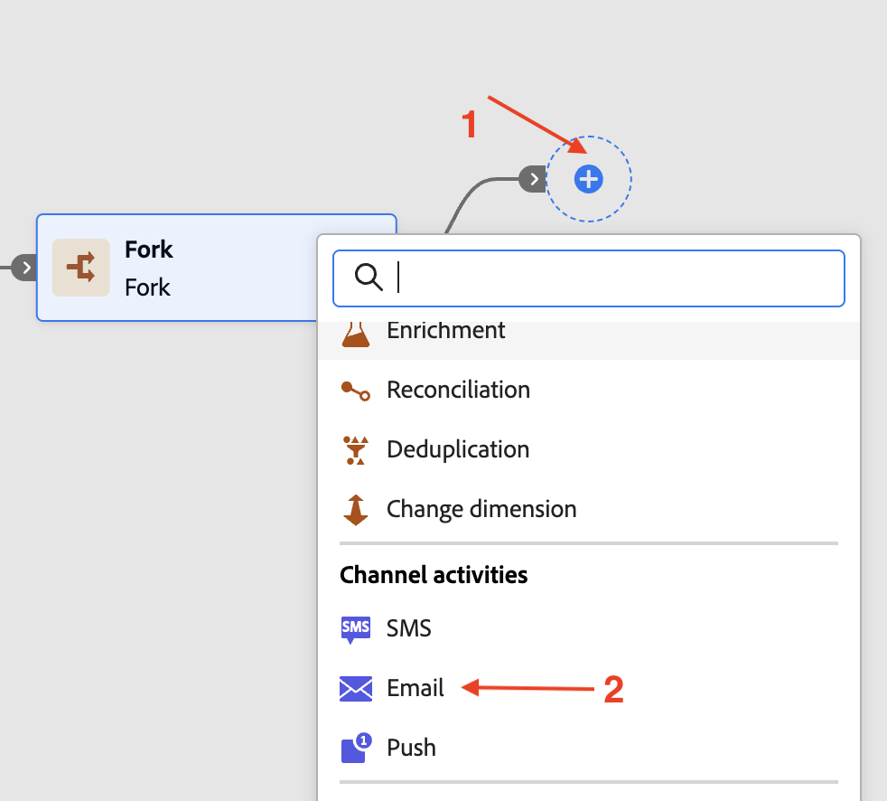
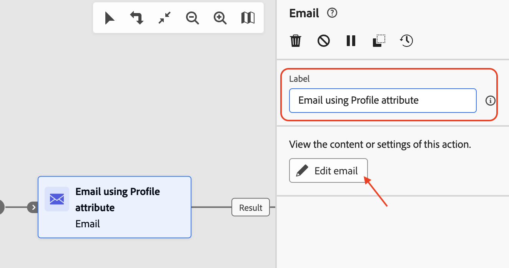

# Añadir actividades de correo electrónico

## Objetivo

En el siguiente conjunto de pasos, se basará en la campaña para agregar dos actividades Email a las dos ramas de actividad Fork. Configurará las dos actividades de correo electrónico para utilizar los canales de correo electrónico creados anteriormente. Finalmente, también agregará la configuración básica de correo electrónico (asunto y cuerpo) a cada una de estas actividades de correo electrónico.

>[!CAUTION]
>
>Antes de continuar, debe asegurarse de que las dos configuraciones de canal de correo electrónico se muestren activas en su estado.
>
>

## Añadir actividad de correo electrónico de rama superior

1. Haga clic en **+** del flujo superior y seleccione **Correo electrónico** de las **actividades de canal**

   

   Se abre el panel de detalles de **Correo electrónico**

   

2. Cambie el nombre de la etiqueta a **Correo electrónico con el atributo de perfil** para la actividad **Correo electrónico** y haga clic en **Editar correo electrónico**. Tenga en cuenta que la creación del cuerpo del correo electrónico solo se realiza con fines de prueba

   

3. Seleccione la ficha **Acciones** y, en la lista desplegable, seleccione la configuración de canal **Perfil-Correo electrónico**

   

4. A continuación, haga clic en **Editar contenido** para agregar contenido de prueba

   

5. Proporcione una **Línea de asunto** (&quot;Oferta de actualización para miembros del plan básico&quot;) y haga clic en el botón **Editar cuerpo del correo electrónico**

   

6. Hay muchas opciones, para esta prueba, elige **Codifique su propia opción** de HTML

   

7. En **Enviar correo electrónico a Designer**, inserte una línea de prueba &quot;Oferta de actualización disponible&quot;. justo antes de las etiquetas `</body></html>` tal y como se muestra y haz clic en **Guardar**

   

8. Espere a que el mensaje de confirmación aparezca en la esquina inferior derecha

   

9. Haga clic en la **flecha izquierda** junto al **Designer de correo electrónico** para salir

   

10. Aparece un cuadro de diálogo de confirmación, haga clic en el botón **Guardar y cerrar**

1. Revise las propiedades y acciones de correo electrónico, incluido el texto agregado al cuerpo del correo electrónico. Haga clic en la **flecha izquierda** para regresar al lienzo de la campaña

## Añadir actividad de correo electrónico de rama inferior

De nuevo en el lienzo de la campaña, haz clic en **+** del flujo inferior y selecciona **Correo electrónico** de las **actividades del canal**. Siga los mismos pasos que se indican arriba (pasos 2 a 11), excepto los siguientes:

- Cambie el nombre de la etiqueta a **Correo electrónico con Dimension de Target** para la actividad **Correo electrónico**
- En la configuración de correo electrónico, elija la configuración de canal de correo electrónico **Correo electrónico relacional**

## Resumen

Ahora ha visto cómo configurar las actividades de correo electrónico con los canales de correo electrónico. Cada actividad se configuró con un asunto y un cuerpo de correo electrónico muy básicos. La próxima vez se probará toda la campaña.
