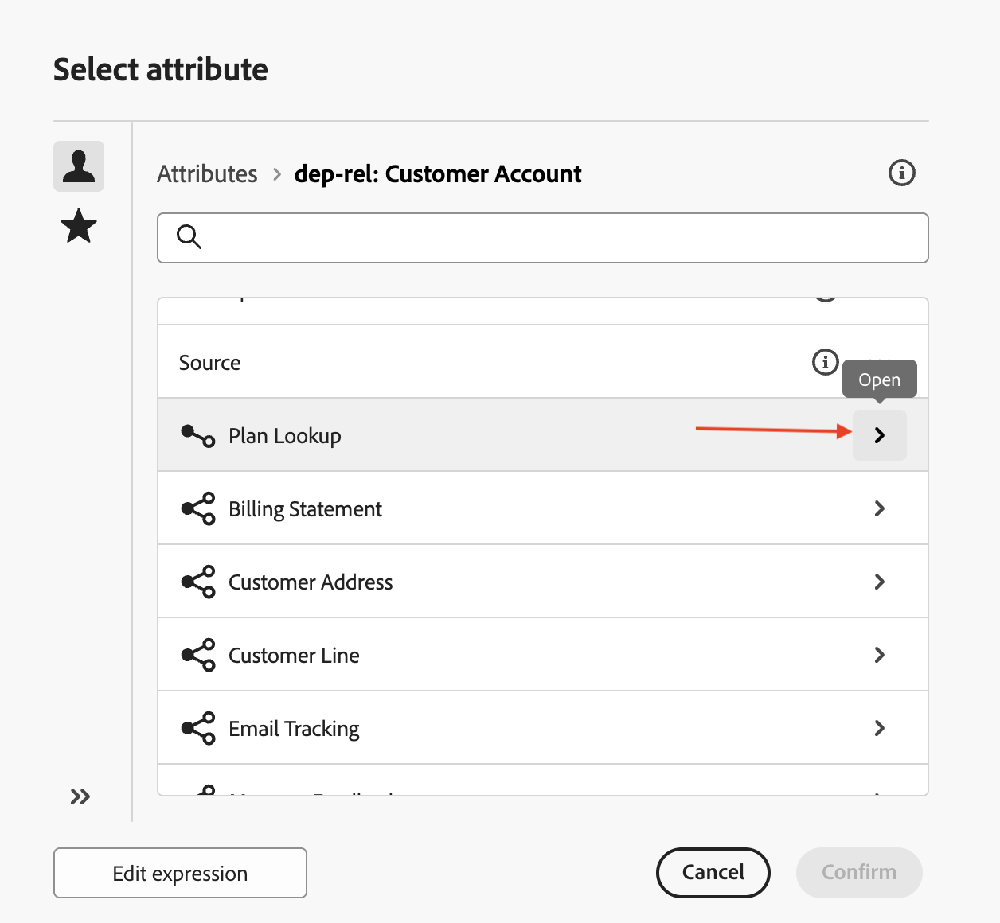
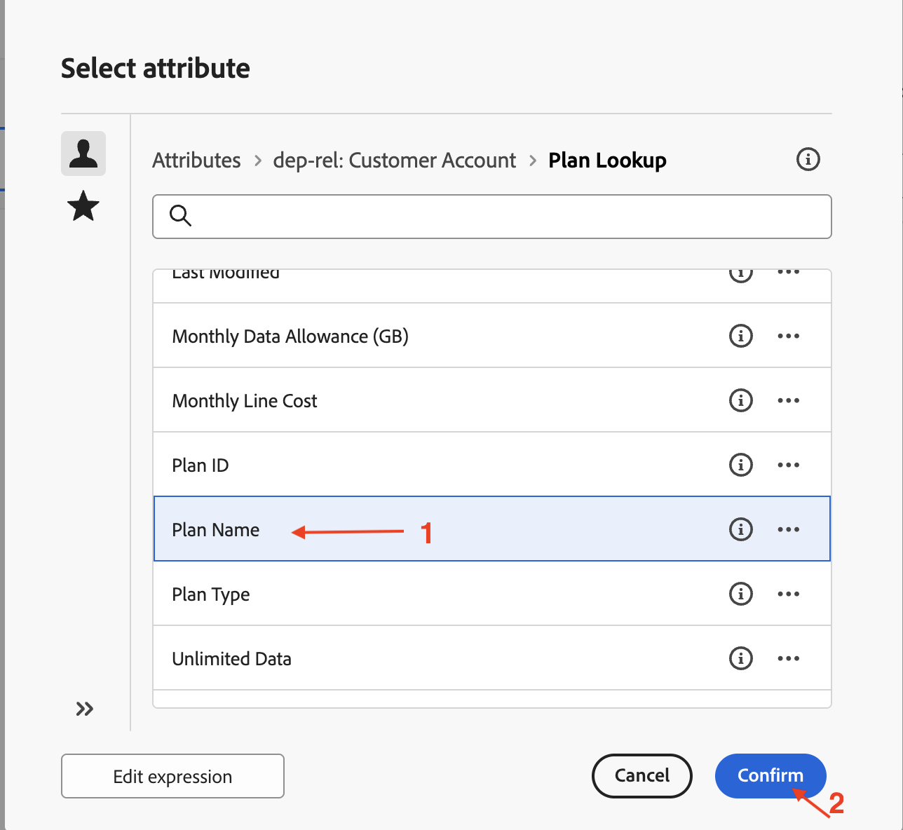

# Crear una audiencia

## Objetivo

En el siguiente conjunto de pasos, se creará una audiencia a partir del esquema relacional seleccionando la dimensión de segmentación correcta y configurando las condiciones adecuadas. También utilizará la opción de actualización para comprobar el número esperado de recuentos de filas.

## Generar público destinatario

1. Una vez que se represente la campaña, haga clic en **+** dentro del lienzo para abrir el menú de opciones y luego seleccione **Generar audiencia** de las **actividades de segmentación**

   

2. La actividad **Generar audiencia** abre el panel de detalles a la derecha, haga clic en el icono Buscar para seleccionar **Dimensión de segmentación**.

   

3. Seleccione `dep-rel: Customer Account` de la lista y haga clic en **Confirmar**

   

4. Una vez configurada **Targeting dimension**, haga clic en Crear audiencia para iniciar el proceso de creación de la audiencia a partir del esquema relacional

   

5. Cuando se abra el panel Crear detalles de audiencia, haga clic en **Agregar condición**

   

6. Desplácese hacia abajo y expanda `dep-rel: Plan Lookup` haciendo clic en **>** que está al lado

   

7. Seleccione `dep-rel: Plan Name` y haga clic en **Confirmar**

   

8. En el panel Personalizar condición, deje el operador como &quot;igual a&quot; y, para Valor, seleccione Básico en la lista desplegable.

   

   >[!NOTE]
   >
   >Observe que todos los valores distintos disponibles para la columna seleccionada se muestran en la lista desplegable, lo que facilita la creación de las condiciones personalizadas.

9. Con la condición personalizada configurada, haga clic en el icono Actualizar para calcular y ver el recuento. Existen dos ubicaciones para ayudar a calcular los resultados

   

   >[!NOTE]
   >
   >La operación Refresh evalúa la condición con respecto a los datos relacionales y muestra los resultados esperados. Esta operación suele tardar unos segundos y resulta extremadamente útil para ajustar los criterios y garantizar que cumple las expectativas.

10. Los recuentos (**38**) indican el número de filas del almacén relacional que coinciden con la condición especificada. Haga clic en **Confirmar** para salir del panel **Crear audiencia**

>[!NOTE]
>
>Hay opciones en la sección Propiedades de la regla para obtener más detalles. Haz clic en **Ver resultados** para ver los resultados reales devueltos. Utilice la opción **Vista de código** para ver la consulta que se está ejecutando.

## Resumen

Ahora ha visto lo fácil que es utilizar la actividad Generar audiencia en la campaña eligiendo la dimensión de segmentación correcta del esquema relacional. A continuación, añadió una condición para restringir los criterios de creación de audiencias y utilizó la opción de actualización para comprobar el número esperado de filas.

Puede leer más [aquí](https://experienceleague.adobe.com/es/docs/journey-optimizer/using/campaigns/orchestrated-campaigns/design-campaigns/build-audience) si está interesado.
