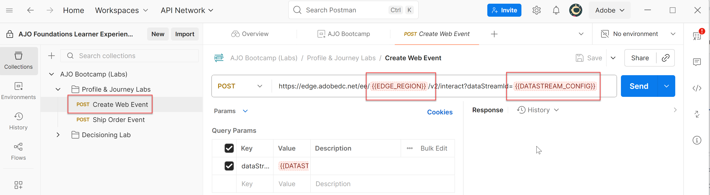
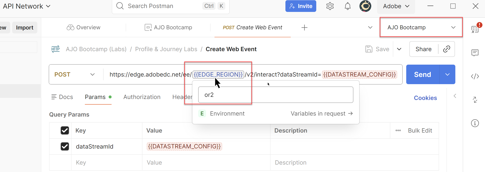

# Importar colección de API

## Objetivo

En este paso va a importar la colección de API que contiene todas las distintas solicitudes que va a necesitar para realizar a lo largo del bootcamp.  Estas solicitudes de API dependen del archivo de entorno que acaba de importar.

## Importar colección de solicitudes

1. Descargue el archivo **AJO Bootcamp (Labs).postman\_collection.json**:

   Descargar archivo: [AJO Bootcamp (Labs).postman_collection.json](assets/ajo-bootcamp-labs.postman_collection.json)

2. Como antes, haz clic en el botón **Importar**.
3. Pegue la URL local del archivo **AJO Bootcamp (Labs).postman\_collection.json** en el cuadro de texto modal de importación o suéltelo en el cuadro de diálogo de importación.  Esto déclencheur una importación automática.
4. Una vez completado el proceso de importación, haga clic en **Colecciones** en la barra de navegación izquierda, expanda la carpeta **AJO Bootcamp (Labs)** y verá la colección recién importada

>[!TIP]
>
>¡Felicidades!  Ha importado correctamente la colección Postman del campamento de arranque

## Validar variables de entorno

La colección que importó contiene todas las llamadas de API necesarias que necesitará para los laboratorios en todo el bootcamp.  Cada laboratorio está organizado en una carpeta específica con su propio conjunto de solicitudes.

A continuación, se encuentran los detalles de cada carpeta:

- **Laboratorios de perfil y Recorrido**: contiene un conjunto de solicitudes para enviar un evento web y un evento que simula una confirmación de envío.
- **Decisioning Labs**: contiene solicitudes para 3 visitantes que imitan las llamadas a las páginas superior e inferior que normalmente se encontrarían en un sitio etiquetado con AEP Web SDK.

Para asegurarse de que el entorno y la colección funcionan correctamente juntos, siga estos pasos.

1. Si es necesario, haga clic en **Colecciones** en el carril izquierdo y, a continuación, expanda la carpeta **Profile &amp; Recorrido Labs**.
2. Haga clic en la solicitud **Crear evento web** y verá que las variables de entorno son **rojas**

   

3. Haga clic en el menú desplegable **Entorno** en la esquina superior derecha y elija el entorno **AJO Bootcamp**.

   

4. Con el entorno adecuado seleccionado, verá que la variable EDGE\_REGION ahora se vuelve de color azul más claro. Esto indica que la variable ahora tiene un valor para el entorno seleccionado. La variable DATASTREAM\_CONFIG permanece en rojo porque aún no ha creado el conjunto de datos, por lo que no tiene un valor para esa variable de entorno. Al pasar el ratón por encima de EDGE\_REGION, verá cuál es el valor del entorno.

## Resumen

Ahora tiene importados los archivos de entorno y colección y sabe cómo utilizarlos.
