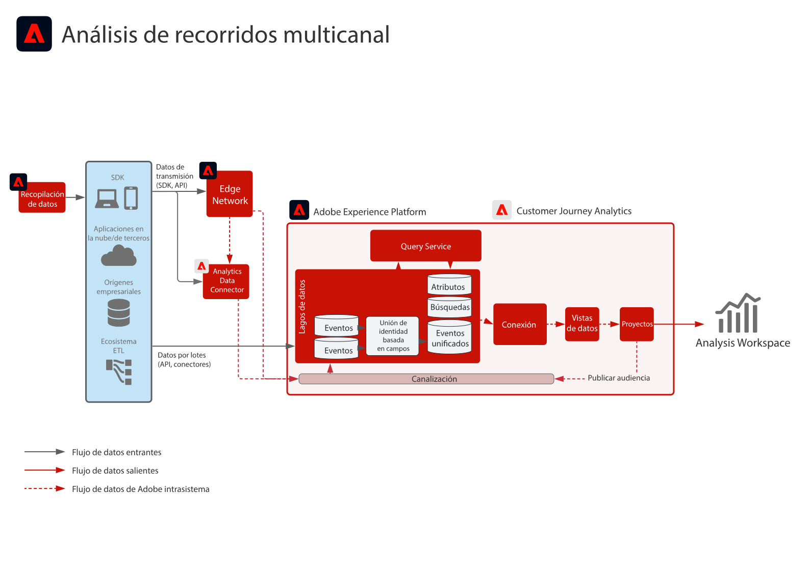

# Modelos de experiencia digital

Los modelos de experiencia digital son implementaciones repetibles creadas para tratar estrategias y solucionar rápidamente problemas empresariales existentes. Cada modelo ofrece una serie de artefactos que explican los problemas empresariales de alto valor, arquitecturas, pasos de implementación, consideraciones técnicas y enlaces a documentación importante.

## Novedades

* **[Modelo de activación de audiencias y perfiles en destinos empresariales](/help/blueprints/audience-activation/enterprise-destinations.md)**

   *Mantenga los perfiles de clientes actualizados en todos los sistemas para potenciar sus equipos de ventas y asistencia. &#x200B;*
* **[Modelo de centro de actividad del cliente](/help/blueprints/audience-activation/customer-activity.md)**

   *Ofrezca contexto a los agentes de ventas y atención al cliente.*
* **[Modelo de análisis de datos e inteligencia](/help/blueprints/data-insights/analysis.md)**

   *Realice consultas y análisis de los datos del repositorio.*

## Modelos incluidos

<table style="table-layout:fixed">
<tr>
  <td>
    
    
<a href="https://experienceleague.adobe.com/docs/blueprints-learn/architecture/customer-journeys/journey-optimizer.html"><strong>Organización en canales múltiples</strong></a>

    
<em>Envíe mensajes e influya en las experiencias de los clientes en tiempo real utilizando [!UICONTROL Platform] como sistema centralizado.</em>

  </td>
  <td>
    
    
<a href="/help/blueprints/audience-activation/known.md"><strong>Activación de Audiencia en línea/sin conexión</strong></a>

    
<em>Ofrezca publicidad multicanal activada por audiencia.</em>

  </td>
  <td>
    
    
<a href="https://experienceleague.adobe.com/docs/analytics-platform/using/cja-usecases/cross-channel.html?lang=en"><strong>Análisis de recorridos multicanal</strong></a>

    
<em>Obtenga una sola vista consolidada del comportamiento del cliente en varios canales.</em>

  </td>
</tr>
</table>

## Entradas del blog

* [[!DNL Introducing Adobe Experience Platform’s New Digital Experience Blueprints]](https://medium.com/adobetech/introducing-adobe-experience-platforms-new-digital-experience-blueprints-93a6b5f5da7c)
* [[!DNL Blueprint for Audience Activation in Adobe Experience Platform]](https://medium.com/adobetech/a-blueprint-for-audience-activation-in-adobe-experience-platform-b2b30fae90fd)
* [[!DNL Blueprint for Web/Mobile Personalization using Adobe Experience Platform Real-Time Customer Profile]](https://medium.com/adobetech/blueprint-for-web-personalization-using-adobe-experience-platform-real-time-customer-profile-fef2ce7a4b2f)
* [[!DNL Blueprint for Cross-Channel Orchestration in Adobe Experience Platform]](https://medium.com/adobetech/blueprint-for-multi-channel-orchestration-in-adobe-experience-platform-c68317e94184)
