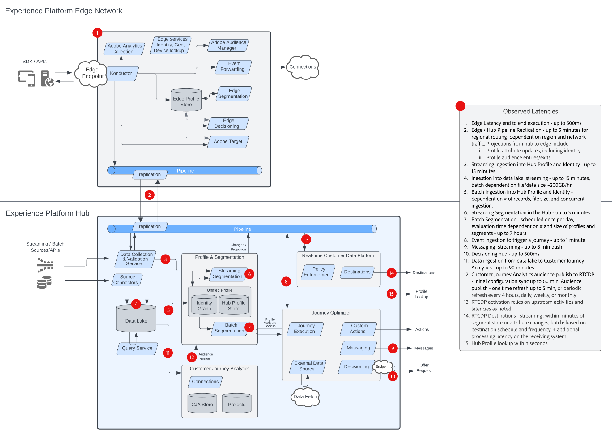

# Modelos de organización de experiencia del cliente

Los modelos de organización de la experiencia del cliente (anteriormente, _experiencia digital_) proporcionan diagramas de la arquitectura del flujo de datos y del sistema para comprender mejor cómo se integran e implementan las aplicaciones de Adobe Experience Platform. Los modelos proporcionan una representación visual de los flujos de contenido y datos entre sistemas y componentes, la secuencia de operaciones y las dependencias para ayudar a informar el diseño de casos de uso y la arquitectura de Adobe Experience Platform y aplicaciones.

## Modelos populares

<table>
<tr>
  <td>
    
    

      <a href="experience-platform/guardrails.md">
    <strong>Diagrama de arquitectura y protecciones de Experience Platform Hub y Edge</strong>
    </a>
    

  </td>
   <td>
    
    

      <a href="experience-platform/deployment/websdk.md">
    <strong>Diagrama de secuencia de Web SDK y Edge Network</strong>
    </a>
    

  </td>
  <td>
    
    

      <a href="customer-journeys/journey-optimizer/journey-optimizer-overview.md">
    <strong>Diagrama de información general de Adobe Journey Optimizer</strong>
    </a>
    

  </td>
</tr>
</table>

