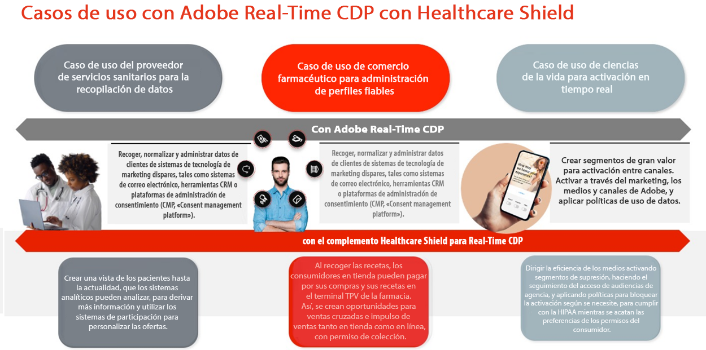
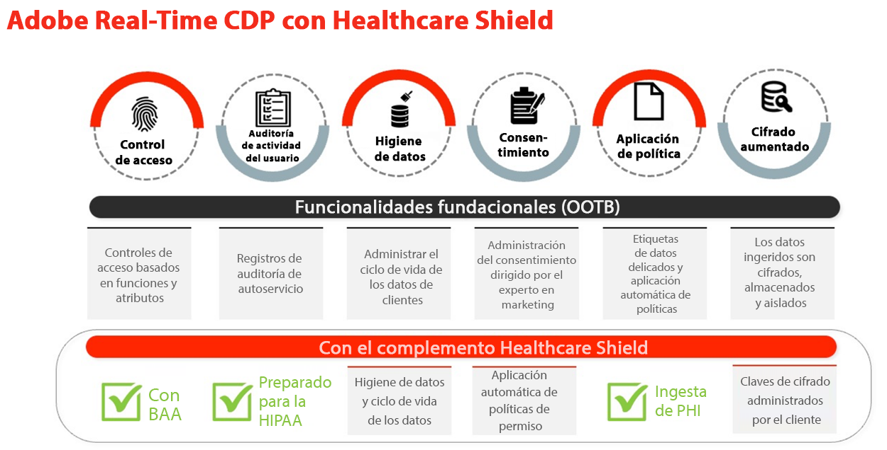
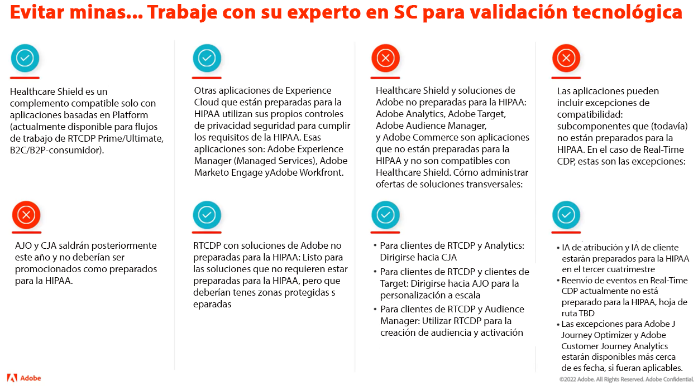
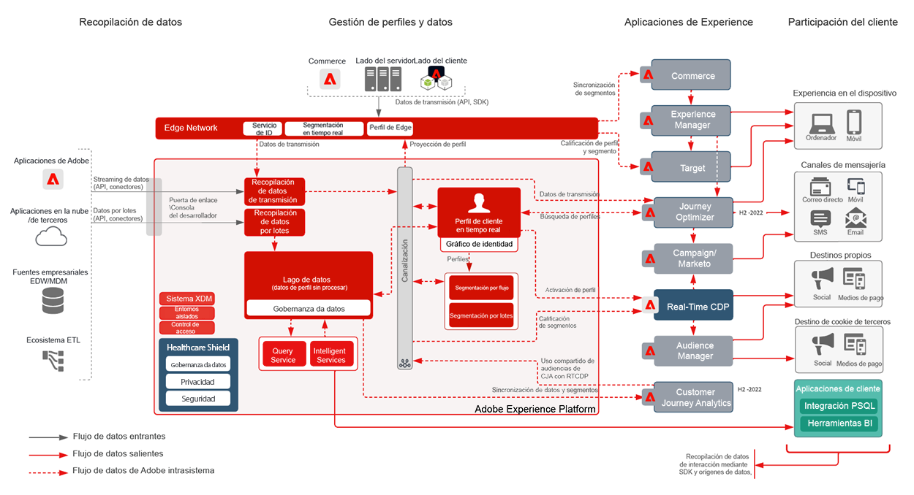
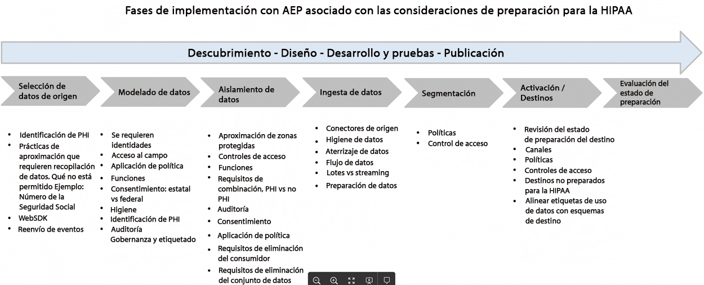

# Escudo sanitario

Healthcare Shield es un complemento de Adobe Experience Platform para aplicaciones basadas en Adobe Experience Platform, como Real-Time CDP, Customer Journey Analytics y Adobe Journey Optimizer. Está diseñado para que estas aplicaciones estén preparadas para HIPAA y cumplan con los requisitos relativos al procesamiento y uso de la Información de Salud Protegida (PHI).

## Preguntas frecuentes sobre Healthcare Shield

Las siguientes preguntas frecuentes ofrecen respuestas a preguntas frecuentes sobre Escudo Sanitario.

### ¿Qué es HIPAA?

HIPAA es la Ley de Portabilidad y Responsabilidad del Seguro de Salud. Es una normativa de EE.UU. que establece importantes protecciones para los negocios. Estas protecciones limitan el uso y la divulgación de información protegida sobre la salud (PHI) cuando se crea, recibe, mantiene o transmite por una entidad o asociados comerciales cubiertos por la HIPAA (como clientes de Adobe) a un asociado comercial (socios tecnológicos como el Adobe).

Adobe está listo para HIPAA como asociado de negocios con respecto a las soluciones de Adobe específicas para HIPAA y el cumplimiento de las reglas de seguridad, privacidad y notificación de infracciones HIPAA.

### ¿Qué es un Acuerdo de Asociado Comercial (BAA) y por qué es importante?

Cuando una entidad cubierta o un asociado comercial (un cliente de Adobe) utiliza los servicios de un asociado comercial (como el Adobe) para crear, recibir, mantener o transmitir ciertos tipos de datos de consumidores que sean Datos de salud protegidos (PHI) o ePHI (versión electrónica de la PHI), la entidad cubierta y el asociado comercial deben suscribirse a un acuerdo de asociación comercial (BAA).

El BAA requiere por contrato Adobe, ya que el Asociado Comercial debe salvaguardar adecuadamente la información protegida sobre la salud cumpliendo con los requisitos de las Reglas de Privacidad, Seguridad y Notificación de Incumplimiento de la HIPAA.

Con el complemento Escudo de salud para Real-Time CDP, Adobe ahora puede ejecutar un BAA con clientes que otorgan esta licencia junto con Adobe Real-Time CDP B2C y los flujos de consumo de Adobe Real-Time CDP B2P Edition.

### ¿Por qué Healthcare Shield for Real-Time CDP (y futuras aplicaciones basadas en plataforma) solo están disponibles en EE. UU.?

Dado que HIPAA es una ley estadounidense, estamos limitando la disponibilidad de Healthcare Shield a los Estados Unidos y a las empresas sujetas a HIPAA. El Adobe tiene la intención de ampliar la cobertura a otras jurisdicciones a medida que abarcamos las necesidades locales y confiamos en que podamos satisfacerlas.

### ¿Qué es el Escudo Sanitario para Real-Time CDP?

Healthcare Shield para Real-Time CDP está destinado a los clientes que sean una entidad cubierta o un asociado comercial y que tengan la intención de utilizar la información protegida sobre la salud en Real-Time CDP para la incorporación de datos, la creación de audiencias y la activación en canales múltiples, así como para solicitar el Adobe para ejecutar un BAA. Se requiere Escudo Sanitario para Entidades Cubiertas con HIPAA casos de uso requeridos para CDP en tiempo real.

### ¿Por qué deberían comprar Real-Time CDP Healthcare Shield los posibles clientes sanitarios?

Como complemento de Real-Time CDP, Healthcare Shield actualiza la aplicación a un estado &quot;listo para HIPAA&quot;. Esto significa que la aplicación cuenta con las salvaguardias necesarias para utilizar la información protegida sobre la salud (PHI) de conformidad con los requisitos de la HIPAA. Además, con Healthcare Shield, Adobe está dispuesto y puede autorizar al cliente a introducir ciertos tipos de datos personales confidenciales permitidos en la aplicación lista para HIPAA. Adobe firma Acuerdos de Asociados Comerciales (BAA) con clientes que otorgan licencia a Healthcare Shield para una aplicación compatible basada en la plataforma.

### ¿Qué tipos de datos están autorizados para Real-Time CDP con Healthcare Shield (y cuáles no)?

Con Healthcare Shield, las marcas pueden incorporar la siguiente información protegida sobre la salud a aplicaciones basadas en plataformas como Real-Time CDP (datos personales confidenciales permitidos):

* Información financiera de una persona
* Médico
* Información sanitaria

Pero estamos excluyendo específicamente los datos que identifican abuso de sustancias, salud mental, registros genéticos de salud o registros de salud de un menor, número completo de cuenta, número completo de tarjeta de crédito, identificadores gubernamentales (como SSN) e información personal de niños. Los niños están protegidos por cualquier ley de protección infantil (como la información personal definida en la Ley de Privacidad Infantil en Línea de los Estados Unidos (COPPA)).

### Con Healthcare Shield, ¿pueden los clientes de Real-Time CDP utilizar cualquier tipo de PHI para crear audiencias y activarlas?

Incluso cuando un cliente puede introducir datos personales confidenciales permitidos en aplicaciones nativas de la plataforma, los clientes deben comprender que son los únicos responsables de cumplir con todas las regulaciones aplicables y de obtener los permisos, consentimientos, autorizaciones y autorizaciones adecuados de los consumidores para utilizar los datos de las formas deseadas.

### ¿Cuáles son los matices de la ingesta y activación de datos de clientes con aplicaciones de Adobe no preparadas para HIPAA?

Una licencia de cliente Healthcare Shield no puede utilizar, ingerir, recopilar, compartir ni integrar datos personales confidenciales permitidos con aplicaciones y servicios de Adobe no preparados para HIPAA.

Por ejemplo, un cliente no debe activar segmentos que contengan información protegida sobre la salud (PHI) en aplicaciones como Audience Manager, Adobe Target y Adobe Analytics. Los clientes con licencia de Healthcare Shield pueden ingerir datos personales confidenciales permitidos o información protegida sobre la salud autorizada en aplicaciones de Adobe listas para HIPAA, independientemente de si la fuente de datos se considera lista para HIPAA o no.

### ¿Cuáles son los matices de la ingesta y activación de datos de clientes con aplicaciones que no están preparadas para HIPAA y que no son de Adobe?

Un Escudo Sanitario con licencia de cliente debe usar el buen criterio para determinar dónde activan los segmentos que contienen PHI fuera de las aplicaciones de Adobe. Adobe no controla (ni es responsable de) los proveedores y datos de terceros enviados por un cliente a un proveedor de terceros que pueden no admitir el procesamiento de datos de acuerdo con las etiquetas de uso de datos de Adobe del esquema de clientes. Además, Adobe no puede proporcionar asesoramiento legal a nuestros clientes.

## Casos clave de uso de Escudo de atención sanitaria

| Casos de uso estándar de RTCDP B2C Edition | Descripción |
|-----|-----|
| Recopilación de datos de flujo continuo | <ul><li>Modelos de datos flexibles y normalizados utilizables en conexiones de Adobe y sin Adobe<li>Esquemas de datos personales y basados en cuentas diseñados para el marketing B2C<li>La administración de etiquetas y el reenvío de eventos recopilan y distribuyen datos a nivel de evento en tiempo real.<li> Perfiles optimizados que aceleran el tiempo de entrega de la experiencia</li></ul> |
| Administración de perfiles de confianza | <ul><li>Perfiles unificados que contienen datos de atributos del consumidor, comportamientos y preferencias<li> El marco de control de datos es flexible, transparente y se aplica a perfiles unificados con creación de políticas y aplicación automática para evitar el uso indebido de los datos. </li></ul> |
| Activación en tiempo real | <ul><li>Segmentación mediante arrastrar y soltar diseñada para especialistas en marketing B2C<li>Resolución de identidades a nivel de persona y cuenta y enriquecimiento de perfiles para la activación en canales múltiples<li> Experiencias de cliente coherentes mediante la organización de audiencias y la activación en tiempo real en todos los canales y entornos (Adobe y sin Adobe) </li></ul> |
| Adquisición de cliente | <ul><li>Perspectivas para convertir usuarios no autenticados a usuarios reconocidos/autenticados<li>Animar a los usuarios no registrados a registrarse para ser miembros.<li> Aumentar o recuperar suscripciones<li> Analice los perfiles de los clientes para comprender la tendencia (p. ej. . comparar segmentos de alto valor con segmentos de bajo rendimiento y optimizar para adquisición)</li></ul> |
| Participación del cliente | <ul><li>Ofertas de Target basadas en la actualización del comportamiento del consumidor y las acciones de frecuencia a las ofertas (en línea y sin conexión)<li>Unifique las propiedades digitales para una experiencia conectada (por ejemplo, anime las descargas de aplicaciones móviles y utilice la activación de segmentos en todos los canales para conectar experiencias)</li></ul> |
| Personalización a escala | <ul><li> Evaluar segmentos en el borde para la personalización de la misma página en tiempo real y de la página siguiente<li>Aumente la participación al proporcionar experiencias únicas y segmentadas a los visitantes que abandonan una sesión en todos los recorridos (p. ej., abandonen el carro de compras, repitan a los visitantes que no logran realizar la conversión).<li> Unificar y conectar los comportamientos sin conexión y en línea para optimizar y captar usuarios</li></ul> |
| Venta cruzada/Venta superior | <ul><li>Mantener clientes al mismo tiempo que crece y mantiene las relaciones existentes con los usuarios<li>Impulse nuevos flujos de ingresos con el valor de duración de la oferta/unidad comercial/marca/oferta entre clientes<li>Obtenga información sobre AOV en productos y SKU (p. ej., paquetes frecuentes, sensibilidad a los precios)</li></ul> |
| Retención de clientes / Lealtad | <ul><li> Reactivar consumidores para fomentar la lealtad y evitar la pérdida del cliente<li>Depurar recomendaciones de productos personalizadas para clientes de alto valor en función de las preferencias y la tendencia<li>Cree una cadencia estándar para la participación y ofertas especiales para consumidores fieles<li> Vincular las preferencias en línea y sin conexión para optimizar las ofertas entre canales</li></ul> |
| Colaboración de datos | <ul><li> Cree apretones de mano dentro de una interfaz de usuario para crear flujos de trabajo de colaboración en datos.<li>(Aproveche las superposiciones de datos de origen entre industrias para tomar decisiones y campañas empresariales estratégicas informadas.<li>Desglose los silos de datos y comprenda el recorrido holístico del cliente<li> Respetar preferencias y consentimiento por caso de uso</li></ul> |
| Eficiencia y optimización de medios/marketing | <ul><li> Aumente la eficacia organizativa al centralizar y mantener los datos de los clientes y los canales de activación en un sistema de registro<li>Apoye las campañas de supresión para aumentar la eficiencia y el gasto en medios de comunicación<li> Alinear con las políticas de TI a través de la gobernanza y la aplicación de políticas<li>Proporcionar acceso a los datos según sea necesario, en tiempo real, para admitir campañas oportunas</li></ul> |

## Capacidades técnicas relevantes

### Diferencias

| Tipo | Fuera de la caja | Escudo sanitario |
|-----|-----|-----|
| Cifrado | [Cifrado de datos en AEP](https://experienceleague.adobe.com/docs/experience-platform/landing/governance-privacy-security/encryption.html?lang=en) | [Cifrado de datos en AEP](https://experienceleague.adobe.com/docs/experience-platform/landing/governance-privacy-security/encryption.html?lang=en) + Claves administradas por el cliente |
| Higiene de los datos | **Fundacional:** Herramienta de autoservicio que permite a los clientes administrar el ciclo de vida de los datos. Esto incluye la eliminación de datos del cliente, actualizaciones a nivel de campo y la configuración de la caducidad de datos en conjuntos de datos para eliminar datos una vez caducados.<ul><li>Límite de **10 000 solicitudes de eliminación** por mes<li>Límite de 2 TTL de conjuntos de datos</li></ul> | **Premium**: Amplíe la capacidad/umbral diario de la funcionalidad de higiene de datos para depurar conjuntos de datos más grandes en menos tiempo.<ul><li>Límite de **2 000 000 solicitudes de eliminación** al mes como parte de HealthCare Shield<li>Límite de 20 TTL de conjuntos de datos</li></ul> |
| Consentimiento | **Fundacional**: El consentimiento y las preferencias granulares mediante la adición manual de atributos relacionados con el consentimiento y las preferencias a la segmentación de audiencia. | **Premium**: Cree y aplique automáticamente políticas sobre cómo se deben utilizar los datos de clientes en función del consentimiento y las preferencias. |

### Gobierno

**Higiene de los datos**

* [Información general sobre la higiene de los datos](https://experienceleague.adobe.com/docs/platform-learn/tutorials/data-hygiene/overview.html?lang=en)
* [Higiene de datos en Adobe Experience Platform](https://experienceleague.adobe.com/docs/experience-platform/hygiene/home.html?lang=en)

**Aplicación de políticas**

* [Información general sobre la administración de datos](https://experienceleague.adobe.com/docs/experience-platform/data-governance/home.html?lang=en)
* [Información general sobre las políticas de uso de datos](https://experienceleague.adobe.com/docs/experience-platform/data-governance/policies/overview.html?lang=en)
* [Gobernanza, privacidad y seguridad en Adobe Experience Platform](https://experienceleague.adobe.com/docs/experience-platform/landing/governance-privacy-security/overview.html?lang=en#consent)

### Privacidad

**Consentimiento**

* [Aplicación automática de directivas](https://experienceleague.adobe.com/docs/experience-platform/data-governance/enforcement/auto-enforcement.html?lang=en#consent-policy-evaluation)

### Seguridad

**Cifrado mejorado**

Vínculos útiles:

* [Documento técnico de seguridad de AEP](https://www.adobe.com/content/dam/cc/en/security/pdfs/AEP_SecurityOverview.pdf)

* [Cifrado de datos en Adobe Experience Platform](https://experienceleague.adobe.com/docs/experience-platform/landing/governance-privacy-security/encryption.html)

* [Funciones hash en la preparación de datos](https://experienceleague.adobe.com/docs/experience-platform/data-prep/functions.html?lang=en#hashing)

* [Etiquetas de codificación de datos](https://experienceleague.adobe.com/docs/experience-platform/tags/api/guides/encrypting-values.html?lang=en)

**Controles de acceso**

* [Resumen del control de acceso basado en atributos](https://experienceleague.adobe.com/docs/experience-platform/access-control/abac/overview.html)

**Auditorías de actividades del usuario**

* [Registros de auditoría](https://experienceleague.adobe.com/docs/experience-platform/landing/governance-privacy-security/audit-logs/overview.html)

**Encriptado mejorado**

* [Información general sobre la seguridad de Adobe Experience Platform](https://www.adobe.com/content/dam/cc/en/security/pdfs/AEP_SecurityOverview.pdf)
* [Cifrar valores](https://experienceleague.adobe.com/docs/experience-platform/tags/api/guides/encrypting-values.html?lang=en)
* [Cifrado de datos en Adobe Experience Platform](https://experienceleague.adobe.com/docs/experience-platform/catalog/data-protection.html)
* [Funciones de asignación de preparación de datos: hash](https://experienceleague.adobe.com/docs/experience-platform/data-prep/functions.html?lang=en#hashing)

**Experience Cloud**

* [Adobe Real-time Customer Data Platform y Escudo para la salud](https://experienceleague.adobe.com/docs/customer-data-management-voices-events/events/governance/healthcare-shield.html?lang=en)

   Entrega de la promesa de experiencia, con acceso a menos datos. En este vídeo, obtenga más información sobre Adobe Real-Time CDP y Healthcare Shield, un complemento de Adobe Experience Platform para las aplicaciones basadas en Adobe Experience Platform diseñado para preparar estas aplicaciones HIPAA y satisfacer los requisitos de HIPAA en cuanto al procesamiento y uso de datos de salud protegidos (PHI).

**Experience Platform**

* [Información general sobre registros de auditoría](https://experienceleague.adobe.com/docs/experience-platform/landing/governance-privacy-security/audit-logs/overview.html)

   Descubra cómo los registros de auditoría le permiten ver quién realizó qué acciones en Adobe Experience Platform.

* [Resumen de higiene de datos](https://experienceleague.adobe.com/docs/experience-platform/hygiene/home.html?lang=en)

   La higiene de los datos de Adobe Experience Platform le permite administrar el ciclo de vida de sus datos mediante la actualización o depuración de registros obsoletos o inexactos.

* [Aplicación automática de directivas](https://experienceleague.adobe.com/docs/experience-platform/data-governance/enforcement/auto-enforcement.html?lang=en)

   Este documento explica cómo se aplican automáticamente las políticas de uso de datos al activar segmentos en destinos en Experience Platform.

* [Información general sobre el control de acceso basado en atributos](https://experienceleague.adobe.com/docs/experience-platform/access-control/abac/overview.html)

   Obtenga información sobre el control de acceso basado en atributos en Adobe Experience Platform.

## HIPAA y productos y servicios de Adobe

El Adobe sigue innovando y adaptándose para satisfacer las necesidades de nuestros clientes en el sector de la atención médica y satisfacer sus necesidades específicas de privacidad y seguridad.

Consulte [Servicios y productos de HIPAA y Adobe](https://www.adobe.com/trust/compliance/hipaa-ready.html).

## Diagrama de mercado de alto nivel

Productos preparados para HIPAA (y no):

**Diagrama de arquitectura**

[Lucidchart source](https://lucid.app/lucidchart/8a795213-3bfa-43f3-a542-f0de56123afd/edit?invitationId=inv_d3183739-8c07-4ca2-bfd1-16d819b911a6&amp;page=0_0)

## Enfoque

En esta sección se describen los pasos de implementación y la fase de entrevista.

### Fases de implementación

Aspectos que se deben tener en cuenta en cada paso:

Esta sección describe algunas prácticas recomendadas a seguir y se divide en tres fases:

### Fase de entrevista

El proceso de entrevistas con las partes interesadas es fundamental para comprender los siguientes aspectos:

* Objetivo: Tipo de casos de uso: conversión, prospección, participación, etc.
* Rendimiento: Cualquier expectativa de objetivo de nivel de servicio
* Fuentes de datos: Web/Analytics, sin conexión/en línea, CRM, lealtad, etc.
* Volumen de datos
* Requisitos de SLT/SLA
* Identidades : número de identidades, administración de datos autenticada frente a anónima
* Formato de los datos: JSON, CSV, etc.
* Calidad de los datos, necesidad de transformaciones de datos
* Cualquier plan para la coincidencia de segmentos (uso compartido) con socios
* Cualquier audiencia externa que se va a importar.
* Cifrado: Clave predeterminada frente a clave administrada por el cliente
* Combinación conjunta de datos: se considera ePHI
* Recopilación de datos de consentimiento: OneTrust, SDK de consentimiento
* Necesidades de destino: Requisitos de Frecuencia y Latencia y Control de Acceso
* Control de acceso
* Requisitos de limpieza de datos
* Requisitos de actualización de datos
* Alerta sobre las necesidades
* Acceso a la API

### Fase de diseño

Sobre la base del proceso de entrevista, la fase de diseño abordará lo siguiente. Huelga decir que la documentación del diseño debe revisarse y cerrarse. El documento de diseño puede abarcar los siguientes aspectos:

* Valor de los datos:
   * Volumen: cantidad de datos introducidos
   * Período de tiempo: tiempo durante el cual deben residir los datos introducidos
   * Fidelidad: riqueza de perfil
* Tenga en cuenta las protecciones de AEP junto con los requisitos de SLT/SLA
* Uso de licencias
* Necesidades de aislamiento de datos: varios entornos limitados en una o varias organizaciones
* Filtrado de datos
* Requisitos de higiene de los datos (cantidad de datos y frecuencia)
* Proceso y metodología para cumplir los requisitos de eliminación/actualización de datos
* Necesidades de transformación de datos: ascendente, preparación de datos, servicio de consulta
* Comprender y determinar identidades primarias y de otro tipo
* [Diseño de esquema XDM](https://experienceleague.adobe.com/docs/experience-platform/xdm/schema/composition.html?lang=en)
* Determinar el número de conjuntos de datos, perfilados y sin perfil
* Combinar diseño de directiva
* Gestión de datos de consentimiento
* Gobierno: Funciones, etiquetas, políticas, acciones de marketing y control de acceso
* [Enriquecimiento de perfiles](https://experienceleague.adobe.com/docs/experience-platform/profile/guardrails.html?lang=es)
* Requisitos de diseño de segmentación para Edge/Streaming/Batch
* Destinos esperados y planes de activación. Tenga en cuenta las necesidades de destino solo listas para HIPAA
* Planes para Analytics
* Alertas
* Añadir requisitos de acceso a API

### Fase de implementación

Una vez revisado y desactivado el documento de diseño, la fase de implementación puede comenzar a abordar las siguientes áreas:

* Número de entornos limitados necesarios: Dev/Test/Prod
* Control de acceso a entornos limitados
* Metodología de implementación
* Necesidades y frecuencia de TTL (higiene de los datos)
* Esquema XDM y control de acceso
* Cumplimiento del consentimiento
* Gobierno: Funciones, etiquetas, políticas y acciones de marketing
* Segmentación
* Conjuntos de datos y control de acceso
* Configuración de higiene de datos
* Configuración de destinos y control de acceso
* Alertas de configuración
* Implementación de los requisitos de acceso a API
* Prueba de extremo a extremo con datos de prueba
