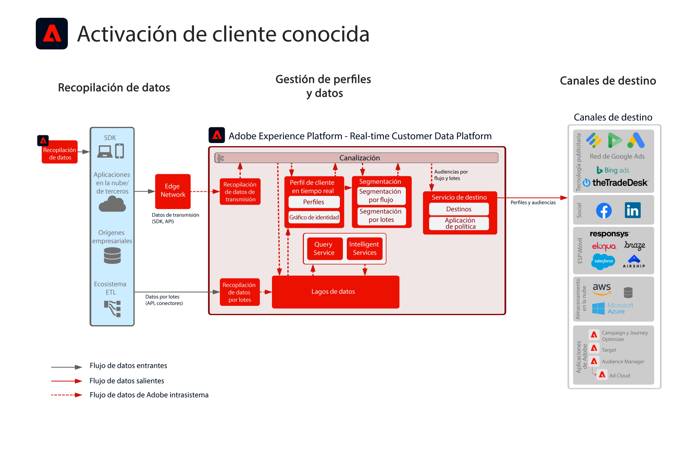

# Éxito del sector con modelos de experiencia digital

Descubra cómo los clientes diseñan buenas experiencias y tienen éxito con los modelos de experiencia digital. Estas implementaciones comprobadas y repetibles le permiten seguir una estrategia y resolver rápidamente los problemas empresariales conocidos.

## Historias de éxito destacadas

<table style="table-layout:fixed">
<tr>
  <td>
    
    </td>
  <td>
    

</td>
  <td>
    
  </td>
  <td>
    
  </td>
</tr>
<tr>
  <td>
    
<a href="https://experienceleague.adobe.com/docs/blueprints-learn/architecture/vertical-blueprints/apparel.html?lang=es"><strong>Sector de la moda</strong></a>

    
<em>Marketing en tiempo real, activación en canales múltiples y Cross-Channel Analytics.</em>

  </td>
  <td>
    
<a href="https://experienceleague.adobe.com/docs/blueprints-learn/architecture/vertical-blueprints/retail.html?lang=es"><strong>Sector minorista</strong></a>

    
<em>Experiencias del cliente en tiempo real en medios digitales, correo electrónico, mensajes push y canales web.</em>

  </td>
  <td>
    
<a href="https://experienceleague.adobe.com/docs/blueprints-learn/architecture/vertical-blueprints/telecommunications.html?lang=es"><strong>Sector de las telecomunicaciones</strong></a>

    
<em>Adapte ofertas en tiempo real con la incorporación eficiente de clientes para una lealtad a largo plazo.</em>

  </td>
  <td>
    
<a href="https://experienceleague.adobe.com/docs/blueprints-learn/architecture/vertical-blueprints/travel-hospitality.html?lang=es"><strong>Sector del turismo y la hostelería</strong></a>

    
<em>Decisiones en tiempo real con una vista consolidada del comportamiento del cliente en varios canales.</em>

  </td>
</tr>
</table>

## Más historias de éxito

* <a href="https://business.adobe.com/customer-success-stories/index.html?Products+%26+Services=Experience">Adobe Experience Cloud</a>
* <a href="https://business.adobe.com/customer-success-stories/index.html?Products+%26+Services=Experience+Platform">Adobe Experience Platform</a>
* <a href="https://business.adobe.com/customer-success-stories/index.html?Products+%26+Services=Intelligent+Services">Servicios inteligentes de Adobe</a>
