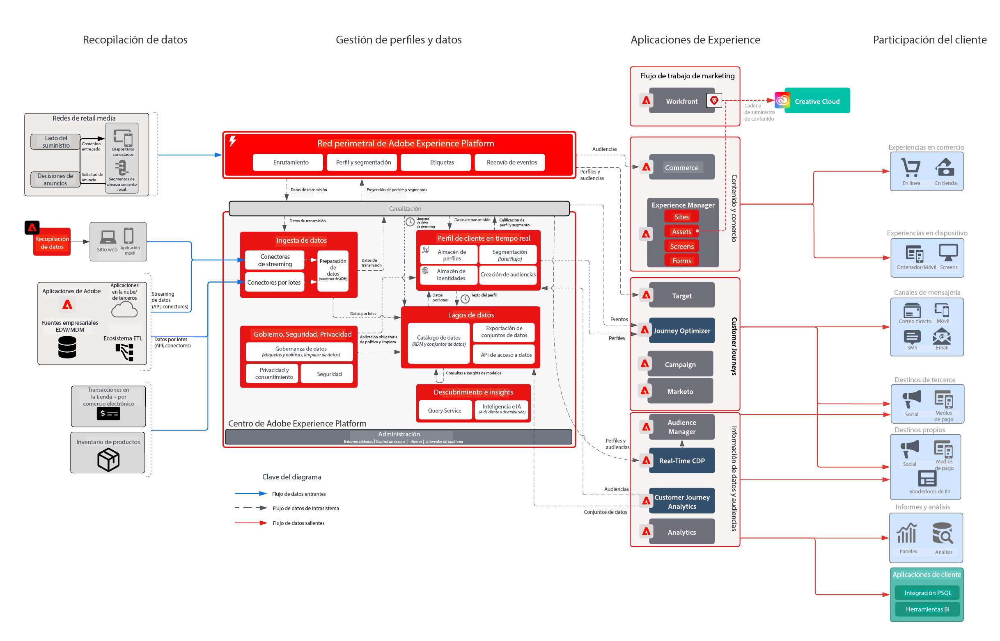

# Desafío empresarial del sector minorista

Esta empresa de experiencia integrada tenía como objetivo personalizar todo el recorrido del cliente para aumentar la lealtad, impulsar las ventas en relación con los clientes existentes y mejorar el gasto en marketing en todas sus campañas. La estrategia para lograr el objetivo era ampliar su capacidad digital para incluir datos de transacciones y datos de clientes sin conexión a fin de impulsar el crecimiento.

## Enfoque de Adobe

* Generar un perfil de cliente unificado que incluya todos los datos relevantes en línea y sin conexión que se puedan activar en tiempo real.
* Orquestar las interacciones de los clientes entre canales web, multimedia y mensajes push para impulsar el comportamiento de compra por primera vez o por segunda vez.

## Valor empresarial ofrecido

| Objetivos | Tácticas | Valor conseguido |
|---|---|---|
| **Orquestación de recorridos de clientes en tiempo real **  ** Impulsar la repetición de compras de los clientes nuevos **  ** Mejore la eficacia del marketing y reduzca los costes de los medios**</ul> | <ul><li>Sólida estrategia de datos e identidad para impulsar un perfil integral en tiempo real.</li><li>Flujo de datos transaccionales y de clientes en tiempo real, incluida una carga histórica de 90 días</li><li>Segmentación de streaming para Advertising Networks y Adobe Target para impulsar el gasto en medios y los esfuerzos de personalización.</li><li>Recorridos de clientes en tiempo real mediante Adobe Campaign que incluyen una estrategia para medir el rendimiento</li></ul> | <ul><li><strong>Real-time Customer Data Platform:</strong> entrega de experiencias del cliente en tiempo real en medios, correo electrónico, mensajes push y canales web.</li><li><strong>Fuentes de datos:</strong> datos de flujo que cubren las tiendas de perfiles, el sistema de pedidos, el catálogo de productos y los puntos de venta de este minorista.</li><li><strong>Activación de medios en tiempo real:</strong>Segmentos de streaming a Advertising Networks para su atribución y supresión de publicidad</li><li><strong>Personalización web en tiempo real:</strong>Segmentos de streaming activados en Adobe Target para activarse en la experiencia web del minorista.</li><li><strong>Journey Orchestration a escala:</strong>Mensajería activada en tiempo real enriquecida con datos de clientes disponibles y activada en tiempo real para enviar correos electrónicos y canales push</li></ul> |

## Usecases

| Categoría | Meta | Caso de uso | Descripción |
|:----|:----|:----|:----|
| Recorridos del cliente | Adquisición | Serie de bienvenida | Bienvenido a los nuevos suscriptores con la introducción al negocio, producto y servicios |
|  |  | 1.º programa de compra |  |
|  | Mejore las ventas | Carro de compras abandonado/Examinar | Recuperar posibles compradores y aumentar las ventas |
|  |  | Revisión del producto/Venta cruzada | Venta cruzada de más artículos con críticas de productos. |
|  |  | Promociones de productos |  |
|  |  | Tiempo para reordenar | Recordatorio recurrente para productos/servicios cíclicos |
|  | Lealtad de marca | Recuperar el éxito | Recuperar clientes que han estado inactivos. |
|  |  | Recordatorios de cumpleaños | ¡Fomenta una relación más personal con tus clientes al ser parte de la celebración de su cumpleaños! |
| Comercialización | Administrar inventario | Volver a stock | Mejore el inventario mostrando a los clientes los productos que querían que volvieran a estar disponibles |
|  |  | Siguiente mejor categoría | Identificar las mejores categorías/ventas para los usuarios |
|  |  | Más vendidos |  |
|  |  | Recordatorios de bajada de precios | Mostrar a los usuarios que los artículos que les gustaron tienen un precio reducido |
|  |  | Productos similares |  |
| Personalizar | Aumentar conversión | Cupones/Ofertas | Mostrar mejores ofertas/cupones a los clientes |
|  |  | Búsqueda personalizada de productos | Mejorar la experiencia de búsqueda |
|  |  | Product Recommendations | Mejore la experiencia de navegación del producto |
|  |  | Experiencia en todos los canales | Llegue a los clientes en todos los canales |
| Medida | Comprender los Recorridos del cliente | Campaña en canales múltiples | Medición de campañas en canales múltiples |
|  |  | Rendimiento del segmento | Comprender el rendimiento y la contribución del segmento |
|  |  | Informes de abandonos | Visualice las conversiones en cada fase |
|  |  | Análisis de cohorte | Mida la participación entre grupos de segmentos |
|  |  | Informes de clic a ladrillo | Ver cómo las conversiones de los clientes conducen a la experiencia en la tienda |
|  |  | Atribución | Vea qué punto de contacto o experiencia tiene la influencia más alta en la conversión de compra. |
|  |  | Perspectivas predictivas | Más información sobre las tendencias de los clientes |

## Arquitectura

## Modelos relacionados

| Caso de uso/Integración  | Vínculo |
|:----|:----|
| CJA + AEP | [Información general sobre modelos de Customer Journey Analytics](https://experienceleague.adobe.com/docs/blueprints-learn/architecture/customer-journey-analytics/overview.html?lang=es) |
|  | [Customer Journey Analytics - Casos de uso](https://experienceleague.adobe.com/docs/analytics-platform/using/cja-usecases/cja-usecases.html?lang=es) |
| AJO + AEP | [Adobe Journey Optimizer: Casos de uso](https://experienceleague.adobe.com/docs/blueprints-learn/architecture/customer-journeys/journey-optimizer/journey-optimizer.html?lang=en) |
|  | [Gestión de decisiones](https://experienceleague.adobe.com/docs/blueprints-learn/architecture/customer-journeys/journey-optimizer/decision-management/decision-management-overview.html?lang=es) |
| RTCDP + AEP | [Activación de Audiencia en línea/sin conexión](https://experienceleague.adobe.com/docs/blueprints-learn/architecture/audience-activation/known-customer-audience-activation/known.html?lang=es) |
|  | [Experience Platform + Activación de la aplicación](https://experienceleague.adobe.com/docs/blueprints-learn/architecture/audience-activation/platform-and-applications.html?lang=es) |
| MARKETO + AEP | [Activación y marketing B2B ](https://experienceleague.adobe.com/docs/blueprints-learn/architecture/b2b-activation/overview.html?lang=en) |  |
| Target + AEP | [Caso de uso de Adobe Target: Personalización web/móvil basada en el comportamiento](https://experienceleague.adobe.com/docs/blueprints-learn/architecture/web-personalization/behavioral.html?lang=es) | [Personalización web y móvil con datos de clientes conocidos](https://experienceleague.adobe.com/docs/blueprints-learn/architecture/web-personalization/known-personalization.html?lang=en) |  |
