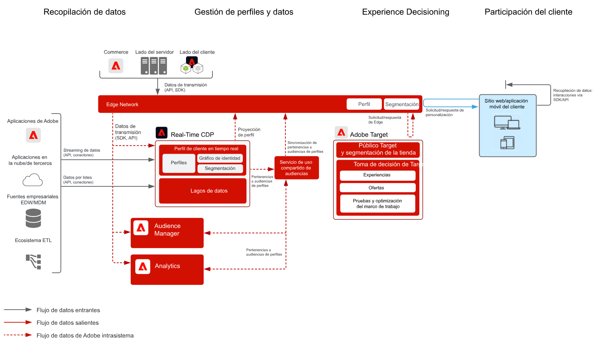
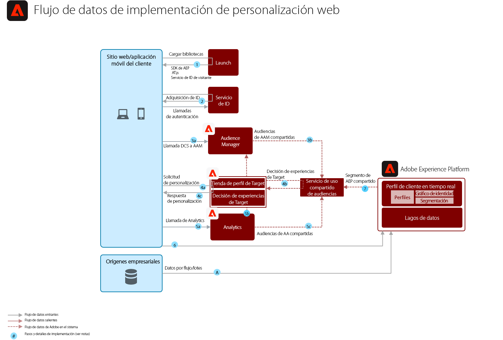

# Modelo de personalización web/móvil basada en comportamiento

Personalización basada en el comportamiento en línea y datos de audiencia.

## Casos de uso

* Optimización de la página de aterrizaje
* Segmentación basada en el comportamiento
* Personalización basada en visualizaciones de productos/contenidos anteriores, afinidad de producto/contenido, atributos del entorno, datos de audiencia de terceros y sectores demográficos

## Aplicaciones

* Adobe Target
* Adobe Analytics (opcional)
* Adobe Audience Manager (opcional)

## Arquitectura

## Guardas

Por defecto, el servicio para compartir segmentos permite que se intercambie un máximo de 75 audiencias por cada grupo de informes de Adobe Analytics. Si se utiliza Audience Manager para compartir audiencias, no habrá límite en el número de las mismas para hacerlo. 

## Patrones de implementación

El modelo de personalización web/móvil se puede implementar mediante los siguientes enfoques, tal como se describe a continuación.

1. Con el [!UICONTROL SDK Platform Web] o [!UICONTROL SDK Platform Mobile] y [!UICONTROL Edge Network].
1. Con SDK tradicionales específicos de cada aplicación (por ejemplo, AppMeasurement.js)

### 1. Enfoque con el SDK Platform Web/Mobile y Edge

### 2. Enfoque con el SDK específico de cada aplicación

## Prerrequisitos de implementación

| Aplicación/servicio | Biblioteca requerida | Notas |
|---|---|---|
| Adobe Target | [!UICONTROL SDK Platform Web]*, at.js 0.9.1+ o mbox.js 61+ | Se recomienda at.js debido a que mbox.js ya no se desarrolla. |
| Adobe Audience Manager (opcional) | [!UICONTROL SDK Platform Web]* o dil.js 5.0+ |  |
| Adobe Analytics (opcional) | [!UICONTROL SDK Platform Web]* o AppMeasurement.js 1.6.4+ |  |
| Servicio de identidad de Experience Cloud | [!UICONTROL SDK Platform Web]* o VisitorAPI.js 2.0+ |  |
| SDK Experience Platform Mobile (opcional) | 4.11 o superior para iOS y Android™ |  |
| SDK Experience Platform Web | 1.0, la versión actual del SDK Experience Platform, cuenta con [varios casos de uso sin compatibilidad con las aplicaciones de Experience Cloud](https://github.com/adobe/alloy/projects/5) |  |

## Pasos de implementación

1. [Implementar Adobe Target](https://experienceleague.adobe.com/docs/target/using/implement-target/implementing-target.html?lang=es) para las aplicaciones móviles o web.

   Si se utiliza Audience Manager o Adobe Analytics:

1. [Implementar Adobe Audience Manager](https://experienceleague.adobe.com/docs/audience-manager/user-guide/implementation-integration-guides/implement-audience-manager.html?lang=es).
1. [Implementar Adobe Analytics](https://experienceleague.adobe.com/docs/analytics/implementation/home.html?lang=es).
1. [Implementar el Servicio de identidad de Experience Cloud](https://experienceleague.adobe.com/docs/id-service/using/implementation/implementation-guides.html?lang=es).

   >[!NOTE]
   >
   >Cada aplicación deberá emplear el Experience Cloud ID y pertenecer a la misma organización de Experience Cloud para que las aplicaciones compartan las audiencias.

1. [Solicitar suministros para los servicios que comparten personas y audiencia (audiencias compartidas)](https://www.adobe.com/go/audiences).
1. Generar segmentos en [Adobe Analytics](https://experienceleague.adobe.com/docs/analytics/components/segmentation/segmentation-workflow/seg-build.html?lang=es) o [Adobe Audience Manager](https://experienceleague.adobe.com/docs/audience-manager/user-guide/features/segments/segment-builder.html?lang=es) y [configurar las audiencias de modo que se compartan con Experience Cloud](https://experienceleague.adobe.com/docs/analytics/components/segmentation/segmentation-workflow/seg-publish.html?lang=es) (si se emplea Audience Manager o Adobe Analytics).
1. Cuando las audiencias estén disponibles en Adobe Target, se podrán utilizar [para la segmentación de experiencias en Adobe Target](https://experienceleague.adobe.com/docs/target/using/audiences/target.html?lang=es).

## Documentación relacionada

* [Audiencias de Experience Cloud](https://experienceleague.adobe.com/docs/core-services/interface/audiences/audience-library.html?lang=es)
* [Integrar Audience Manager con Adobe Target](https://experienceleague.adobe.com/docs/audience-manager/user-guide/implementation-integration-guides/integration-other-solutions/aam-target-integration.html?lang=es)
* [Intercambio de segmentos de Adobe Analytics mediante Adobe Audience Manager](https://experienceleague.adobe.com/docs/analytics/components/segmentation/segmentation-workflow/seg-publish.html)

## Entradas relacionadas en el blog

* [[!DNL Blueprint for Web Personalization using Adobe Experience Platform Real-Time Customer Profile]](https://medium.com/adobetech/blueprint-for-web-personalization-using-adobe-experience-platform-real-time-customer-profile-fef2ce7a4b2f)
* [[!DNL Integrating Adobe Experience Platform Decisioning Engine with AEM Websites]](https://jaeness.medium.com/integrating-adobe-experience-platform-decisioning-engine-with-aem-websites-9c222acd12e2)
* [[!DNL How Adobe Experience Platform Predictive Audiences improves Personalized Experiences]](https://medium.com/adobetech/how-adobe-experience-platform-predictive-audiences-improves-personalized-experiences-1f75a60cb7a3)
* [[!DNL Adobe Experience Platform Web SDK for Audience Management]](https://medium.com/adobetech/adobe-experience-platform-web-sdk-for-audience-management-751fa6d063bc)
* [[!DNL Implementing Adobe Experience Platform Real-Time Customer Profile through our “Customer Zero” Program]](https://medium.com/adobetech/implementing-adobe-experience-platform-real-time-customer-profile-through-our-customer-zero-32e7cd952896)
* [[!DNL How Adobe Experience Platform Can Help Customers Personalize Their Mobile Messaging in Real-Time with Journey Orchestration Service and a Mobile Messaging Vendor]](https://medium.com/adobetech/how-adobe-experience-platform-helped-a-client-personalize-their-mobile-messaging-in-real-time-with-7d634aefa098)
* [[!DNL Segmentation in Seconds: How Adobe Experience Platform Made Real-time Customer Profiles a Reality]](https://medium.com/adobetech/segmentation-in-seconds-how-adobe-experience-platform-made-real-time-customer-profiles-a-reality-a7a8552b0847)
