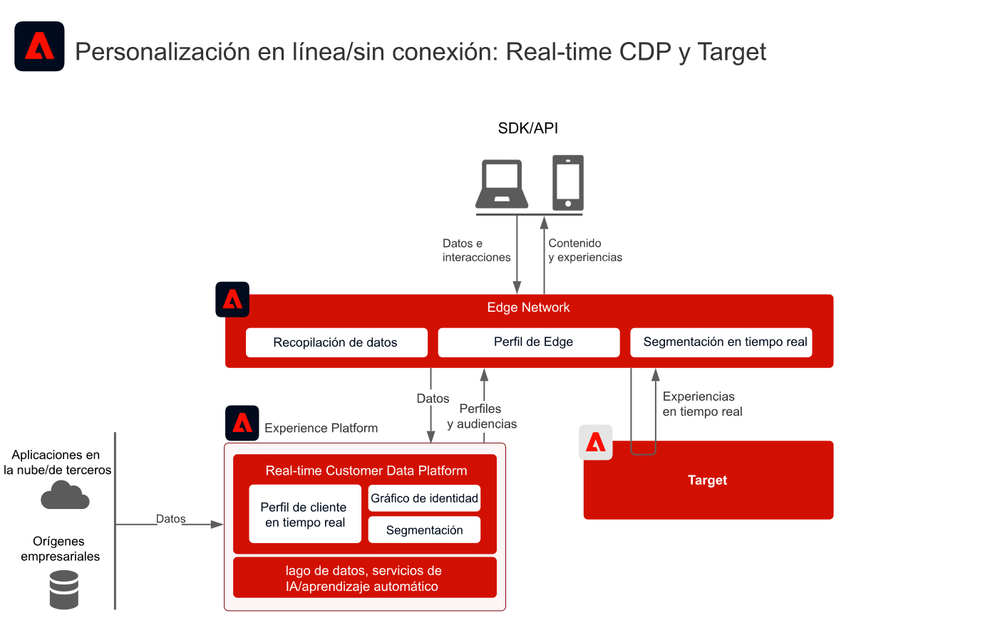
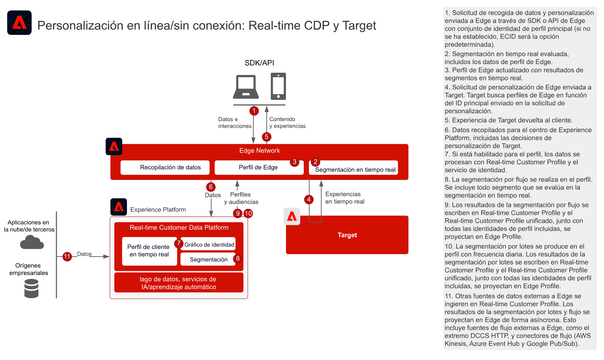
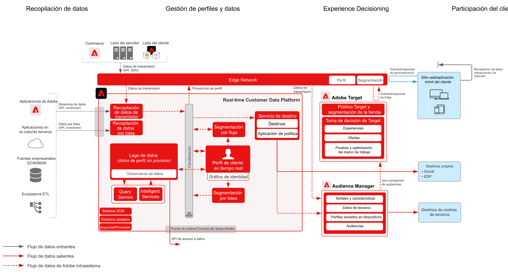

# Personalización web y móvil con datos de clientes conocidos

## Casos de uso

* Personalización en línea con datos de clientes conocidos
* Optimización de la página de aterrizaje
* Personalización basada en visualizaciones de productos/contenidos anteriores, afinidad de producto/contenido, atributos del entorno y datos demográficos, además de datos sin conexión, tales como datos de transacciones, fidelidad y CRM, e información modelada.
* Comparta y dirija audiencias definidas en Real-time Customer Data Platform en sitios web y aplicaciones móviles mediante Adobe Target.

## Aplicaciones

* [!UICONTROL Real-time Customer Data Platform]
* Adobe Target
* Adobe Audience Manager (opcional): Agrega datos de audiencia de terceros
* Adobe Analytics o Customer Journey Analytics (opcional): añade la capacidad de generar segmentos basados en datos históricos de comportamiento y clientes con segmentación detallada

## Patrones de integración

| Patrón de integración | Capacidad | Requisitos previos |
|---|---|---|
| Evaluación de segmentos en tiempo real en Edge compartida desde Real-time Customer Data Platform en Target | <ul><li>Evalúe las audiencias en tiempo real para la personalización de la misma página o de la siguiente en Edge.</li><li>Además, cualquier segmento evaluado en flujo o por lotes también se proyectará en la red de Edge para que se incluya en la evaluación y personalización de segmentos de Edge.</li></ul> | <ul><li>El SDK web/móvil debe implementarse o la API de servidor de red de Edge</li><li>La secuencia de datos debe estar configurada en Experience Edge con Target y la extensión de Experience Platform habilitadas</li><li>El destino de Target debe configurarse en los destinos de Real-time Customer Data Platform.</li><li>La integración con Target requiere la misma organización de IMS que la instancia de Experience Platform.</li></ul> |
| Uso compartido de audiencias por flujo y por lotes desde Real-time Customer Data Platform en Target con el enfoque de Edge | <ul><li>Comparta audiencias de flujo y por lotes de Real-time Customer Data Platform en Target a través de Edge Network. Las audiencias evaluadas en tiempo real requieren la implementación de WebSDK y Edge Network.</li></ul> | <ul><li>El SDK web/móvil no es necesario para compartir audiencias de flujo y por lotes en Target, aunque es necesario para habilitar la evaluación de segmentos de Edge en tiempo real.</li><li>Si utiliza AT.js, solo se admite la integración de perfiles con el área de nombres de identidad de ECID.</li><li>Para las búsquedas del área de nombres de identidad personalizadas en Edge, se necesita la implementación de WebSDK o la API de Edge y cada identidad debe establecerse como tal en el mapa de identidades.</li><li>El destino de Target debe configurarse en los destinos de Real-time Customer Data Platform. Solo se admite la zona protegida de producción en RTCDP.</li><li>La integración con Target requiere la misma organización de IMS que la instancia de Experience Platform.</li></ul> |
| Uso compartido de audiencias de streaming y lotes de Real-time Customer Data Platform en Target y Audience Manager con el enfoque del servicio de uso compartido de audiencias | <ul><li>Este patrón de integración se puede aprovechar cuando se desea un enriquecimiento adicional de datos y audiencias de terceros en Audience Manager.</li></ul> | <ul><li>El SDK web/móvil no es necesario para compartir audiencias de flujo y por lotes en Target, aunque es necesario para habilitar la evaluación de segmentos de Edge en tiempo real.</li><li>Si utiliza AT.js, solo se admite la integración de perfiles con el área de nombres de identidad de ECID.</li><li>Para las búsquedas del área de nombres de identidad personalizadas en Edge, se necesita la implementación de WebSDK o la API de Edge y cada identidad debe establecerse como tal en el mapa de identidades.</li><li>Se debe aprovisionar la proyección de audiencias mediante el servicio de uso compartido de audiencias.</li><li>La integración con Target requiere la misma organización de IMS que la instancia de Experience Platform.</li><li>Solo las audiencias de la zona protegida del producto admiten el servicio principal de uso compartido de audiencias.</li></ul> |

## Uso compartido de audiencias en tiempo real, por streaming y por lotes en Adobe Target

Arquitectura

Detalle de secuencia

Vista general de la arquitectura

## Patrones de implementación

La personalización de cliente conocida se admite mediante varios enfoques de implementación.

### Patrón de implementación 1: red de Edge con SDK web/móvil o API de red de Edge (enfoque recomendado)

* Uso de Edge Network con el SDK web/móvil. La segmentación perimetral en tiempo real requiere el enfoque de implementación del SDK web/móvil o la API de Edge.
* [Consulte el modelo del SDK móvil y web de Experience Platform](../data-ingestion/websdk.md)   para la implementación basada en SDK.
* Para su uso en el SDK móvil, la [extensión Adobe Journey Optimizer - Decisioning](https://aep-sdks.gitbook.io/docs/using-mobile-extensions/adobe-journey-optimizer-decisioning) debe estar instalada en el SDK móvil.
* [Consulte la API de servidor de red de Edge](https://experienceleague.adobe.com/docs/experience-platform/edge-network-server-api/overview.html?lang=es) para una implementación basada en API de Adobe Target con perfil de Edge.

### Patrón de implementación 2: SDK específicos para aplicaciones

Con SDK tradicionales específicos de cada aplicación (por ejemplo, AT.js y AppMeasurement.js). La evaluación de segmentos en tiempo real de Edge no se admite con este enfoque de implementación. Sin embargo, el uso compartido de audiencias por flujo y por lotes desde el centro de Experience Platform se admite con este enfoque de implementación.

[Consulte el modelo de SDK específico de la aplicación](../data-ingestion/appsdk.md)

### Pasos de implementación

1. [Implemente Adobe Target](https://experienceleague.adobe.com/docs/target/using/implement-target/implementing-target.html?lang=es) para sus aplicaciones móviles o web
1. [Implemente Experience Platform y [!UICONTROL Real-time Customer Profile]](https://experienceleague.adobe.com/docs/platform-learn/getting-started-for-data-architects-and-data-engineers/overview.html?lang=es), y asegúrese de que las audiencias creadas se activen en Edge configurando las [políticas de combinación](https://experienceleague.adobe.com/docs/experience-platform/profile/merge-policies/ui-guide.html?lang=es#create-a-merge-policy) como activas en Edge.
1. Implemente el [SDK web de Experience Platform](https://experienceleague.adobe.com/docs/experience-platform/edge/home.html?lang=es) o el [SDK móvil de Experience Platform](https://aep-sdks.gitbook.io/docs/) con la extensión correcta (Target o Adobe Journey Optimizer - Decisioning) instalada. Se requiere el SDK web o móvil de Experience Platform o bien la API de Edge para la segmentación en tiempo real de Edge, pero no es necesario para compartir audiencias de flujo continuo y por lotes de Real-time Customer Data Platform a Target.
1. [Configuración de Edge Network con una secuencia de datos de Edge](https://experienceleague.adobe.com/docs/experience-platform/edge/fundamentals/datastreams.html?lang=es)
1. [Activación de Adobe Target como destino en Real-time Customer Data Platform](https://experienceleague.adobe.com/docs/experience-platform/destinations/catalog/personalization/adobe-target-connection.html?lang=es)
1. (Opcional) [Implemente Adobe Audience Manager](https://experienceleague.adobe.com/docs/audience-manager/user-guide/implementation-integration-guides/implement-audience-manager.html?lang=es).
1. (Opcional) [Solicite aprovisionamiento para el uso compartido de audiencias entre Experience Platform y Adobe Target (audiencias compartidas)](https://www.adobe.com/go/audiences) para compartir audiencias de Experience Platform en Target.

## Guardas

[Consulte los guardas de la página de información general sobre los modelos de personalización web/móvil.](overview.md)

## Consideraciones sobre la implementación

Requisitos previos de identidad

* Cualquier identidad principal se puede aprovechar al utilizar el patrón de implementación 1 descrito anteriormente con Edge Network y WebSDK. La personalización del primer inicio de sesión requiere que la identidad principal del conjunto de solicitudes de personalización coincida con la identidad principal del perfil de Real-time Customer Data Platform. La vinculación de identidad entre dispositivos anónimos y clientes conocidos se procesa en el centro y, posteriormente, se proyecta al extremo.
* Tenga en cuenta que los datos cargados en el centro antes de que un consumidor visite un sitio web o inicie sesión en este no estarán disponibles inmediatamente para su personalización. En primer lugar, debe existir un perfil de Edge activo con el que sincronizar los datos del centro. Una vez creado, el perfil de Edge se sincronizará con el perfil del centro de forma asíncrona, lo que dará como resultado la personalización de la página siguiente.
* El uso compartido de audiencias de Adobe Experience Platform a Adobe Target requiere el uso de ECID como identidad al utilizar el servicio de uso compartido de audiencias, tal como se describe en los patrones de integración 2 y 3 anteriores.
* También se pueden usar identidades alternativas para compartir audiencias de Experience Platform en Adobe Target a través de Audience Manager. Experience Platform activa las audiencias en Audience Manager mediante las siguientes áreas de nombres admitidas: IDFA, GAID, AdCloud, Google, ECID, EMAIL_LC_SHA256. Tenga en cuenta que Audience Manager y Target resuelven las suscripciones de la audiencia a través de la identidad de ECID, de modo que ECID debe estar en el gráfico de identidad para el consumidor para que, finalmente, se pueda compartir la audiencia con Adobe Target.

## Documentación relacionada

### Documentación del SDK

* [Documentación del SDK web de Experience Platform](https://experienceleague.adobe.com/docs/experience-platform/edge/home.html)
* [Documentación de las etiquetas de Experience Platform](https://experienceleague.adobe.com/docs/experience-platform/tags/home.html?lang=es)
* [Documentación de Experience Cloud ID Service](https://experienceleague.adobe.com/docs/id-service/using/home.html?lang=es)

### Documentación de la conexión

* [Conexión de Adobe Target para Real-time Customer Data Platform](https://experienceleague.adobe.com/docs/experience-platform/destinations/catalog/personalization/adobe-target-connection.html?lang=en)
* [Configuración de la secuencia de datos de Edge](https://experienceleague.adobe.com/docs/experience-platform/edge/fundamentals/datastreams.html)
* [Compartir segmentos en Experience Platform con Audience Manager y otras soluciones de Experience Cloud](https://experienceleague.adobe.com/docs/audience-manager/user-guide/implementation-integration-guides/integration-experience-platform/aam-aep-audience-sharing.html?lang=es)

### Documentación de la segmentación

* [Información general sobre la segmentación en Experience Platform](https://experienceleague.adobe.com/docs/experience-platform/segmentation/home.html?lang=es)
* [Segmentación en tiempo real](https://experienceleague.adobe.com/docs/experience-platform/segmentation/ui/edge-segmentation.html?lang=es)
* [Segmentación por flujo](https://experienceleague.adobe.com/docs/experience-platform/segmentation/api/streaming-segmentation.html?lang=es)
* [Intercambio de segmentos de Adobe Analytics mediante Adobe Audience Manager](https://experienceleague.adobe.com/docs/analytics/components/segmentation/segmentation-workflow/seg-publish.html?lang=es)
* [Configuración de políticas de combinación](https://experienceleague.adobe.com/docs/experience-platform/profile/merge-policies/ui-guide.html?lang=en#create-a-merge-policy)

### Tutoriales

* [Personalización de próxima visita con Real-Time CDP y Adobe Target](https://experienceleague.adobe.com/docs/platform-learn/tutorials/experience-cloud/next-hit-personalization.html?lang=es)

### Entradas relacionadas en el blog

* [Adobe lanza la personalización mejorada de la misma página con Adobe Target y Real-time Customer Data Platform](https://blog.adobe.com/en/publish/2021/10/05/adobe-announces-same-page-enhanced-personalization-with-adobe-target-real-time-customer-data-platform)
* [[!DNL Blueprint for Web Personalization using Adobe Experience Platform Real-Time Customer Profile]](https://medium.com/adobetech/blueprint-for-web-personalization-using-adobe-experience-platform-real-time-customer-profile-fef2ce7a4b2f)
* [[!DNL Adobe Experience Platform’s Identity Service — How to Solve the Customer Identity Conundrum]](https://medium.com/adobetech/adobe-experience-platforms-identity-service-how-to-solve-the-customer-identity-conundrum-f95e22d16ea9)
* [[!DNL Adobe Experience Platform Web SDK for Audience Management]](https://medium.com/adobetech/adobe-experience-platform-web-sdk-for-audience-management-751fa6d063bc)
* [[!DNL Implementing Adobe Experience Platform Real-Time Customer Profile through our “Customer Zero” Program]](https://medium.com/adobetech/implementing-adobe-experience-platform-real-time-customer-profile-through-our-customer-zero-32e7cd952896)
* [[!DNL Segmentation in Seconds: How Adobe Experience Platform Made Real-time Customer Profiles a Reality]](https://medium.com/adobetech/segmentation-in-seconds-how-adobe-experience-platform-made-real-time-customer-profiles-a-reality-a7a8552b0847)
