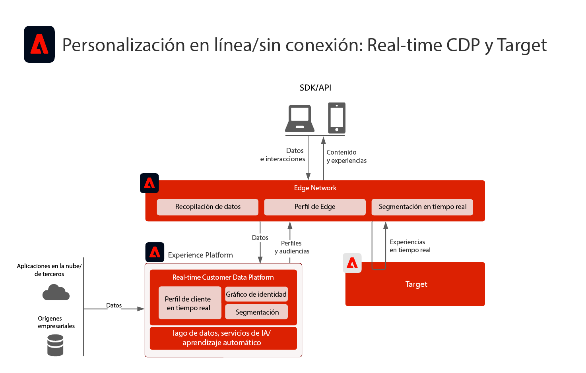
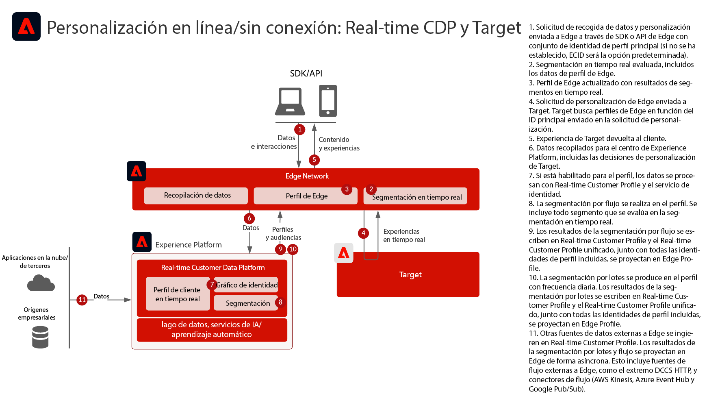
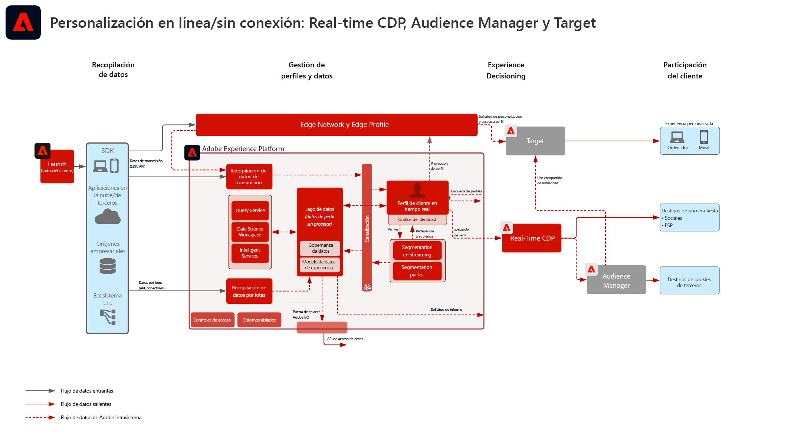
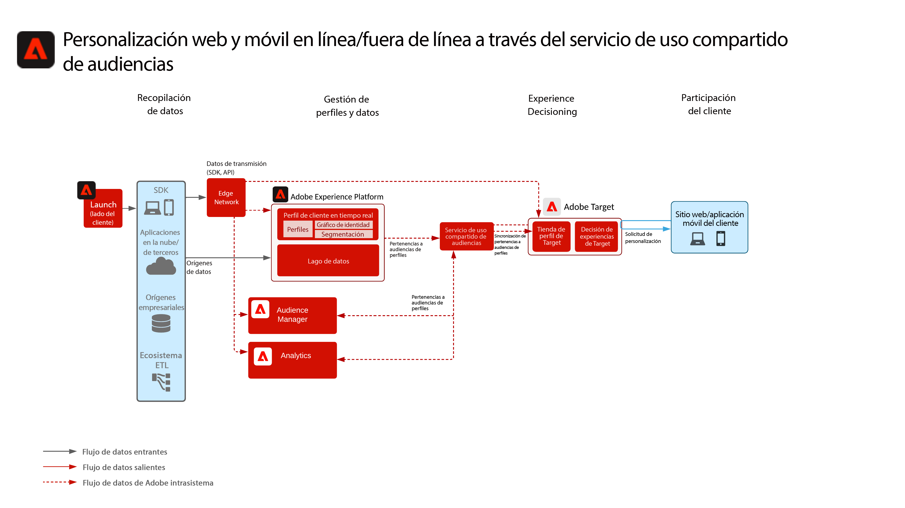
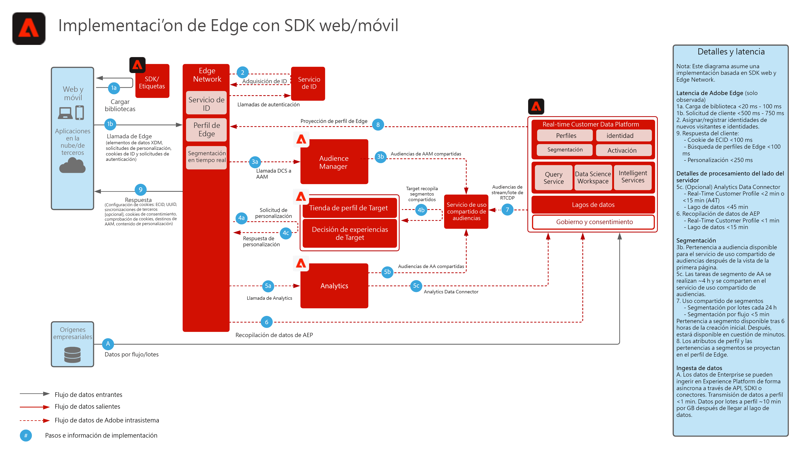
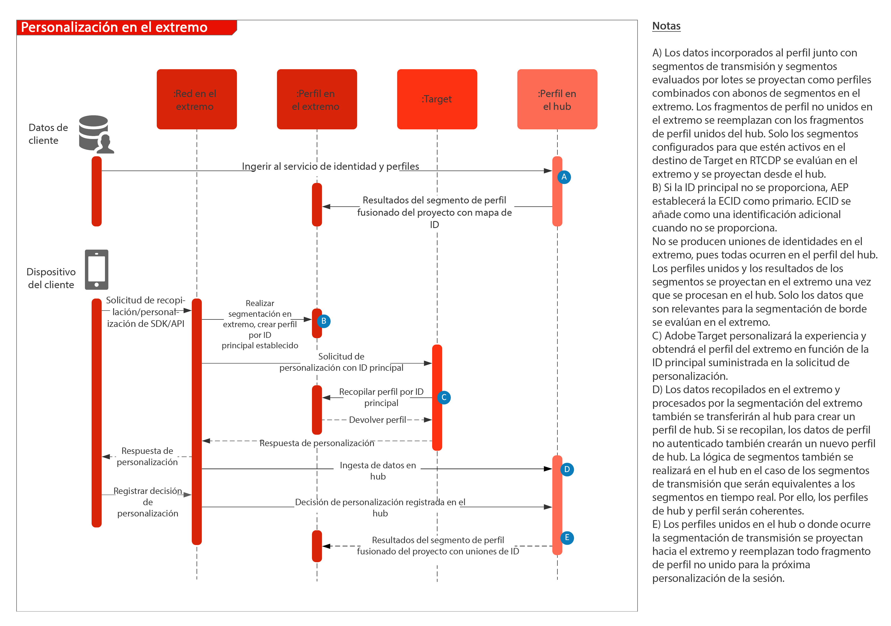

# Personalización web/móvil con datos en línea y sin conexión

Sincronice la personalización del sitio web con la del email y otras personalizaciones de canales anónimos y conocidos.

## Casos de uso

* Optimización de la página de aterrizaje
* Segmentación de perfiles según comportamiento y sin conexión
* Personalización basada en visualizaciones de productos/contenidos anteriores, afinidad de producto/contenido, atributos del entorno, datos de audiencia de terceros y sectores demográficos, además de datos sin conexión, tales como transacciones, datos de fidelidad y CRM, y datos modelados.
* Comparta y dirija audiencias definidas en Real-time Customer Data Platform en sitios web y aplicaciones móviles mediante Adobe Target.

## Aplicaciones

* [!UICONTROL Real-time Customer Data Platform]
* Adobe Target
* Adobe Audience Manager (opcional): Agrega datos de audiencia de terceros, gráficos de dispositivos basados en cooperación, la capacidad de mostrar audiencias de Real-time Customer Data Platform en Adobe Analytics y la capacidad de mostrar audiencias de Adobe Analytics en Real-time Customer Data Platform.
* Adobe Analytics (opcional): añade la habilidad de generar segmentos basados en los datos de comportamiento histórico y realizar una segmentación detallada de los datos de Adobe Analytics.

## Casos de uso

<table class="tg" style="undefined;table-layout: fixed; width: 790px">
<colgroup>
<col style="width: 20px">
<col style="width: 276px">
<col style="width: 229px">
<col style="width: 265px">
</colgroup>
<thead>
  <tr>
    <th class="tg-y6fn">#</th>
    <th class="tg-f7v4">Casos de uso</th>
    <th class="tg-y6fn">Capacidad</th>
    <th class="tg-f7v4">Requisitos previos</th>
  </tr>
</thead>
<tbody>
  <tr>
    <td class="tg-0lax">1</td>
<td class="tg-73oq">Evaluación de segmentos en tiempo real en Edge compartida de Real-time Customer Data Platform a Target</td>
    <td class="tg-0lax">- Evalúe las audiencias en tiempo real para la personalización de la misma página o de la siguiente en Edge. - Además, cualquier segmento evaluado en flujo continuo o por lotes también se proyectará a la red perimetral para que se incluya en la evaluación y personalización de segmentos Edge.</td>
    <td class="tg-73oq"> - El patrón de implementación 1 se describe a continuación. : el SDK web/móvil debe implementarse. : Tenga en cuenta que el SDK móvil y la compatibilidad basada en API para la segmentación en tiempo real no están disponibles actualmente - El almacén de datos debe configurarse en Experience Edge con la extensión Target y el Experience Platform habilitada, el ID del almacén de datos se proporcionará en la configuración de destino de Target. : el destino de destino debe configurarse en Real-time Customer Data Platform Destinations. - La integración con Target requiere la misma organización de IMS que la instancia de Experience Platform.</td> 
  </tr>
  <tr>
    <td class="tg-0lax">2</td>
    <td class="tg-73oq">Uso compartido de audiencias por transmisión y por lotes de Real-time Customer Data Platform a Target mediante el enfoque de Edge</td>
    <td class="tg-0lax">: comparta audiencias de flujo continuo y por lotes de Real-time Customer Data Platform a Target a través de la red perimetral. Las audiencias evaluadas en tiempo real requieren el uso de WebSDK y la evaluación de audiencias en tiempo real que se describen en el patrón de integración 1. : Esta integración suele aprovecharse para compartir audiencias de flujo continuo y por lotes mediante SDK tradicionales en lugar de migrar a la recopilación de Edge y a WebSDK, que alimenta las audiencias en tiempo real, así como las de flujo continuo y por lotes, tal como se describe en el patrón de integración 1.</td>
    <td class="tg-73oq"> - Patrón de implementación 1 o 2 descrito a continuación. : El SDK web/móvil no es necesario para compartir audiencias de flujo continuo y por lotes con Target, aunque es necesario para habilitar la evaluación de segmentos perimetrales en tiempo real como se describe en el patrón de integración 1.  - Si se utiliza AT.js, solo se admite la integración de perfiles con el espacio de nombres de identidad de ECID.  : Para las búsquedas de espacio de nombres de identidad personalizado en Edge, la implementación de WebSDK es necesaria y cada identidad debe configurarse como identidad en el mapa de identidad. - El almacén de datos debe configurarse en Experience Edge, el ID del almacén de datos se proporcionará en la configuración de destino de Target. : el destino de destino debe configurarse en Real-time Customer Data Platform Destinations. - La integración con Target requiere la misma organización de IMS que la instancia de Experience Platform.</td>
  </tr>
  <tr>
    <td class="tg-0lax">3</td>
    <td class="tg-73oq">Flujo continuo y uso compartido de audiencias por lotes de Real-time Customer Data Platform a Target y Audience Manager mediante el enfoque del servicio de uso compartido de audiencias</td>
    <td class="tg-0lax">: comparta audiencias de flujo continuo y por lotes de Real-time Customer Data Platform a Target y Audience Manager mediante el servicio de uso compartido de audiencias.  -Este patrón de integración se puede aprovechar cuando se desea un enriquecimiento adicional de datos y audiencias de terceros en Audience Manager. De lo contrario, se prefieren los patrones de integración 1 y 2. Las audiencias evaluadas en tiempo real requieren el uso de WebSDK y la evaluación de audiencias en tiempo real que se describen en el patrón de integración 1.</td>
    <td class="tg-73oq"> - Patrón de implementación 1 o 2 descrito a continuación. : La implementación del SDK web/móvil no es necesaria para esta integración. - Se debe aprovisionar la proyección de audiencias mediante el servicio de uso compartido de audiencias. - La integración con Target requiere la misma organización de IMS que la instancia de Experience Platform. - La identidad debe resolverse en ECID para compartirla en el extremo para que Target actúe al respecto.</td>
  </tr>
</tbody>
</table>

## Arquitectura para los escenarios 1 y 2: uso compartido de audiencias en tiempo real, de transmisión y por lotes a través de la red perimetral

Arquitectura

Detalle de secuencia

Arquitectura de información general para el patrón de integración 1

### Pasos de implementación para el escenario 1, también admite el escenario 2

1. [Implementar Adobe Target](https://experienceleague.adobe.com/docs/target/using/implement-target/implementing-target.html?lang=es) para sus aplicaciones móviles o web
1. [Implementar Experience Platform y [!UICONTROL Real-time Customer Profile]](https://experienceleague.adobe.com/docs/platform-learn/getting-started-for-data-architects-and-data-engineers/overview.html?lang=es)
1. Implementación [SDK web de Experience Platform](https://experienceleague.adobe.com/docs/experience-platform/edge/home.html?lang=es). El SDK web de Experience Platform es necesario para la segmentación perimetral en tiempo real, pero no es necesario para compartir audiencias de flujo continuo y por lotes de Real-time Customer Data Platform a Target. Tenga en cuenta que actualmente no está disponible la compatibilidad con la segmentación en tiempo real mediante el SDK móvil y la API.
1. [Configuración de la red perimetral con un conjunto de datos perimetral](https://experienceleague.adobe.com/docs/experience-platform/edge/fundamentals/datastreams.html)
1. [Habilitar Adobe Target como destino en Real-time Customer Data Platform](https://experienceleague.adobe.com/docs/experience-platform/destinations/catalog/personalization/adobe-target-connection.html?lang=es)

## Arquitectura para el escenario 3: uso compartido de audiencias por transmisión y por lotes a través del servicio de uso compartido de audiencias con Adobe Target y Audience Manager

Arquitectura

### Pasos de implementación para el escenario 3, también admite el escenario 2

1. [Implementar Adobe Target](https://experienceleague.adobe.com/docs/target/using/implement-target/implementing-target.html) para sus aplicaciones móviles o web
1. [Implementar Adobe Audience Manager](https://experienceleague.adobe.com/docs/audience-manager/user-guide/implementation-integration-guides/implement-audience-manager.html?lang=es) (opcional)
1. [Implementar Adobe Analytics](https://experienceleague.adobe.com/docs/analytics/implementation/home.html?lang=es) (opcional)
1. [Implementar Experience Platform y [!UICONTROL Real-time Customer Profile]](https://experienceleague.adobe.com/docs/platform-learn/getting-started-for-data-architects-and-data-engineers/overview.html)
1. Implementación [Servicio de identidad de Experience Cloud](https://experienceleague.adobe.com/docs/id-service/using/implementation/implementation-guides.html?lang=es)
1. [Solicitar aprovisionamiento para el uso compartido de audiencias entre Experience Platform y Adobe Target (audiencias compartidas)](https://www.adobe.com/go/audiences) para compartir audiencias de Experience Platform a Target.
1. (Opcional) [Configuración de la red perimetral con un conjunto de datos perimetral](https://experienceleague.adobe.com/docs/experience-platform/edge/fundamentals/datastreams.html) (Esto solo es necesario para el patrón de integración 2, en el que las audiencias no necesitan compartirse con el Audience Manager ni enriquecirse con audiencias o datos Audience Manager).
1. (Opcional) [Habilitar Adobe Target como destino en Real-time Customer Data Platform](https://experienceleague.adobe.com/docs/experience-platform/destinations/catalog/personalization/adobe-target-connection.html?lang=en) para compartir audiencias de flujo continuo y por lotes desde Real-time Customer Data Platform directamente a Edge, frente al servicio y Audience Manager de uso compartido de audiencias.

### Patrones de implementación

La personalización en línea y sin conexión es compatible mediante varios enfoques de implementación.

### Patrón de implementación 1: admite los casos de uso 1 y 2. Red perimetral con SDK web/móvil (enfoque recomendado)

Uso de la red perimetral con el SDK web/móvil

 
Diagrama de secuencia

### Patrón de implementación 2: admite los casos de uso 3 y 2. SDK específicos de la aplicación

Uso de SDK tradicionales específicos de la aplicación (por ejemplo, AT.js y AppMeasurement.js)

## Guardas

[Consulte los guardas de la página de información general sobre los modelos de personalización web/móvil.](overview.md)

## Consideraciones sobre la implementación

Requisitos previos de identidad

* Cualquier identidad principal se puede aprovechar al utilizar el patrón de integración 1 descrito anteriormente con la red Edge y WebSDK. La personalización del primer inicio de sesión requiere que la identidad principal del conjunto de solicitudes de personalización coincida con la identidad principal del perfil de Real-time Customer Data Platform. La vinculación de identidad entre dispositivos anónimos y clientes conocidos se procesa en el concentrador y, posteriormente, se proyecta al extremo. Por lo tanto, si la identidad principal se establece como identificador del dispositivo, los datos de cliente conocidos no se aplicarán hasta las sesiones siguientes en las que se hayan unificado los perfiles anónimos y conocidos.
* El uso compartido de audiencias de Adobe Experience Platform con Adobe Target requiere el uso de ECID como identidad al utilizar el servicio de uso compartido de audiencias, tal como se describe en el patrón de integración 3 anterior.
* También se pueden usar identidades alternativas para compartir audiencias de Experience Platform a Adobe Target a través de Audience Manager. Experience Platform activa las audiencias en Audience Manager mediante las siguientes áreas de nombres admitidas: IDFA, GAID, AdCloud, Google, ECID, EMAIL_LC_SHA256. Tenga en cuenta que Audience Manager y Target resuelven las suscripciones de audiencia a través de la identidad de ECID, por lo que ECID sigue siendo necesario para que la audiencia final se comparta en Adobe Target.

## Documentación relacionada

### Documentación

* [Conexión de Adobe Target para Real-time Customer Data Platform](https://experienceleague.adobe.com/docs/experience-platform/destinations/catalog/personalization/adobe-target-connection.html?lang=en)
* [Compartir segmentos en Experience Platform con Audience Manager y otras soluciones de Experience Cloud](https://experienceleague.adobe.com/docs/audience-manager/user-guide/implementation-integration-guides/integration-experience-platform/aam-aep-audience-sharing.html?lang=es)
* [Documentación del SDK web de Experience Platform](https://experienceleague.adobe.com/docs/experience-platform/edge/home.html)
* [Documentación de Experience Cloud ID Service](https://experienceleague.adobe.com/docs/id-service/using/home.html?lang=es)
* [Información general sobre la segmentación en Experience Platform](https://experienceleague.adobe.com/docs/experience-platform/segmentation/home.html?lang=es)
* [Segmentación en tiempo real](https://experienceleague.adobe.com/docs/experience-platform/segmentation/ui/edge-segmentation.html)
* [Segmentación por flujo](https://experienceleague.adobe.com/docs/experience-platform/segmentation/api/streaming-segmentation.html?lang=es)
* [Información general sobre el generador de segmentos de Experience Platform](https://experienceleague.adobe.com/docs/experience-platform/segmentation/ui/overview.html)
* [Conector de origen de Audience Manager](https://experienceleague.adobe.com/docs/experience-platform/sources/connectors/adobe-applications/audience-manager.html?lang=es)
* [Intercambio de segmentos de Adobe Analytics mediante Adobe Audience Manager](https://experienceleague.adobe.com/docs/analytics/components/segmentation/segmentation-workflow/seg-publish.html?lang=es)
* [Documentación de las etiquetas de Experience Platform](https://experienceleague.adobe.com/docs/experience-platform/tags/home.html?lang=es)

### Tutoriales

* [Personalización de próxima visita con Real-time CDP y Adobe Target](https://experienceleague.adobe.com/docs/platform-learn/tutorials/experience-cloud/next-hit-personalization.html?lang=es)

## Entradas relacionadas en el blog

* [[!DNL Blueprint for Web Personalization using Adobe Experience Platform Real-Time Customer Profile]](https://medium.com/adobetech/blueprint-for-web-personalization-using-adobe-experience-platform-real-time-customer-profile-fef2ce7a4b2f)
* [[!DNL Build an Optimal Online Experience: Enrich Unified Profile with Query Service]](https://medium.com/adobetech/build-an-optimal-online-experience-enrich-unified-profile-with-query-service-8027c196ab33)
* [[!DNL Integrating Adobe Experience Platform Decisioning Engine with AEM Websites]](https://jaeness.medium.com/integrating-adobe-experience-platform-decisioning-engine-with-aem-websites-9c222acd12e2)
* [[!DNL Adobe Experience Platform’s Identity Service — How to Solve the Customer Identity Conundrum]](https://medium.com/adobetech/adobe-experience-platforms-identity-service-how-to-solve-the-customer-identity-conundrum-f95e22d16ea9)
* [[!DNL How Adobe Experience Platform Predictive Audiences improves Personalized Experiences]](https://medium.com/adobetech/how-adobe-experience-platform-predictive-audiences-improves-personalized-experiences-1f75a60cb7a3)
* [[!DNL Adobe Experience Platform Web SDK for Audience Management]](https://medium.com/adobetech/adobe-experience-platform-web-sdk-for-audience-management-751fa6d063bc)
* [[!DNL Implementing Adobe Experience Platform Real-Time Customer Profile through our “Customer Zero” Program]](https://medium.com/adobetech/implementing-adobe-experience-platform-real-time-customer-profile-through-our-customer-zero-32e7cd952896)
* [[!DNL How Adobe Experience Platform Can Help Customers Personalize Their Mobile Messaging in Real-Time with Journey Orchestration Service and a Mobile Messaging Vendor]](https://medium.com/adobetech/how-adobe-experience-platform-helped-a-client-personalize-their-mobile-messaging-in-real-time-with-7d634aefa098)
* [[!DNL Segmentation in Seconds: How Adobe Experience Platform Made Real-time Customer Profiles a Reality]](https://medium.com/adobetech/segmentation-in-seconds-how-adobe-experience-platform-made-real-time-customer-profiles-a-reality-a7a8552b0847)
* [[!DNL Build an Optimal Online Experience: Enrich Unified Profile with Query Service]](https://medium.com/adobetech/build-an-optimal-online-experience-enrich-unified-profile-with-query-service-8027c196ab33)
