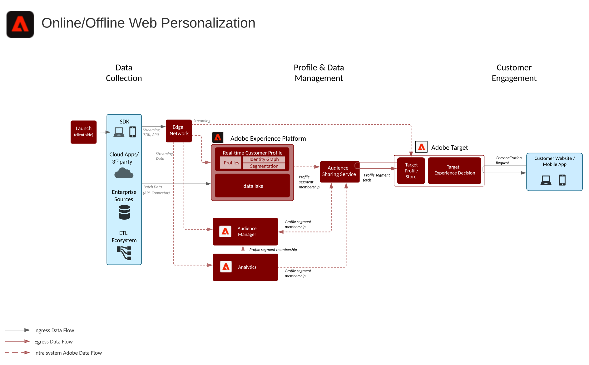

# Modelo de personalización móvil/web en línea/sin conexión

Sincronice la personalización del sitio web con la del email y otras personalizaciones de canales anónimos y conocidos.

## Casos de uso

* Optimización de la página de aterrizaje
* Segmentación de perfiles según comportamiento y sin conexión
* Personalización basada en visualizaciones de productos/contenidos anteriores, afinidad de producto/contenido, atributos del entorno, datos de audiencia de terceros y sectores demográficos, además de datos sin conexión, tales como transacciones, datos de fidelidad y CRM, y datos modelados.

## Aplicaciones

* [!UICONTROL Real-time Customer Data Platform]
* Adobe Target
* Adobe Audience Manager (opcional): añade datos de audiencia de terceros, gráficos de cooperación basados en dispositivos y la habilidad de rescatar segmentos de Platform en Adobe Analytics y viceversa.
* Adobe Analytics (opcional): añade la habilidad de generar segmentos basados en los datos de comportamiento histórico y realizar una segmentación detallada de los datos de Adobe Analytics.

## Arquitectura

## Guardas

### Protecciones para la evaluación y activación de segmentos

| Tipo de segmentación | Frecuencia | Rendimiento | Latencia (Evaluación de segmentos) | Latencia (Activación de segmentos) |
|-|-|-|-|-|-|
| Segmentación de Edge | La segmentación de Edge está actualmente en fase beta y permite evaluar una segmentación válida en tiempo real en la red perimetral del Experience Platform para la toma de decisiones en la misma página en tiempo real mediante Adobe Target y Journey Optimizer de Adobe. |  | ~100 ms | Disponible inmediatamente para su personalización en Adobe Target, para búsquedas de perfiles en el perfil de Edge y para su activación mediante destinos basados en cookies. |
| Segmentación por transmisión | Cada vez que se incorpora un nuevo evento o registro de flujo continuo en el perfil del cliente en tiempo real y la definición del segmento es un segmento de flujo continuo válido.  Consulte la documentación de  [segmentación ](https://experienceleague.adobe.com/docs/experience-platform/segmentation/api/streaming-segmentation.html?lang=es) para obtener instrucciones sobre los criterios de los segmentos de flujo continuo | Hasta 1500 eventos por segundo.  | ~ p95 &lt;5 min | Una vez que se producen estas realizaciones de segmentos, se comparten con el Audience Manager y el servicio de uso compartido de audiencias en cuestión de minutos y están disponibles para la personalización de la misma página o de la siguiente en Adobe Target. |
| Segmentación incremental | Una vez por hora para los nuevos datos que se han incorporado en el perfil del cliente en tiempo real desde la última evaluación de segmentos por lotes o incrementales. |  |  | Una vez que estas suscripciones a segmentos se hayan realizado, se comparten con el Audience Manager y el servicio de uso compartido de audiencias en cuestión de minutos y están disponibles para la personalización de la misma página/siguiente en Adobe Target. |
| Segmentación por lotes | Una vez al día en función de una programación predeterminada del sistema o iniciada manualmente mediante API. |  | Aproximadamente una hora por trabajo para un tamaño de almacén de perfiles de hasta 10 TB, 2 horas por trabajo para un tamaño de almacén de perfiles de entre 10 TB y 100 TB. El rendimiento del trabajo del segmento por lotes depende del número de perfiles, el tamaño de los perfiles y el número de segmentos que se evalúen. | Una vez que estas suscripciones a segmentos se hayan realizado, se comparten con el Audience Manager y el servicio de uso compartido de audiencias en cuestión de minutos y están disponibles para la personalización de la misma página/siguiente en Adobe Target. |

### Protecciones para el uso compartido de audiencias entre aplicaciones

| Patrón de integración del uso compartido de audiencias | Detalle | Frecuencia | Rendimiento | Latencia (Evaluación de segmentos) | Latencia (Activación de segmentos) |
|-|-|-|-|-|-|-|
| Plataforma de datos del cliente en tiempo real para el Audience Manager |  | Depende del tipo de segmentación : consulte la tabla de protecciones de segmentación anterior. | Depende del tipo de segmentación : consulte la tabla de protecciones de segmentación anterior. | Depende del tipo de segmentación : consulte la tabla de protecciones de segmentación anterior. | En los minutos siguientes a la finalización de la evaluación del segmento. La sincronización inicial de la configuración de audiencia entre la plataforma de datos del cliente en tiempo real y el Audience Manager tarda aproximadamente 4 horas. Cualquier pertenencia a una audiencia realizada durante el periodo de 4 horas se escribirá en el Audience Manager del trabajo de segmentación por lotes subsiguiente como pertenencia a una audiencia &quot;existente&quot;. |
| Adobe Analytics para Audience Manager | De forma predeterminada, se puede compartir un máximo de 75 audiencias para cada grupo de informes de Adobe Analytics. Si se utiliza una licencia de Audience Manager, no hay límite en el número de audiencias que se pueden compartir entre Adobe Analytics y Adobe Target o Adobe Audience Manager y Adobe Target. |  |  |  |  |
| Adobe Analytics a la plataforma de datos del cliente en tiempo real | Actualmente no está disponible. |  |  |  |  |

## Patrones de implementación

El modelo de personalización web/móvil se puede implementar mediante los siguientes enfoques, tal como se describe a continuación.

1. Uso del [!UICONTROL Platform Web SDK] o [!UICONTROL Platform Mobile SDK] y [!UICONTROL Edge Network].
1. Uso de SDK tradicionales específicos de la aplicación (por ejemplo, AppMeasurement.js)

### 1. SDK web/móvil de plataforma y enfoque perimetral

### 2. Enfoque de SDK específico de la aplicación

## Prerrequisitos de implementación

| Aplicación/servicio | Biblioteca requerida | Notas |
|---|---|---|
| Adobe Target | [!UICONTROL SDK] web de plataforma*, at.js 0.9.1+ o mbox.js 61+ | Se recomienda at.js debido a que mbox.js ya no se desarrolla. |
| Adobe Audience Manager (opcional) | [!UICONTROL SDK] web de plataforma* o dil.js 5.0+ |  |
| Adobe Analytics (opcional) | [!UICONTROL SDK] web de plataforma* o AppMeasurement.js 1.6.4+ | El seguimiento de Adobe Analytics debe emplear la recopilación de datos regional (RDC). |
| Servicio Experience Cloud ID | [!UICONTROL SDK] web de plataforma* o VisitorAPI.js 2.0+ | (Recomendación) Emplear Experience Platform Launch para implementar el servicio de ID y así garantizar que este ID se configure antes de la llamada de cualquier aplicación. |
| SDK móvil de Experience Platform (opcional) | 4.11 o superior para iOS y Android™ |  |
| SDK web de Experience Platform | 1.0, la versión actual del SDK de Experience Platform cuenta con [varios casos de uso sin compatibilidad con las aplicaciones de Experience Cloud](https://github.com/adobe/alloy/projects/5) |  |

## Pasos de implementación

1. [Implementar Adobe Target](https://experienceleague.adobe.com/docs/target/using/implement-target/implementing-target.html?lang=es) para sus aplicaciones móviles o web
1. [Implementar Adobe Audience Manager](https://experienceleague.adobe.com/docs/audience-manager/user-guide/implementation-integration-guides/implement-audience-manager.html?lang=es) (opcional)
1. [Implementar Adobe Analytics](https://experienceleague.adobe.com/docs/analytics/implementation/home.html?lang=es) (opcional)
1. [[!UICONTROL Implementar Experience Platform y Real-time Customer Profile]](https://experienceleague.adobe.com/docs/platform-learn/getting-started-for-data-architects-and-data-engineers/overview.html?lang=es)
1. Implementar [Servicio de identidad de Experience Cloud](https://experienceleague.adobe.com/docs/id-service/using/implementation/implementation-guides.html?lang=es) o [el SDK Experience Platform Web](https://experienceleague.adobe.com/docs/experience-platform/edge/home.html?lang=es)
   >[!NOTE]
   >
   >Cada aplicación deberá emplear el Experience Cloud ID y pertenecer a la misma organización de Experience Cloud para que las aplicaciones compartan las audiencias.
1. [Solicitar suministros para compartir audiencias entre Experience Platform y Adobe Target (audiencias compartidas)](https://www.adobe.com/go/audiences)

## Documentación relacionada

* [Compartir segmentos en Experience Platform con Audience Manager y otras soluciones de Experience Cloud](https://experienceleague.adobe.com/docs/audience-manager/user-guide/implementation-integration-guides/integration-experience-platform/aam-aep-audience-sharing.html?lang=es)
* [Información general sobre la segmentación en Experience Platform](https://experienceleague.adobe.com/docs/experience-platform/segmentation/home.html?lang=es)
* [Segmentación por flujo](https://experienceleague.adobe.com/docs/experience-platform/segmentation/api/streaming-segmentation.html)
* [Información general sobre el generador de segmentos de Experience Platform](https://experienceleague.adobe.com/docs/experience-platform/segmentation/ui/overview.html?lang=es)
* [Conector de origen de Audience Manager](https://experienceleague.adobe.com/docs/experience-platform/sources/connectors/adobe-applications/audience-manager.html?lang=es)
* [Uso compartido de segmentos de Adobe Analytics mediante Adobe Audience Manager](https://experienceleague.adobe.com/docs/analytics/components/segmentation/segmentation-workflow/seg-publish.html?lang=es)
* [Documentación del SDK Experience Platform Web](https://experienceleague.adobe.com/docs/experience-platform/edge/home.html)
* [Documentación de Experience Cloud ID Service](https://experienceleague.adobe.com/docs/id-service/using/home.html?lang=es)
* [Documentación de Experience Platform Launch](https://experienceleague.adobe.com/docs/launch/using/home.html?lang=es)

## Entradas relacionadas en el blog

* [[!DNL Blueprint for Web Personalization using Adobe Experience Platform Real-Time Customer Profile]](https://medium.com/adobetech/blueprint-for-web-personalization-using-adobe-experience-platform-real-time-customer-profile-fef2ce7a4b2f)
* [[!DNL Build an Optimal Online Experience: Enrich Unified Profile with Query Service]](https://medium.com/adobetech/build-an-optimal-online-experience-enrich-unified-profile-with-query-service-8027c196ab33)
* [[!DNL Integrating Adobe Experience Platform Decisioning Engine with AEM Websites]](https://jaeness.medium.com/integrating-adobe-experience-platform-decisioning-engine-with-aem-websites-9c222acd12e2)
* [[!DNL Adobe Experience Platform’s Identity Service — How to Solve the Customer Identity Conundrum]](https://medium.com/adobetech/adobe-experience-platforms-identity-service-how-to-solve-the-customer-identity-conundrum-f95e22d16ea9)
* [[!DNL How Adobe Experience Platform Predictive Audiences improves Personalized Experiences]](https://medium.com/adobetech/how-adobe-experience-platform-predictive-audiences-improves-personalized-experiences-1f75a60cb7a3)
* [[!DNL Adobe Experience Platform Web SDK for Audience Management]](https://medium.com/adobetech/adobe-experience-platform-web-sdk-for-audience-management-751fa6d063bc)
* [[!DNL Implementing Adobe Experience Platform Real-Time Customer Profile through our “Customer Zero” Program]](https://medium.com/adobetech/implementing-adobe-experience-platform-real-time-customer-profile-through-our-customer-zero-32e7cd952896)
* [[!DNL How Adobe Experience Platform Can Help Customers Personalize Their Mobile Messaging in Real-Time with Journey Orchestration Service and a Mobile Messaging Vendor]](https://medium.com/adobetech/how-adobe-experience-platform-helped-a-client-personalize-their-mobile-messaging-in-real-time-with-7d634aefa098)
* [[!DNL Segmentation in Seconds: How Adobe Experience Platform Made Real-time Customer Profiles a Reality]](https://medium.com/adobetech/segmentation-in-seconds-how-adobe-experience-platform-made-real-time-customer-profiles-a-reality-a7a8552b0847)
* [[!DNL Build an Optimal Online Experience: Enrich Unified Profile with Query Service]](https://medium.com/adobetech/build-an-optimal-online-experience-enrich-unified-profile-with-query-service-8027c196ab33)
