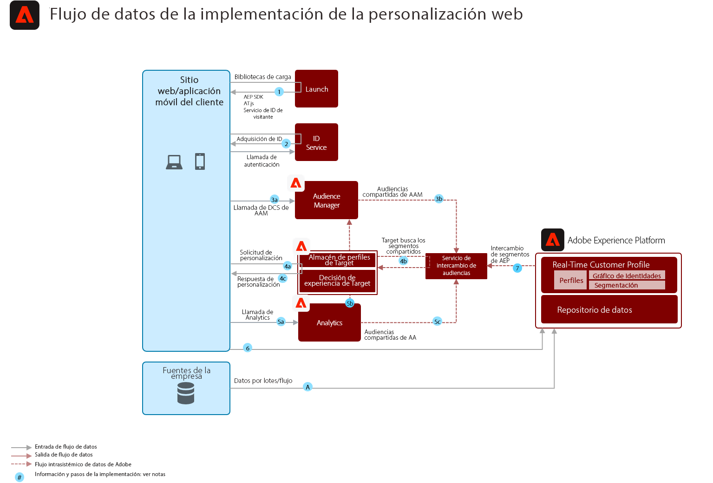

# Modelo de personalización móvil/web en línea/sin conexión

Sincronice la personalización web con el correo electrónico y otras personalizaciones de canal conocidas y anónimas.

## Casos de uso

* Optimización de la página de aterrizaje
* Segmentación de perfiles en comportamiento y sin conexión
* Personalización basada en vistas de producto/contenido anteriores, afinidad de producto/contenido, atributos de entorno, datos de audiencia de terceros y datos demográficos, además de perspectivas sin conexión como transacciones, datos de fidelidad y CRM y perspectivas modeladas

## Aplicaciones

* [!UICONTROL Plataforma de datos de clientes en tiempo real]
* Adobe Target
* Adobe Audience Manager (opcional): Agrega datos de audiencia de terceros, gráficos de dispositivos basados en cooperación, la capacidad de mostrar segmentos de Platform en Adobe Analytics y la capacidad de mostrar segmentos de Adobe Analytics en Platform
* Adobe Analytics (opcional): Añade la capacidad de generar segmentos basados en datos de comportamiento históricos y en una segmentación detallada a partir de datos de Adobe Analytics

## Arquitectura

## Seguridad

* Los segmentos compartidos de Experience Platform a Audience Manager se comparten pocos minutos después de la realización del segmento, ya sea a través del método de evaluación por lotes o de flujo continuo. Hay una sincronización inicial de la configuración del segmento entre el Experience Platform y el Audience Manager de aproximadamente 4 horas para que las suscripciones al segmento del Experience Platform empiecen a realizarse en los perfiles del Audience Manager. Una vez en los perfiles de Audience Manager, las suscripciones a segmentos de Experience Platform están disponibles para la misma personalización de página a través de Adobe Target.
* Tenga en cuenta que para las realizaciones de segmentos que se producen dentro de la sincronización de configuración de segmentos de 4 horas entre el Experience Platform y el Audience Manager, estas realizaciones de segmentos se realizarán en el Audience Manager en el siguiente trabajo de segmentos por lotes como segmentos &quot;existentes&quot;.
* Uso compartido de segmentos por lotes desde el Experience Platform: una vez al día o se inicia manualmente mediante API. Una vez realizadas estas suscripciones a segmentos, se comparten con el Audience Manager en cuestión de minutos y están disponibles para la personalización de la misma página o de la siguiente en Target.
* La segmentación por transmisión se realiza en aproximadamente 5 minutos. Una vez que se producen estas realizaciones de segmentos, se comparten con el Audience Manager en cuestión de minutos y están disponibles para la personalización de la misma página o de la siguiente en Target.
* De forma predeterminada, el servicio de uso compartido de segmentos permite compartir un máximo de 75 audiencias para cada grupo de informes de Adobe Analytics. Si el cliente dispone de una licencia de Audience Manager, no hay límite en el número de audiencias que se pueden compartir entre Adobe Analytics y Adobe Target, o entre el Audience Manager y Adobe Target.

## Patrones de implementación

El modelo de personalización web/móvil se puede implementar mediante los siguientes enfoques, tal como se describe a continuación.

1. Uso del [!UICONTROL Platform Web SDK] o [!UICONTROL Platform Mobile SDK] y [!UICONTROL Edge Network].
1. Uso de SDK tradicionales específicos de la aplicación (por ejemplo, AppMeasurement.js)

### 1. SDK web/móvil de plataforma y enfoque perimetral

### 2. Enfoque de SDK específico de la aplicación

## Requisitos previos de implementación

| Aplicación/servicio | Biblioteca requerida | Notas |
|---|---|---|
| Adobe Target | [!UICONTROL SDK] web de plataforma*, at.js 0.9.1+ o mbox.js 61+ | Se prefiere at.js porque mbox.js ya no se está desarrollando. |
| Adobe Audience Manager (opcional) | [!UICONTROL SDK] web de plataforma* o dil.js 5.0+ |  |
| Adobe Analytics (opcional) | [!UICONTROL SDK] web de plataforma* o AppMeasurement.js 1.6.4+ | El seguimiento de Adobe Analytics debe utilizar la recopilación de datos regionales (RDC). |
| Servicio de ID de Experience Cloud | [!UICONTROL SDK] web de plataforma* o VisitorAPI.js 2.0+ | (Recomendado) Use Experience Platform Launch para implementar el servicio de ID y asegurarse de que el ID se establezca antes de cualquier llamada de aplicación |
| SDK móvil de Experience Platform (opcional) | 4.11 o superior para iOS y Android™ |  |
| SDK web de Experience Platform | 1.0, la versión actual del SDK de Experience Platform tiene [varios casos de uso aún no compatibles con las aplicaciones de Experience Cloud](https://github.com/adobe/alloy/projects/5) |  |

## Pasos de la implementación

1. [Implementación de Adobe ](https://experienceleague.adobe.com/docs/target/using/implement-target/implementing-target.html) Target para aplicaciones web o móviles
1. [Implementación de Adobe Audience Manager](https://experienceleague.adobe.com/docs/audience-manager/user-guide/implementation-integration-guides/implement-audience-manager.html)  (opcional)
1. [Implementación de Adobe Analytics](https://experienceleague.adobe.com/docs/analytics/implementation/home.html)   (opcional)
1. [Implementación del Experience Platform y del perfil del cliente en tiempo  [!UICONTROL real]](https://experienceleague.adobe.com/docs/platform-learn/getting-started-for-data-architects-and-data-engineers/overview.html)
1. Implementar [servicio de identidad de Experience Cloud](https://experienceleague.adobe.com/docs/id-service/using/implementation/implementation-guides.html) o [SDK web de Experience Platform](https://experienceleague.adobe.com/docs/experience-platform/edge/home.html)
   >[!NOTE]
   >
   >Cada aplicación debe utilizar el ID de Experience Cloud y formar parte de la misma organización de Experience Cloud para permitir el uso compartido de audiencias entre aplicaciones.
1. [Solicitar aprovisionamiento para el uso compartido de audiencias entre Experience Platform y Adobe Target (audiencias compartidas)](https://www.adobe.com/go/audiences)

## Documentación relacionada

* [uso compartido de segmentos de Experience Platform con Audience Manager y otras soluciones de Experience Cloud](https://experienceleague.adobe.com/docs/audience-manager/user-guide/implementation-integration-guides/integration-experience-platform/aam-aep-audience-sharing.html)
* [Información general sobre la segmentación de Experience Platform](https://experienceleague.adobe.com/docs/experience-platform/segmentation/home.html)
* [Segmentación por transmisión](https://experienceleague.adobe.com/docs/experience-platform/segmentation/api/streaming-segmentation.html)
* [Información general del Generador de segmentos de Experience Platform](https://experienceleague.adobe.com/docs/experience-platform/segmentation/ui/overview.html)
* [Conector de origen del Audience Manager](https://experienceleague.adobe.com/docs/experience-platform/sources/connectors/adobe-applications/audience-manager.html)
* [Uso compartido de segmentos de Adobe Analytics mediante Adobe Audience Manager](https://experienceleague.adobe.com/docs/analytics/components/segmentation/segmentation-workflow/seg-publish.html)
* [Documentación del SDK web de Experience Platform](https://experienceleague.adobe.com/docs/experience-platform/edge/home.html)
* [Documentación del servicio de ID de Experience Cloud](https://experienceleague.adobe.com/docs/id-service/using/home.html)
* [documentación del Experience Platform Launch](https://experienceleague.adobe.com/docs/launch/using/home.html)

## Publicaciones de blog relacionadas

* [[!DNL Blueprint for Web Personalization using Adobe Experience Platform Real-Time Customer Profile]](https://medium.com/adobetech/blueprint-for-web-personalization-using-adobe-experience-platform-real-time-customer-profile-fef2ce7a4b2f)
* [[!DNL Build an Optimal Online Experience: Enrich Unified Profile with Query Service]](https://medium.com/adobetech/build-an-optimal-online-experience-enrich-unified-profile-with-query-service-8027c196ab33)
* [[!DNL Integrating Adobe Experience Platform Decisioning Engine with AEM Websites]](https://jaeness.medium.com/integrating-adobe-experience-platform-decisioning-engine-with-aem-websites-9c222acd12e2)
* [[!DNL Adobe Experience Platform’s Identity Service — How to Solve the Customer Identity Conundrum]](https://medium.com/adobetech/adobe-experience-platforms-identity-service-how-to-solve-the-customer-identity-conundrum-f95e22d16ea9)
* [[!DNL How Adobe Experience Platform Predictive Audiences improves Personalized Experiences]](https://medium.com/adobetech/how-adobe-experience-platform-predictive-audiences-improves-personalized-experiences-1f75a60cb7a3)
* [[!DNL Adobe Experience Platform Web SDK for Audience Management]](https://medium.com/adobetech/adobe-experience-platform-web-sdk-for-audience-management-751fa6d063bc)
* [[!DNL Implementing Adobe Experience Platform Real-Time Customer Profile through our “Customer Zero” Program]](https://medium.com/adobetech/implementing-adobe-experience-platform-real-time-customer-profile-through-our-customer-zero-32e7cd952896)
* [[!DNL How Adobe Experience Platform Can Help Customers Personalize Their Mobile Messaging in Real-Time with Journey Orchestration Service and a Mobile Messaging Vendor]](https://medium.com/adobetech/how-adobe-experience-platform-helped-a-client-personalize-their-mobile-messaging-in-real-time-with-7d634aefa098)
* [[!DNL Segmentation in Seconds: How Adobe Experience Platform Made Real-time Customer Profiles a Reality]](https://medium.com/adobetech/segmentation-in-seconds-how-adobe-experience-platform-made-real-time-customer-profiles-a-reality-a7a8552b0847)
* [[!DNL Build an Optimal Online Experience: Enrich Unified Profile with Query Service]](https://medium.com/adobetech/build-an-optimal-online-experience-enrich-unified-profile-with-query-service-8027c196ab33)
