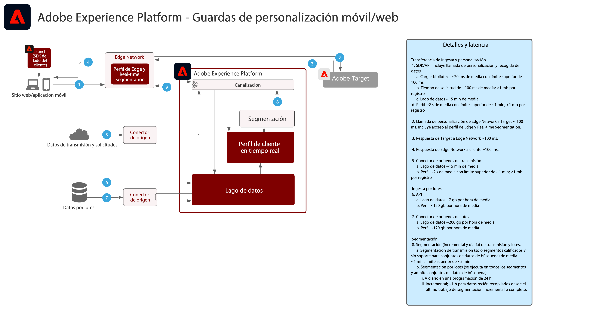

# Personalización web y móvil

La personalización web y móvil aborda la habilidad de emplear la segmentación de perfil y audiencias en distintas aplicaciones para personalizar y optimizar la experiencia del cliente. Se pueden aprovechar los comportamientos, la demografía, el nivel de fidelidad y las transacciones anteriores de los clientes para personalizar los diseños, las llamadas a acción y el contenido.

 

| Modelo | Descripción | Aplicaciones de Experience Cloud |
|---|---|---|
| **[Personalización web/móvil basada en comportamiento](behavioral.md)** | <ul><li>Personalizar según el comportamiento en línea y los datos de audiencia</li></ul> | <ul><li>Adobe Target</li><li>Adobe Real-time Customer Data Platform *(opcional)*</li><li>Adobe Analytics *(opcional)*</li><li>Adobe Audience Manager *(opcional)*</li></ul> |
| **[Personalización web/móvil con datos en línea y sin conexión](online-offline.md)** | <ul><li>Los perfiles completos de los clientes y la segmentación mejorada ofrecen experiencias personalizadas mejoradas.</li><li>Personalizar con atributos y eventos sin conexión (transacciones, reservas, CRM y datos de fidelidad).</li><li>Sincronizar la personalización en el sitio web, el email y otros canales conocidos.</li></ul> | <ul><li>Adobe Target</li><li>[!UICONTROL Real-time Customer Data Platform]</li><li>Adobe Analytics *(opcional)*</li><li>Adobe Audience Manager *(opcional)*</li></ul> |

 

## Guardas para la personalización web y móvil

[Para obtener información sobre las protecciones relacionadas con la activación de audiencias y perfiles, consulte la documentación sobre las protecciones de perfiles y segmentación.](https://experienceleague.adobe.com/docs/experience-platform/profile/guardrails.html?lang=es)

 

### Diagrama de guardas de la personalización en línea/sin conexión

## Entradas relacionadas en el blog

* [[!DNL Blueprint for Web Personalization using Adobe Experience Platform Real-Time Customer Profile]](https://medium.com/adobetech/blueprint-for-web-personalization-using-adobe-experience-platform-real-time-customer-profile-fef2ce7a4b2f)
* [[!DNL Integrating Adobe Experience Platform Decisioning Engine with AEM Websites]](https://jaeness.medium.com/integrating-adobe-experience-platform-decisioning-engine-with-aem-websites-9c222acd12e2)
* [[!DNL Content and Commerce AI: Personalizing Your Interactions with Customers Through Content Intelligence]](https://medium.com/adobetech/content-and-commerce-ai-personalizing-your-interactions-with-customers-through-content-intelligence-dc182601deab)
* [[!DNL How Adobe Experience Platform Predictive Audiences improves Personalized Experiences]](https://medium.com/adobetech/how-adobe-experience-platform-predictive-audiences-improves-personalized-experiences-1f75a60cb7a3)
* [[!DNL Adobe Experience Platform Web SDK for Audience Management]](https://medium.com/adobetech/adobe-experience-platform-web-sdk-for-audience-management-751fa6d063bc)
* [[!DNL Implementing Adobe Experience Platform Real-Time Customer Profile through our “Customer Zero” Program]](https://medium.com/adobetech/implementing-adobe-experience-platform-real-time-customer-profile-through-our-customer-zero-32e7cd952896)
* [[!DNL Segmentation in Seconds: How Adobe Experience Platform Made Real-time Customer Profiles a Reality]](https://medium.com/adobetech/segmentation-in-seconds-how-adobe-experience-platform-made-real-time-customer-profiles-a-reality-a7a8552b0847)
* [[!DNL Build an Optimal Online Experience: Enrich Unified Profile with Query Service]](https://medium.com/adobetech/build-an-optimal-online-experience-enrich-unified-profile-with-query-service-8027c196ab33)
